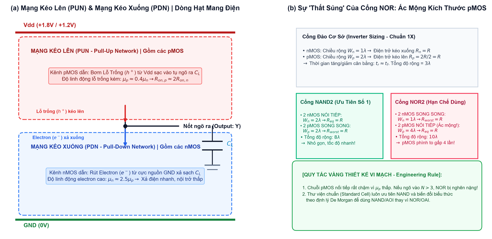
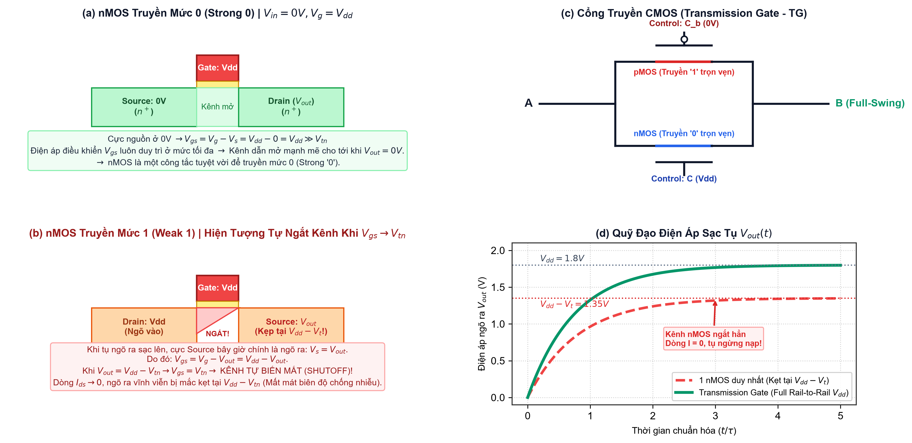
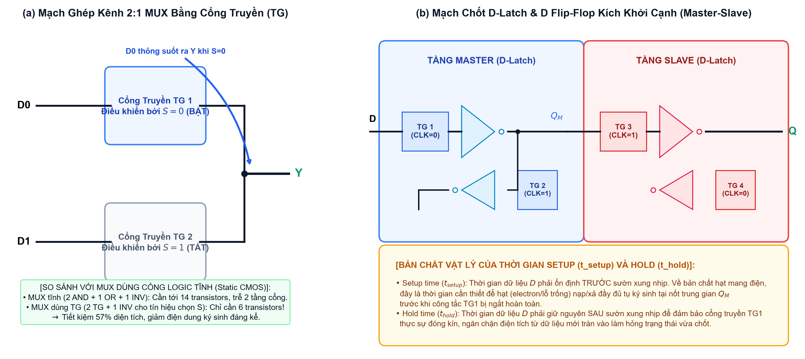
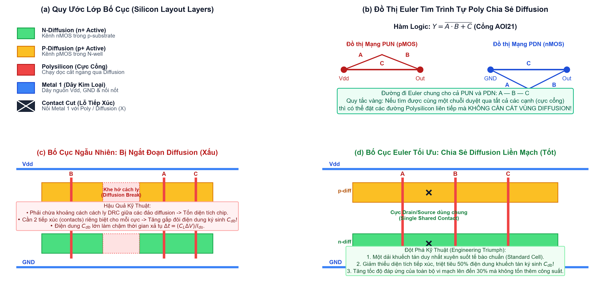

# Chương 2: Mạch Logic CMOS & Bố cục Silicon (Circuits & Layout)
> **Phiên bản:** Kể chuyện Cơ chế Vật lý Vi mô & Nghệ thuật Bố cục Silicon  
> **Đối tượng:** Sinh viên Thiết kế Vi mạch ĐH Công nghệ Thông tin (UIT)  
> **Thời gian học tập tối ưu:** 4 Giờ Trọng tâm  
> **Tài liệu đối chiếu:** `source/source_uit_vn/chapter2-cktlay.pdf` (Slides 1 – 46) & Giáo trình CMOS VLSI Design (Weste & Harris)  
> **Nguyên lý cốt lõi:** Kết nối trực tiếp mạch nguyên lý và sơ đồ bố cục với các hiện tượng vật lý lượng tử và toán học đã học ở Chương 3 (độ linh động hạt dẫn $\mu_n / \mu_p$, sụt áp ngưỡng $V_t$, điện trở kênh $R_{on}$, và điện dung khuếch tán ký sinh $C_{db}$).

---

## Lộ trình Học tập 4 Giờ Cốt lõi (4-Hour Study Roadmap)

```
[Giờ 1: 0:00 - 1:00] ──> Bản chất Cổng Logic CMOS Bổ sung & Ác mộng Kích thước NOR
[Giờ 2: 1:00 - 2:00] ──> Transistor Truyền dẫn (Pass Transistor) & Cổng Truyền (Transmission Gate)
[Giờ 3: 2:00 - 3:00] ──> Mạch Tuần tự: D-Latch, DFF & Bản chất Vật lý Setup/Hold
[Giờ 4: 3:00 - 4:00] ──> Bố cục Silicon, Stick Diagram & Đột phá Tối ưu Đường đi Euler
```

---

## Giờ 1: Bản chất Cổng Logic CMOS Bổ sung & Ác mộng Kích thước NOR
*(Tương ứng Slide 13 – 18 | Thời gian mục tiêu: 60 phút)*

### 1.1 Vượt qua Tư duy Công tắc Lý tưởng: Mạng Kéo Lên (PUN) & Mạng Kéo Xuống (PDN)
Trong lý thuyết hàm Boolean trừu tượng, một cổng logic chỉ đơn thuần là phép biến đổi toán học giữa các biến $0$ và $1$. Nhưng trong thế giới vật lý bán dẫn vi mô, **mức logic $0$ và $1$ thực chất là hai trạng thái điện áp được tạo ra bằng cách bơm đầy hoặc rút cạn hạt mang điện trên tụ tải ngõ ra $C_L$**.

Mọi cổng logic CMOS chuẩn (Static Complementary CMOS) luôn được tạo thành từ hai mạng đối ngẫu nhau, như minh họa trên **Hình 2.1(a)**:
1. **Mạng kéo lên (Pull-Up Network - PUN):** Nối từ nguồn điện áp dương $V_{dd}$ xuống nốt ngõ ra $Y$. Mạng này **chỉ sử dụng các transistor pMOS**. Khi ngõ ra cần lên mức cao (mức $1$), các pMOS dẫn thông, đóng vai trò như chiếc van mở dòng để **bơm các hạt lỗ trống ($h^+$) từ nguồn $V_{dd}$ đổ vào nạp đầy tụ điện ngõ ra $C_L$**.
2. **Mạng kéo xuống (Pull-Down Network - PDN):** Nối từ nốt ngõ ra $Y$ xuống đất (GND - $0\text{V}$). Mạng này **chỉ sử dụng các transistor nMOS**. Khi ngõ ra cần hạ xuống mức thấp (mức $0$), các nMOS dẫn thông, đóng vai trò như ống thoát hiểm để **rút các hạt electron ($e^-$) từ cực nguồn GND tràn lên trung hòa và xả sạch điện tích trên tụ $C_L$**.



> [!NOTE]
> ### 🔬 Bản chất Vật lý Vi mô: Tại sao không dùng nMOS để kéo lên và pMOS để kéo xuống?
> Đây là câu hỏi cốt tử mà rất nhiều sinh viên thắc mắc. Tại sao chúng ta phải chia rạch ròi: pMOS cho PUN và nMOS cho PDN?
> - Transistor nMOS là một công tắc **hoàn hảo để dẫn mức 0 (Strong '0')** vì khi nối xuống GND ($0\text{V}$), điện thế cực nguồn $V_s = 0\text{V}$, giúp giữ cho điện áp điều khiển $V_{gs} = V_g - V_s = V_{dd} - 0 = V_{dd} \gg V_t$ ở mức cực đại trong suốt quá trình xả. Kênh dẫn luôn mở toang cho đến khi nốt $Y$ chạm mốc $0\text{V}$. Ngược lại, nếu dùng nMOS để kéo lên $V_{dd}$, nMOS sẽ bị **ngắt kênh sớm** và ngõ ra bị kẹt tại $V_{dd} - V_t$ (chúng ta sẽ giải phẫu chi tiết hiện tượng này ở Giờ 2).
> - Tương tự, pMOS là công tắc **hoàn hảo để dẫn mức 1 (Strong '1')**, nhưng lại là công tắc rất tồi khi kéo xuống đất vì nó sẽ tự tắt khi điện áp ngõ ra chạm mốc $|V_{tp}|$.
> - Do đó, kiến trúc CMOS bổ sung (Complementary) là giải pháp thiên tài để đảm bảo ngõ ra luôn đạt biên độ điện áp trọn vẹn từ nguồn tới đất **(Full Rail-to-Rail Swing)** mà không hao phí dòng điện một chiều tĩnh ($I_{static} \approx 0$).

### 1.2 Quy tắc Mắc Nối tiếp / Song song Đối ngẫu (Conduction Complement Rule)
Để đảm bảo nguyên lý logic: ngõ ra $Y$ chỉ được nối lên $V_{dd}$ HOẶC nối xuống GND tại bất kỳ thời điểm nào (không bao giờ được chập cả hai gây ngắn mạch, và không bao giờ thả nổi cả hai gây mất định pha):
- Khi các nMOS trong mạng PDN mắc **NỐI TIẾP** (thực hiện hàm logic AND: cần cả $A$ VÀ $B$ cùng mở thì nốt mới nối đất), các pMOS tương ứng trong mạng PUN bắt buộc phải mắc **SONG SONG** (hàm OR: chỉ cần $A$ HOẶC $B$ tắt là nốt được cấp điện từ $V_{dd}$). Cấu trúc này tạo nên cổng **NAND**.
- Khi các nMOS trong mạng PDN mắc **SONG SONG** (hàm logic OR: chỉ cần $A$ HOẶC $B$ mở là nốt nối đất), các pMOS trong PUN bắt buộc phải mắc **NỐI TIẾP**. Cấu trúc này tạo nên cổng **NOR**.

### 1.3 Ác mộng Kích thước Của Cổng NOR: Tại sao NOR bị "Thất sủng"?
Hãy nhìn vào **Hình 2.1(b)**. Ở đây ẩn chứa một bí mật thiết kế vi mạch vô cùng quan trọng: sự chênh lệch kích thước khủng khiếp giữa NAND và NOR.

Như chúng ta đã chứng minh bằng vật lý lượng tử ở Chương 3:
- Hạt tải điện của nMOS là các electron tự do lướt êm ái trong dải dẫn *(Conduction Band)* với độ linh động cao ($\mu_n \approx 500-600\text{ cm}^2/\text{V}\cdot\text{s}$).
- Hạt tải điện của pMOS là các lỗ trống trong dải hóa trị *(Valence Band)*, di chuyển nhờ electron liên kết nhảy chỗ từng bước (như trò chơi ghế âm nhạc), chịu va chạm mạng tinh thể lớn nên độ linh động rất kém ($\mu_p \approx 200-250\text{ cm}^2/\text{V}\cdot\text{s}$).
- Tỷ số độ linh động thực tế:
  $$\frac{\mu_n}{\mu_p} \approx 2 \text{ đến } 2.5$$

> [!IMPORTANT]
> ### 📐 Dẫn xuất Định cỡ Cân bằng (Transistor Sizing Derivation)
> 1. **Cổng đảo cơ sở (Inverter 1X):** Điện trở dẫn nMOS chuẩn ($W_n = 1\lambda$) là $R_n = R$. Vì độ linh động lỗ trống kém hơn một nửa, pMOS cùng kích thước có $R_p = 2R$. Để thời gian nạp tụ ($t_r$) cân bằng thời gian xả ($t_f$), ta mở rộng kênh dẫn pMOS lên gấp đôi: $W_p = 2 W_n = 2\lambda$. Tổng bề rộng: $W_{total} = 1\lambda + 2\lambda = 3\lambda$.
> 2. **Cổng NAND2:**  
>    - Mạng PDN gồm 2 nMOS nối tiếp: $R_{PDN} = R_n + R_n = 2R_n$. Để $R_{PDN} = R$, ta chọn $W_n = 2\lambda$.
>    - Mạng PUN gồm 2 pMOS song song: Worst-case 1 pMOS dẫn $\to$ giữ nguyên $W_p = 2\lambda$.
>    - Tổng bề rộng kênh dẫn: $W_{NAND2} = 2\lambda + 2\lambda + 2\lambda + 2\lambda = 8\lambda$.
> 3. **Cổng NOR2 (Ác mộng thực sự):**  
>    - Mạng PDN gồm 2 nMOS song song: Worst-case 1 nMOS mở $\to W_n = 1\lambda$.
>    - Mạng PUN gồm 2 pMOS NỐI TIẾP: Điện trở kéo lên là:
>      $$R_{PUN} = \frac{2R}{W_p} + \frac{2R}{W_p} = \frac{4R}{W_p} = R \implies W_p = 4\lambda !$$
>    - Tổng bề rộng: $W_{NOR2} = 1\lambda + 1\lambda + 4\lambda + 4\lambda = 10\lambda$ (pMOS phình to gấp 4 lần!).

> [!TIP]
> ### ⚡ Quyết định Thiết kế Sống còn của Kỹ sư Vi mạch
> 1. **Hiệu ứng chuỗi nối tiếp:** Một chuỗi các pMOS mắc nối tiếp là cơn ác mộng về hiệu năng. Nếu thiết kế cổng NOR 3 ngõ vào (NOR3), mỗi pMOS phải phình to lên $W_p = 6\lambda$; với NOR4, con số này là $W_p = 8\lambda$! Kích thước này làm nốt cực cổng phình to khổng lồ, kéo theo điện dung ngõ vào $C_{in} = C_{ox} W L$ tăng vọt, biến cổng NOR thành một tải nặng nề làm nghẽn toàn bộ mạch phía trước.
> 2. **Quy tắc vàng công nghiệp:** Trong các thư viện tế bào chuẩn (Standard Cell Library) của TSMC hay Intel, **cổng NAND luôn được ưu tiên tối đa**. Bất kỳ kỹ sư thiết kế logic nào cũng được huấn luyện sử dụng định lý De Morgan để chuyển đổi các hàm logic thành dạng cổng NAND hoặc cổng phức hợp AOI (And-Or-Invert) thay vì dùng NOR.

### 1.4 Thiết kế Cổng Phức hợp (Compound Gates: AOI & OAI)
Trong thực tế, vi mạch không ghép nối hàng loạt cổng AND và OR rời rạc vì tốn diện tích và chịu trễ qua nhiều tầng đệm. Thay vào đó, kỹ sư chế tạo các **Cổng Phức hợp (Compound Gates)** gộp chung cả hai hàm vào một tầng logic duy nhất:
- **Cổng AOI21 (And-Or-Invert):** Thực hiện hàm $Y = \overline{A \cdot B + C}$ (PDN: $(A, B)$ nối tiếp, song song nhánh $C$; PUN: $(A, B)$ song song, nối tiếp nhánh $C$).
- **Cổng AOI22:** Thực hiện hàm $Y = \overline{(A \cdot B) + (C \cdot D)}$ (Chỉ cần 8 transistor trong một tầng logic duy nhất, thay vì 14 transistor nếu dùng cổng rời!).

---

## Giờ 2: Transistor Truyền dẫn (Pass Transistor) & Cổng Truyền (Transmission Gate)
*(Tương ứng Slide 19 – 24 | Thời gian mục tiêu: 60 phút)*

### 2.1 Ảo tưởng Công tắc Đơn Transistor & Hiện tượng Ngắt Kênh Ký sinh
Để tiết kiệm diện tích silicon, một ý tưởng trực giác nảy sinh: Tại sao phải tốn tới 2 hoặc 4 transistor để đóng/ngắt một đường tín hiệu? Tại sao ta không dùng duy nhất một transistor nMOS làm một chiếc công tắc nối tiếp trên đường dây?

Ý tưởng ngây thơ này lập tức sụp đổ khi chạm vào bản chất vật lý bán dẫn. Hãy quan sát tỉ mỉ **Hình 2.2(a) và 2.2(b)**:



> [!NOTE]
> ### 🔬 Cơ chế Vi mô Đằng sau Cú sụt áp Ngưỡng ($V_t$ Drop)
> - **Khi nMOS truyền mức 0 ($V_{in} = 0\text{V}$, $V_g = V_{dd}$ — Hình 2.2a):**  
>   Cực Nguồn (Source) được định nghĩa là cực có điện thế thấp hơn giữa hai đầu khuếch tán. Do đó, nốt ngõ vào đóng vai trò là Source ($V_s = 0\text{V}$).  
>   Điện áp điều khiển cổng - nguồn là:
>   $$V_{gs} = V_g - V_s = V_{dd} - 0 = V_{dd}$$
>   Vì $V_{dd} \gg V_{tn}$, điện áp điều khiển đạt cực đại tuyệt đối. Lực hút tĩnh điện duy trì kênh dẫn mở toang, hút electron từ nguồn xả thẳng nốt ngõ ra xuống đất cho tới khi $V_{out} = 0\text{V}$. nMOS là một công tắc hoàn hảo để truyền mức 0 **(Strong '0')**.
> 
> - **Khi nMOS truyền mức 1 ($V_{in} = V_{dd}$, $V_g = V_{dd}$ — Hình 2.2b):**  
>   Ban đầu ngõ ra ở $0\text{V}$, nên nốt ngõ ra đóng vai trò là cực Source ($V_s = V_{out} = 0\text{V}$). Điện áp $V_{gs} = V_{dd} - 0 = V_{dd} > V_{tn}$, kênh dẫn mở, dòng điện bắt đầu nạp cho tụ $C_L$.  
>   **Bi kịch bắt đầu khi tụ tích điện:** Điện áp $V_{out}$ tăng dần lên $0.5\text{V}, 1.0\text{V}, 1.3\text{V}...$  
>   Vì cực Source chính là nốt ngõ ra, điện áp cổng - nguồn bị bóp nghẹt liên tục theo thời gian:
>   $$V_{gs}(t) = V_g - V_{out}(t) = V_{dd} - V_{out}(t)$$
>   Khi điện áp ngõ ra vừa chạm tới ngưỡng:
>   $$V_{out} = V_{dd} - V_{tn} \implies V_{gs} = V_{dd} - (V_{dd} - V_{tn}) = V_{tn}$$
>   Lúc này, hiệu điện thế dọc qua lớp oxit cổng không còn đủ mạnh để duy trì lớp đảo (Inversion layer). **Kênh dẫn tự động biến mất hoàn toàn (Channel Shutoff)!**  
>   Dòng điện dẫn tắt lịm ($I_{ds} \to 0$). Tụ điện không thể nạp thêm được một electron nào nữa. Ngõ ra vĩnh viễn bị kẹp chặt ở mức điện áp tàn tật:
>   $$V_{out, max} = V_{dd} - V_{tn}$$

> [!WARNING]
> ### ⚠️ Hậu quả Chết người của Mức 1 Yếu (Weak '1')
> Nếu nguồn $V_{dd} = 1.8\text{V}$ và điện áp ngưỡng (có xét hiệu ứng đế - Body Effect) là $V_{tn} \approx 0.5\text{V}$, ngõ ra chỉ lên được tối đa $1.3\text{V}$.  
> Nếu mức điện áp $1.3\text{V}$ này được đưa vào cổng của một Inverter tiếp theo, nó không đủ cao để tắt hoàn toàn pMOS của Inverter đó ($|V_{gs, p}| = 1.8 - 1.3 = 0.5\text{V} \approx |V_{tp}|$). Cả pMOS và nMOS của tầng sau đều hé mở cùng lúc, tạo ra một **dòng ngắn mạch chạy thẳng từ $V_{dd}$ xuống đất**, đốt cháy năng lượng tĩnh và làm sụp đổ hoàn toàn biên độ chống nhiễu **(Noise Margin)** của hệ thống!

### 2.2 Giải pháp Toàn vẹn: Cổng Truyền CMOS (Transmission Gate - TG)
Để vừa có một công tắc điều khiển hai chiều nhỏ gọn, vừa không bị sụt áp ngưỡng $V_t$, các kỹ sư vi mạch đã phát minh ra **Cổng Truyền (Transmission Gate - TG)**, thể hiện trên **Hình 2.2(c)**.

Cổng truyền được tạo thành bằng cách **ghép song song một transistor nMOS và một transistor pMOS**, được điều khiển bởi hai tín hiệu xung nhịp đối pha nhau ($C$ và $\overline{C}$):
- Khi $C = 1$ ($V_{dd}$) và $\overline{C} = 0$ ($0\text{V}$): Cổng truyền BẬT.
  - Khi truyền mức thấp ($0 \to 0\text{V}$): nMOS dẫn mạnh mẽ kéo nốt về tận $0\text{V}$. pMOS bị ngắt khi nốt xuống dưới $|V_{tp}|$, nhưng nMOS gánh trọn vẹn phần còn lại.
  - Khi truyền mức cao ($0 \to V_{dd}$): Ban đầu nMOS nạp nhanh cho tụ. Khi $V_{out}$ vượt quá $V_{dd} - V_{tn}$, nMOS tắt ngấm, nhưng pMOS có cực cổng nối đất ($\overline{C} = 0\text{V}$) nên điện thế điều khiển của nó luôn là $|V_{gs, p}| = V_{in} - 0 = V_{dd} \gg |V_{tp}|$! pMOS tiếp tục bơm lỗ trống kéo thẳng điện áp ngõ ra lên chạm nóc $V_{dd}$.
- Kết quả: Như đồ thị động học trên **Hình 2.2(d)** minh chứng, cổng truyền TG đạt **đáp ứng điện áp toàn dải (Full Rail-to-Rail Swing từ $0\text{V}$ đến $V_{dd}$)** với nội trở tương đương $R_{TG} = R_n \parallel R_p$ gần như không đổi trong suốt quá trình chuyển mạch.

### 2.3 Ứng dụng Kinh điển: Mạch Dồn Kênh 2:1 MUX (Multiplexer)
Hãy nhìn vào bảng so sánh trên **Hình 2.3(a)**. Đây là minh chứng hùng hồn cho sức mạnh của tư duy thiết kế mạch:
- **Cách thiết kế cổng tĩnh truyền thống (Static CMOS MUX):**  
  Hàm $Y = D_0 \cdot \overline{S} + D_1 \cdot S$ đòi hỏi: 2 cổng AND (12 transistors) + 1 cổng OR (6 transistors) + 1 cổng đảo (2 transistors) = Tổng cộng cần tới **14 đến 20 transistors**, tín hiệu phải đi qua ít nhất 2 đến 3 tầng trễ!
- **Cách thiết kế bằng Cổng truyền TG (TG-based MUX):**  
  Ta chỉ cần 2 cổng truyền TG mắc chung ngõ ra và 1 cổng đảo để tạo $\overline{S}$. Khi $S=0$, TG1 mở thông dòng $D_0$ ra $Y$; khi $S=1$, TG2 mở thông $D_1$ ra $Y$.  
  Tổng số linh kiện: Chỉ vỏn vẹn **6 transistors**!  
  **Hiệu quả:** Tiết kiệm gần $60\%$ diện tích silicon, giảm điện dung ký sinh tại nốt $Y$, giúp tốc độ dồn kênh tăng gấp đôi.

---

## Giờ 3: Mạch Tuần tự: D-Latch, DFF & Vật lý Setup/Hold
*(Tương ứng Slide 25 – 29 | Thời gian mục tiêu: 60 phút)*

### 3.1 Bước Chuyển từ Mạch Tổ hợp sang Mạch Tuần tự: Phần tử Ổn định Kép (Bistable Loop)
Tất cả các cổng logic ta khảo sát ở Giờ 1 và Giờ 2 đều là **mạch tổ hợp (Combinational Logic)**: ngõ ra tức thời chỉ phụ thuộc vào các ngõ vào ở thời điểm hiện tại. Mạch không có ký ức.

Để lưu trữ được 1 bit thông tin ($0$ hoặc $1$), mạch điện bắt buộc phải có **vòng phản hồi (Feedback Loop)**. Cấu trúc cơ bản nhất là hai cổng đảo mắc nối tiếp vòng tròn khép kín thành một **Phần tử Ổn định Kép (Bistable Element)**:
- Nếu nốt $Q = 1$, cổng đảo thứ nhất kéo nốt $\overline{Q} = 0$.
- Nốt $\overline{Q} = 0$ đưa ngược về ngõ vào của cổng đảo thứ hai, giữ chặt nốt $Q = 1$.
- Vòng phản hồi dương này tự khóa điện tích và giữ trạng thái vĩnh viễn chừng nào nguồn $V_{dd}$ còn duy trì.

### 3.2 Mạch Chốt D Điều khiển bằng Xung nhịp (Clocked D-Latch)
Vấn đề là làm sao ta có thể ghi dữ liệu mới vào vòng lặp này mà không bị xung đột điện tích? Giải pháp là sử dụng các cổng truyền TG làm van đóng/ngắt có điều khiển, như trên **Hình 2.3(b)**:



Mạch D-Latch hoạt động theo hai pha xung nhịp rõ rệt:
1. **Pha Trong suốt (Transparent Phase — Khi $\text{CLK} = 1$):**  
   Cổng truyền ngõ vào TG1 mở thông, trong khi cổng truyền phản hồi TG2 bị khóa chặt. Dữ liệu từ ngõ vào $D$ tự do tràn qua TG1, qua cổng đảo thứ nhất và xuất hiện tại nốt ngõ ra. Mọi sự thay đổi ở ngõ vào $D$ đều phản ánh tức thì ra ngõ ra (mạch "trong suốt").
2. **Pha Giữ / Chốt (Hold/Opaque Phase — Khi $\text{CLK} = 0$):**  
   TG1 lập tức ngắt lìa ngõ vào $D$, cô lập mạch khỏi thế giới bên ngoài. Đồng thời, TG2 bật sáng, đóng kín vòng lặp giữa hai cổng đảo. Điện tích tại nốt trung gian $Q_M$ được khóa chặt và bảo toàn, dữ liệu được ghi nhớ an toàn.

### 3.3 Mạch D Flip-Flop Kích khởi Cạnh (Master-Slave Edge-Triggered DFF)
Nhược điểm của D-Latch là nó "trong suốt" trong suốt nửa chu kỳ xung nhịp. Nếu dữ liệu ngõ vào bị nhiễu hoặc thay đổi nhiều lần khi $\text{CLK}=1$, dữ liệu rác sẽ tràn ra ngõ ra.

Để giải quyết triệt để, ta ghép hai mạch D-Latch nối tiếp nhau nhưng điều khiển bởi **hai pha xung nhịp ngược chiều nhau**, tạo thành cấu trúc **Master-Slave D Flip-Flop** (Hình 2.3b):
- Tầng thứ nhất gọi là **Master Latch** (điều khiển bởi $\text{CLK}$).
- Tầng thứ hai gọi là **Slave Latch** (điều khiển bởi $\overline{\text{CLK}}$).
- **Khi $\text{CLK} = 0$:** Tầng Master trong suốt nạp dữ liệu $D$ vào nốt nội bộ $Q_M$, trong khi tầng Slave khóa chặt, giữ nguyên ngõ ra $Q$ cũ.
- **Khi $\text{CLK}$ nhảy từ $0 \to 1$ (Sườn dương - Rising Edge):** Tầng Master lập tức đóng cửa cô lập dữ liệu tại $Q_M$, đồng thời tầng Slave mở cửa truyền điện tích từ $Q_M$ phóng thẳng ra ngõ ra $Q$!
- **Kết quả:** Dữ liệu chỉ được chốt và cập nhật tại **đúng thời khắc cực ngắn của sườn xung nhịp** (Edge-Triggered).

### 3.4 Bản chất Vật lý Vi mô của Thời gian Setup ($t_{setup}$) và Hold ($t_{hold}$)
Trong mọi kỳ thi đại học và phỏng vấn kỹ sư vi mạch tại các tập đoàn (Intel, Marvell, Synopsys), câu hỏi về $t_{setup}$ và $t_{hold}$ luôn xuất hiện. Hầu hết sinh viên chỉ học vẹt định nghĩa thời gian mà không hiểu bản chất cơ học hạt phía sau:

> [!NOTE]
> ### 🔬 Dòng Chuyển động Hạt Đằng sau $t_{setup}$ và $t_{hold}$
> - **Thời gian Thiết lập (Setup Time - $t_{setup}$):**  
>   Hãy nhìn vào nốt trung gian $Q_M$ trên Hình 2.3(b). Nốt này có điện dung ký sinh hữu hạn $C_{QM}$ (gồm điện dung khuếch tán của TG1, TG2 và điện dung cực cổng của cổng đảo).  
>   Khi dữ liệu $D$ thay đổi, dòng electron hoặc lỗ trống phải chảy qua kênh dẫn của TG1 (với nội trở $R_{TG}$) để nạp hoặc xả tụ $C_{QM}$. Quá trình này cần một hằng số thời gian vật lý $\tau = R_{TG} C_{QM}$ để điện áp tại $Q_M$ vượt qua ngưỡng lật logic.  
>   $\to$ **Bản chất:** $t_{setup}$ là **khoảng thời gian tối thiểu dữ liệu $D$ phải đến sớm và đứng yên TRƯỚC sườn xung nhịp**, nhằm đảm bảo hạt mang điện có đủ thời gian tích tụ đầy đủ điện tích trên tụ $Q_M$ trước khi công tắc TG1 đóng sập lại! Nếu vi phạm, điện tích lơ lửng dở dang sẽ đẩy mạch vào trạng thái **Siêu ổn định (Metastability)** khiến chip bị tê liệt.
> 
> - **Thời gian Duy trì (Hold Time - $t_{hold}$):**  
>   Khi xung nhịp $\text{CLK}$ đổi trạng thái, tín hiệu điều khiển không thể làm công tắc TG1 ngắt tức thời trong 0 giây (do trễ dây dẫn và quán tính phóng điện cực cổng). TG1 mất một khoảng thời gian ngắn $\Delta t_{off}$ mới thực sự cô lập hoàn toàn.  
>   $\to$ **Bản chất:** $t_{hold}$ là **khoảng thời gian dữ liệu $D$ bắt buộc phải giữ nguyên SAU sườn xung nhịp**, nhằm ngăn không cho các hạt điện tích của gói dữ liệu mới lọt qua khe cửa chưa kịp đóng kín của TG1 làm vấy bẩn và đảo lộn trạng thái vừa chốt.

---

## Giờ 4: Bố cục Silicon, Stick Diagram & Đột phá Euler Path
*(Tương ứng Slide 30 – 46 | Thời gian mục tiêu: 60 phút)*

### 4.1 Giải phẫu Các Lớp Vật lý Trên Tinh thể Silicon (Silicon Layout Layers)
Từ sơ đồ nguyên lý trừu tượng trên giấy, làm thế nào để chế tạo vi mạch hàng tỷ transistor? Người ta sử dụng công nghệ quang khắc chiếu chùm tia tử ngoại qua các mặt nạ *(Photolithography Masks)* để khắc từng lớp vật liệu lên phiến silicon.

Như minh họa trên **Hình 2.4(a)**, các lớp vật lý cơ bản trong một tế bào chuẩn (Standard Cell) gồm có:
1. **N-Diffusion (Vùng khuếch tán $n^+$ - Màu xanh lá):** Được tạo ra bằng cách cấy ion Arsenic hoặc Phosphorus nồng độ cao vào đế p, tạo thành cực Source và Drain cho nMOS.
2. **P-Diffusion (Vùng khuếch tán $p^+$ - Màu vàng/nâu):** Được cấy ion Boron vào giếng n (N-well), tạo thành Source và Drain cho pMOS.
3. **Polysilicon (Silicon đa tinh thể - Màu đỏ):** Đóng vai trò là cực Cổng (Gate). **Bất cứ nơi nào một đường Polysilicon chạy cắt ngang qua một dải Diffusion, một transistor MOSFET sẽ tự động hình thành ngay tại giao điểm đó!**
4. **Metal 1 (Lớp kim loại 1 - Màu xanh dương):** Dùng để dẫn hai đường ray cấp nguồn ($V_{dd}$ ở đỉnh tế bào, GND ở đáy tế bào) và định tuyến tín hiệu nội bộ.
5. **Contact Cut (Lỗ tiếp xúc - Ký hiệu chữ X màu đen):** Các lỗ khoan thẳng đứng xuyên qua lớp điện môi cách điện để kết nối dây kim loại Metal 1 với Polysilicon hoặc Diffusion.



### 4.2 Sơ đồ Que (Stick Diagram) & Kiến trúc Tế bào Chuẩn
Để phác thảo bố cục nhanh trước khi vẽ hình học chi tiết, các kỹ sư sử dụng **Sơ đồ que (Stick Diagram)**:
- Hai đường ray kim loại song song chạy ngang: đường trên là nguồn $V_{dd}$, đường dưới là đất GND.
- Dải khuếch tán pMOS chạy ngang ở nửa trên (nằm trong N-well).
- Dải khuếch tán nMOS chạy ngang ở nửa dưới.
- Các thanh Polysilicon của các ngõ vào ($A, B, C...$) chạy dọc từ trên xuống dưới, cắt ngang qua cả hai dải khuếch tán, điều khiển đồng thời cả cặp pMOS và nMOS tương ứng.

### 4.3 Đột phá Lý thuyết Đồ thị: Tối ưu Hóa Bằng Đường Đi Euler (Euler Path)
Hãy so sánh hai phương án bố cục layout trên **Hình 2.4(c)** và **Hình 2.4(d)**. Đây là ranh giới phân biệt giữa một kỹ sư nghiệp dư và một chuyên gia thiết kế vi mạch hàng đầu:

1. **Bố cục Ngẫu nhiên (Unoptimized Layout — Hình 2.4c):**  
   Nếu ta xếp thứ tự các thanh Polysilicon ngẫu nhiên (ví dụ: $B - A - C$), mạng pMOS và mạng nMOS sẽ có các cực khuếch tán không tương thích nhau. Ta bắt buộc phải **chặt đứt dải diffusion thành nhiều hòn đảo riêng biệt**.  
   Hậu quả kỹ thuật cực kỳ nặng nề:
   - Theo luật thiết kế (DRC), giữa hai đảo khuếch tán tách rời bắt buộc phải có một khe hở cách ly **(Diffusion Break)** tối thiểu $3\lambda$ để chống rò điện. Tế bào bị kéo dài ra, lãng phí diện tích silicon.
   - Mỗi đảo khuếch tán độc lập đều phải khoan các lỗ tiếp xúc riêng biệt **(Contact Cuts)** để nối dây kim loại. Mỗi lỗ tiếp xúc đòi hỏi diện tích kim loại bao quanh, làm tăng kích thước cell.

> [!IMPORTANT]
> ### 📐 Mối Liên hệ Sống còn với Điện dung Ký sinh Học ở Chương 3
> Trong Chương 3 (Mục 4.2), chúng ta đã biết điện dung khuếch tán ký sinh cực Máng ($C_{db}$) phụ thuộc trực tiếp vào diện tích đáy ($A$) và chu vi thành bên ($P$) của tiếp giáp P-N:
> $$C_{db} = C_j A + C_{jsw} P$$
> Khi dải khuếch tán bị bẻ gãy thành nhiều khúc riêng biệt, tổng diện tích khuếch tán và chu vi biên tăng vọt lên gấp đôi. Điện dung ký sinh $C_{db}$ tại nốt ngõ ra tăng hơn $100\%$.  
> Thời gian trễ nạp/xả tụ:
> $$\Delta t = \frac{C_L \Delta V}{I} = \frac{(C_{wire} + C_g + C_{db}) \Delta V}{I}$$
> Điện dung $C_{db}$ phình to trực tiếp kéo sập tốc độ của toàn bộ vi mạch!

2. **Giải pháp Euler Đột phá (Euler Path Optimization — Hình 2.4d):**  
   Ta chuyển đổi sơ đồ nguyên lý của mạng PUN và PDN thành hai đồ thị có hướng (Graphs) với các đỉnh là các nốt mạch ($V_{dd}$, GND, Output, nốt trung gian) và các cạnh là các cực cổng transistor ($A, B, C...$), như minh họa trên **Hình 2.4(b)**.
   - **Định nghĩa Đường đi Euler:** Là một chuỗi thứ tự đi qua **tất cả các cạnh của đồ thị đúng một lần duy nhất**.
   - **Quy tắc Vàng:** Kỹ sư tìm một chuỗi thứ tự ngõ vào sao cho nó là **Đường đi Euler chung cho cả hai đồ thị PUN và PDN** (Ví dụ: đối với cổng AOI21, chuỗi Euler chung là $A - B - C$).

> [!TIP]
> ### ⚡ Chiến thắng Kỹ thuật của Bố cục Euler
> Khi bố trí các thanh Polysilicon theo đúng chuỗi Euler ($A - B - C$):
> 1. **Dải khuếch tán liền mạch tuyệt đối:** Cả dải p-diffusion và n-diffusion trải dài liên tục từ đầu đến cuối cell mà không cần bất kỳ một vết cắt nào!
> 2. **Chia sẻ cực khuếch tán không cần tiếp xúc (Uncontacted Shared Diffusion):** Cực Drain của transistor $A$ chạm thẳng vào cực Source của transistor $B$ ngay trong lòng khối silicon mà không cần dây nối kim loại, không cần lỗ tiếp xúc contact cut!
> 3. **Kết quả:** Triệt tiêu $50\%$ điện dung khuếch tán ký sinh $C_{db}$, giảm diện tích cell chuẩn $25-30\%$, tăng tốc độ đáp ứng của chip thêm $20-30\%$ mà không tiêu tốn thêm bất kỳ một microwatt công suất nào!

---

### 4.4 Bảng Tra cứu Thông số Cốt lõi Toàn chương (Summary Cheat Sheet)

| Khái niệm / Thuật ngữ | Bản chất Vật lý / Nguyên lý | Ý nghĩa Thực tế / Quy tắc Vàng |
| :--- | :--- | :--- |
| **PUN (Pull-Up Network)** | Mạng pMOS bơm lỗ trống từ $V_{dd}$ | Truyền mức 1 mạnh mẽ (Strong 1); pMOS nối tiếp rất chậm. |
| **PDN (Pull-Down Network)** | Mạng nMOS hút electron xả về GND | Truyền mức 0 hoàn hảo (Strong 0); ưu tiên hơn PUN. |
| **Tỷ lệ Định cỡ Inverter** | $W_p \approx 2 W_n$ | Cân bằng thời gian tăng/giảm ($t_r \approx t_f$) do $\mu_n / \mu_p \approx 2.5$. |
| **Cổng NAND vs NOR** | NAND có nMOS nối tiếp, NOR có pMOS nối tiếp | NAND nhỏ hơn ($8\lambda$ vs $10\lambda$) và nhanh hơn gấp 2 lần so với NOR. |
| **Sụt áp Ngưỡng ($V_t$ Drop)** | Kênh nMOS tự ngắt khi $V_s = V_{out} \to V_{dd} - V_t$ | nMOS truyền mức 1 yếu (Weak 1), pMOS truyền mức 0 yếu (Weak 0). |
| **Transmission Gate (TG)** | Ghép song song nMOS và pMOS đối pha | Đạt full rail-to-rail swing ($0 \to V_{dd}$); giảm 57% diện tích MUX. |
| **Thời gian Setup ($t_{setup}$)** | Thời gian nạp đầy điện tích nốt nội bộ $Q_M$ | Dữ liệu phải ổn định TRƯỚC sườn xung nhịp. |
| **Thời gian Hold ($t_{hold}$)** | Thời gian để công tắc TG1 đóng kín hoàn toàn | Dữ liệu phải giữ nguyên SAU sườn xung nhịp. |
| **Đường đi Euler (Euler Path)** | Chuỗi duyệt qua mọi cực cổng chung cho PUN/PDN | Tạo dải diffusion liền mạch, triệt tiêu 50% điện dung ký sinh $C_{db}$. |

---

### 4.5 Bộ Câu hỏi Phản xạ Tư duy Kỹ sư Vi mạch (Diagnostic Self-Assessment)

1. **Câu hỏi 1 (Tư duy Đánh đổi):** Một kỹ sư mới ra trường muốn cổng NOR2 chạy nhanh bằng cổng NAND2 nên đã tăng kích thước cả 2 pMOS của cổng NOR lên $W_p = 8\lambda$. Hãy chỉ ra 2 tác dụng phụ tiêu cực mà sự thay đổi này gây ra cho toàn bộ vi mạch?  
   *Lời giải:* 
   - **Thứ nhất (Quá tải tầng trước):** Khi $W_p$ tăng lên $8\lambda$, diện tích cực cổng tăng gấp đôi khiến điện dung ngõ vào $C_{in} = C_{ox} W L$ tăng vọt. Cổng logic ở tầng trước muốn kích mở cổng NOR này sẽ phải mất thời gian nạp điện tích lâu hơn gấp 2-3 lần, làm chậm toàn bộ chuỗi lan truyền tín hiệu.
   - **Thứ hai (Phình to diện tích và dòng rò):** Diện tích giếng N-well và dải p-diffusion phình to đột biến, phá vỡ chiều cao chuẩn hóa của hàng tế bào (standard cell row height), đồng thời làm tăng dòng rò dưới ngưỡng *(subthreshold leakage current)* qua các mối nối P-N khi chip ở chế độ chờ.

2. **Câu hỏi 2 (Cơ chế Vật lý Hạt):** Tại sao một transistor nMOS duy nhất khi dẫn mức điện áp cao ($V_{in} = 1.8\text{V}$) chỉ có thể đẩy nốt ngõ ra lên mức tối đa là $1.3\text{V}$ rồi dừng lại, mặc dù điện áp cực Cổng vẫn được cấp $1.8\text{V}$ liên tục?  
   *Lời giải:* Vì cực Nguồn (Source) luôn là cực có điện thế thấp hơn. Khi tụ sạc lên, nốt ngõ ra đóng vai trò là Source ($V_s = V_{out}$). Điện áp điều khiển thực tế đặt lên lớp oxit cổng là $V_{gs} = V_g - V_s = 1.8\text{V} - V_{out}$. Khi $V_{out}$ chạm tới mốc $1.8\text{V} - V_{tn} = 1.3\text{V}$, hiệu điện thế $V_{gs}$ tụt đúng bằng điện áp ngưỡng $V_{tn} = 0.5\text{V}$. Điện trường dọc biến mất, lớp đảo electron bị triệt tiêu khiến kênh dẫn tự đóng sập lại. Dòng nạp tắt lịm ($I_{ds} = 0$), điện áp bị kẹp cứng tại $1.3\text{V}$.

3. **Câu hỏi 3 (Chẩn đoán Lỗi Timing):** Trong quá trình kiểm tra vi mạch sau đóng gói, một thanh ghi D Flip-Flop thỉnh thoảng xuất hiện dữ liệu rác không xác định (lúc $0$, lúc $1$) khi nhiệt độ chip tăng cao. Kỹ sư nghi ngờ mạch đã vi phạm thời gian gì? Giải thích từ góc độ điện trở và điện dung ký sinh?  
   *Lời giải:* Mạch đã vi phạm **Thời gian Thiết lập (Setup Time - $t_{setup}$)**. Khi nhiệt độ chip tăng, dao động nhiệt của mạng tinh thể silicon mạnh lên *(lattice phonon scattering)* làm giảm độ linh động hạt dẫn, khiến nội trở $R_{TG}$ của cổng truyền tăng lên. Thời gian nạp tụ ký sinh $\tau = R_{TG} C_{QM}$ bị kéo dài. Dữ liệu $D$ không kịp nạp đủ điện tích làm lật trạng thái nốt $Q_M$ trước khi xung nhịp đóng TG1, đẩy chốt vào trạng thái **Siêu ổn định (Metastability)** khiến ngõ ra dao động bất định giữa 0 và 1.

4. **Câu hỏi 4 (Bản chất Bố cục Silicon):** Tại sao việc áp dụng Đường đi Euler để bố trí một dải khuếch tán liền mạch lại giúp cổng logic chạy nhanh hơn đáng kể so với việc bố trí các transistor ngẫu nhiên, dù tổng số transistor trên sơ đồ nguyên lý là y hệt nhau?  
   *Lời giải:* Bố trí theo đường đi Euler cho phép hai transistor kế tiếp nhau dùng chung một vùng khuếch tán cực Máng/Nguồn mà không cần cắt rời và không cần khoan lỗ tiếp xúc kim loại (Contact cut). Điều này triệt tiêu các khoảng cách cách ly DRC và giảm hơn $50\%$ diện tích cũng như chu vi đáy của tiếp giáp P-N. Theo công thức học ở Chương 3, điện dung khuếch tán ký sinh $C_{db} = C_j A + C_{jsw} P$ giảm một nửa. Do tổng điện dung tải $C_L$ giảm mạnh, thời gian trễ chuyển mạch $\Delta t = \frac{C_L \Delta V}{I}$ giảm tương ứng, giúp vi mạch tăng tốc mà không cần tăng dòng tiêu thụ.
