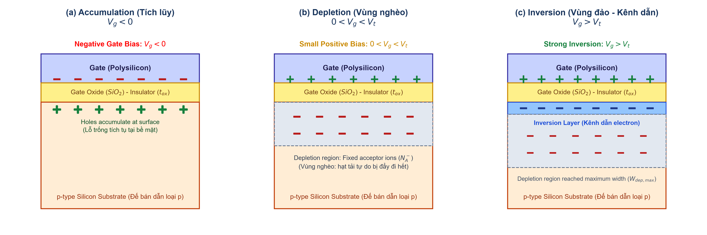
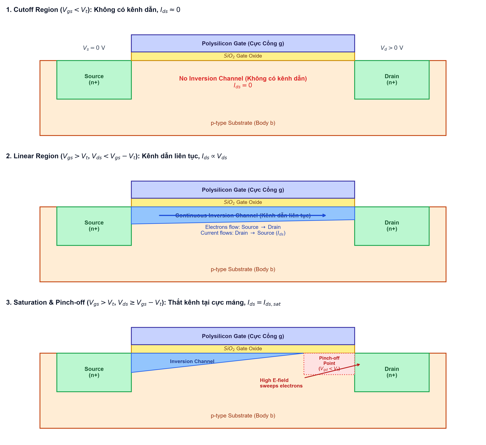
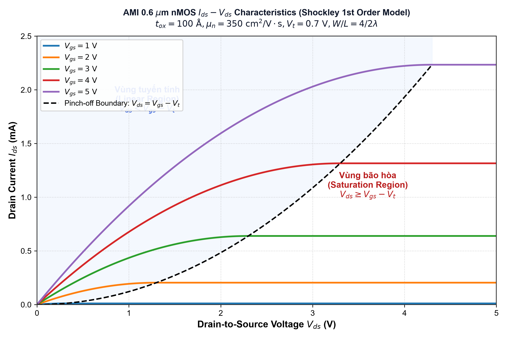
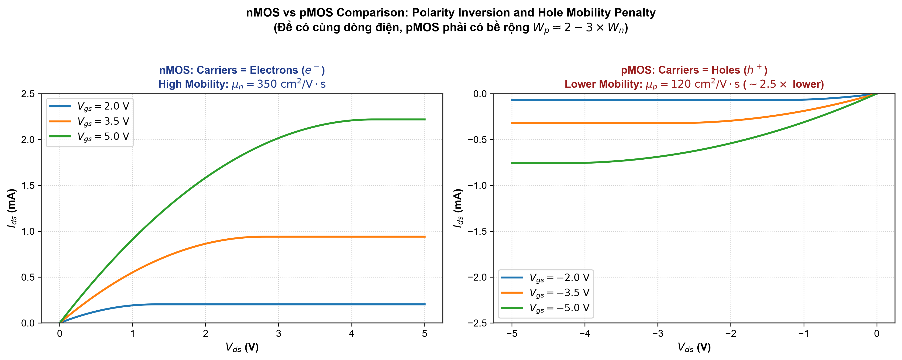
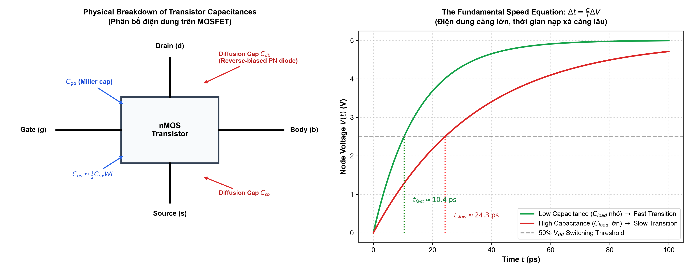

# Chapter 3: CMOS Transistor Theory (Lý thuyết Transistor CMOS)
> **Target Audience:** UIT VLSI Design Student  
> **Study Time Allocation:** 4 Hours Total (4 giờ học tập trung)  
> **Lecture Reference:** `source/source_uit_vn/chapter3-transistors.pdf` (Slides 1 – 20) & Weste & Harris Textbook (`cmos_vlsi.pdf`)  
> **Prerequisites Skipped:** Chapters 1 & 2 are not required. Everything is derived from first principles *(nguyên lý cơ bản)*.

---

## 4-Hour Study Roadmap (Lộ trình học tập 4 giờ)

```
[Hour 1: 0:00 - 1:00] ──> The MOS Capacitor & 3 Operating Modes (Vật lý tụ MOS & 3 chế độ)
[Hour 2: 1:00 - 2:00] ──> Mathematical Derivation of I-V Model (Chứng minh toán học dòng điện)
[Hour 3: 2:00 - 3:00] ──> pMOS Physics & AMI 0.6um Hand Calculation (Vật lý pMOS & Tính toán mẫu)
[Hour 4: 3:00 - 4:00] ──> Parasitic Capacitances & Speed Impact (Điện dung ký sinh & Tốc độ mạch)
```

---

## Hour 1: The MOS Capacitor & The 3 Operating Modes
*(Thời gian dự kiến: 60 phút | Tương ứng Slide 1 – 5)*

### 1.1 Why Do We Need Transistor Theory? (Tại sao cần lý thuyết transistor?)
In Chapter 1 and basic digital logic, we treat transistors as **ideal switches** *(công tắc lý tưởng)*:
* When Gate is `1`: switch is ON (closed, zero resistance).
* When Gate is `0`: switch is OFF (open, zero current).

**The Real Silicon Reality (Thực tế trên chip silicon):**
1. An ON transistor does not have zero resistance. It passes a **finite current** *(dòng điện có giới hạn)* depending on the terminal voltages *(điện áp các cực)*.
2. The gate, source, and drain all have **capacitance** *(điện dung ký sinh)*.
3. Because current charges/discharges capacitors, **capacitance and current determine the maximum speed (clock frequency) of the chip** *(dòng điện và điện dung quyết định trực tiếp tần số hoạt động của chip)*:
   $$\Delta t = \frac{C}{I} \Delta V$$

---

### 1.2 Physical Structure of the MOS Capacitor
A MOSFET is built around a sandwich of three materials:
1. **Gate (Cực Cổng):** Polysilicon *(silicon đa tinh thể dẫn điện tốt)*.
2. **Dielectric (Chất điện môi cách điện):** Silicon Dioxide ($SiO_2$) with thickness $t_{ox}$ and relative permittivity *(hằng số điện môi tương đối)* $\epsilon_{ox} \approx 3.9$.
3. **Body / Substrate (Đế bán dẫn):** p-type Silicon substrate doped with Acceptor atoms *(pha tạp chất nhận)* such as Boron ($N_A$).

The capacitance per unit area of this gate oxide is:
$$C_{ox} = \frac{\epsilon_{ox}}{t_{ox}} = \frac{3.9 \times \epsilon_0}{t_{ox}}$$
where $\epsilon_0 = 8.85 \times 10^{-14} \text{ F/cm} = 8.85 \times 10^{-12} \text{ F/m}$.

---

### 1.3 The Three Operating Modes (Ba chế độ hoạt động)
Depending on the voltage applied to the Gate ($V_g$) relative to the Body ($V_b = 0\text{ V}$), the MOS structure enters one of three physical states:



#### Mode 1: Accumulation (Chế độ tích lũy) — $V_g < 0\text{ V}$
* **What happens physically:** The gate is at a negative potential *(điện thế âm)*. Negative charges on the gate attract mobile positive holes *(lỗ trống mang điện tích dương)* from the p-substrate to the $Si-SiO_2$ interface.
* **Result:** A dense layer of positive holes builds up directly under the gate oxide.
* **Is there a channel for electrons?** No. The transistor is strictly OFF.

#### Mode 2: Depletion (Chế độ nghèo) — $0 < V_g < V_t$
* **What happens physically:** A small positive voltage is applied to the gate. This positive voltage repels *(đẩy)* the mobile positive holes away from the surface into the substrate.
* **Result:** The region under the gate becomes depleted of free mobile carriers *(sạch bóng hạt tải điện tự do)*. 
* Uncompensated negative acceptor ions *(các ion tạp chất mang điện tích âm bị cố định trong mạng tinh thể)* are left behind:
  $$Q_{dep} = -q N_A W_{dep}$$
* This region is called the **Depletion Region** *(vùng nghèo)*. It acts as an insulator layer in series with the oxide.

#### Mode 3: Inversion (Chế độ đảo — Hình thành kênh dẫn) — $V_g > V_t$
* **What happens physically:** As $V_g$ increases further above a critical voltage called the **Threshold Voltage ($V_t$)** *(điện áp ngưỡng)*, the strong positive electric field attracts minority electrons *(các hạt electron thiểu số)* from the substrate to the surface.
* **The "Inversion" phenomenon:** The surface silicon, which was originally p-type, now has more free electrons than holes. Its electrical behavior is completely inverted from p-type to n-type!
* **Result:** A continuous conducting layer of free electrons forms between Source and Drain. This thin layer is called the **Inversion Layer** *(lớp nghịch đảo)* or **Channel** *(kênh dẫn)*.

> **Key Rule of Thumb (Quy tắc cốt lõi):**  
> To turn an nMOS transistor ON, you must apply $V_{gs} > V_t$. This creates the inversion channel through which electrons can travel!

---

## Hour 2: Mathematical Derivation of Shockley $I-V$ Equations
*(Thời gian dự kiến: 60 phút | Tương ứng Slide 6 – 14)*

### 2.1 The Terminal Voltages and Operating Regions
A MOSFET has 4 terminals: **Gate (g), Source (s), Drain (d), Body (b)**.
For nMOS, the body is grounded ($V_b = 0\text{ V}$). We define:
* $V_{gs} = V_g - V_s$ (Controls channel formation).
* $V_{ds} = V_d - V_s$ (Pulls electrons from Source to Drain).
* $V_{gd} = V_g - V_d = V_{gs} - V_{ds}$ (Gate voltage relative to the drain side).

By convention, for nMOS, the Source is the terminal at lower voltage, so $V_{ds} \ge 0$.



---

### 2.2 First-Principles Derivation of Current ($I_{ds}$)
Current is defined as electric charge per unit time *(lượng điện tích di chuyển qua một mặt cắt trong một đơn vị thời gian)*:
$$I_{ds} = \frac{Q_{channel}}{t_{transit}}$$

Let's derive both $Q_{channel}$ and $t_{transit}$ step-by-step:

#### Step 1: Calculate Channel Charge ($Q_{channel}$)
The MOS structure behaves like a parallel-plate capacitor *(tụ điện phẳng song song)* with gate area $A = W \times L$.
The effective voltage available to create the mobile inversion charge is the gate-to-channel voltage minus the threshold voltage:
$$V_{eff} = V_{gc} - V_t$$

Along the channel from Source ($x=0, V(x)=0$) to Drain ($x=L, V(x)=V_{ds}$), the average channel voltage is:
$$V_{channel, avg} = \frac{V_s + V_d}{2} = \frac{0 + V_{ds}}{2} = \frac{V_{ds}}{2}$$

Therefore, the average voltage across the gate capacitor is:
$$V_{eff} = \left(V_{gs} - \frac{V_{ds}}{2}\right) - V_t$$

Since capacitance is $C_g = C_{ox} W L$, the total mobile charge in the channel is:
$$Q_{channel} = C_g V_{eff} = C_{ox} W L \left[ (V_{gs} - V_t) - \frac{V_{ds}}{2} \right]$$

#### Step 2: Calculate Carrier Transit Time ($t_{transit}$)
Electrons in the channel are propelled *(bị gia tốc)* by the lateral electric field $\mathcal{E}$ between Source and Drain:
$$\mathcal{E} = \frac{V_{ds}}{L}$$

The drift velocity $v$ *(vận tốc trôi)* of electrons is proportional to the electric field through electron mobility $\mu_n$ *(độ linh động của electron)*:
$$v = \mu_n \mathcal{E} = \mu_n \frac{V_{ds}}{L}$$

The time $t_{transit}$ it takes for an electron to travel the channel length $L$ is:
$$t_{transit} = \frac{L}{v} = \frac{L}{\mu_n \frac{V_{ds}}{L}} = \frac{L^2}{\mu_n V_{ds}}$$

#### Step 3: Combine Charge and Transit Time
Substituting $Q_{channel}$ and $t_{transit}$ into $I_{ds} = \frac{Q_{channel}}{t_{transit}}$:
$$I_{ds} = \frac{C_{ox} W L \left[(V_{gs} - V_t) - \frac{V_{ds}}{2}\right]}{\frac{L^2}{\mu_n V_{ds}}}$$

Simplify the fraction:
$$I_{ds} = \mu_n C_{ox} \frac{W}{L} \left[ (V_{gs} - V_t) V_{ds} - \frac{V_{ds}^2}{2} \right]$$

We define the **MOS Transistor Gain Factor** $\beta$ *(hệ số khuếch đại dòng transistor)*:
$$\beta = \mu_n C_{ox} \frac{W}{L}$$

Thus, in the **Linear Region** *(vùng tuyến tính)*:
$$\boxed{I_{ds} = \beta \left[ (V_{gs} - V_t) V_{ds} - \frac{V_{ds}^2}{2} \right]}$$

---

### 2.3 The Saturation Region & Pinch-Off Mechanism (Vùng bão hòa & Hiện tượng thắt kênh)
Notice what happens when we increase $V_{ds}$:
* Near the Source, the gate-to-channel voltage is $V_{gs} > V_t$ (strong inversion).
* Near the Drain, the gate-to-channel voltage is $V_{gd} = V_{gs} - V_{ds}$.
* When $V_{ds}$ reaches $V_{dsat} = V_{gs} - V_t$, then:
  $$V_{gd} = V_t$$
* At this point, the inversion layer at the drain boundary disappears! This phenomenon is called **Pinch-off** *(hiện tượng thắt kênh)*.

#### Why Doesn't Current Drop to Zero at Pinch-off?
A common beginner question is: *"If the channel is pinched off, why doesn't current stop?"*
* **The physical reason:** Electrons traveling from the Source arrive at the pinch-off point with high speed. Between the pinch-off point and the Drain $n^+$ region, there is a very high electric field. This electric field **sweeps *(quét mạnh)* the electrons across the depletion gap into the Drain**.
* Further increasing $V_{ds}$ does not increase the current because the voltage drop across the inversion channel remains fixed at $V_{dsat} = V_{gs} - V_t$. The extra voltage simply drops across the pinch-off depletion gap.

Substituting $V_{ds} = V_{dsat} = V_{gs} - V_t$ into the linear equation:
$$I_{ds,sat} = \beta \left[ (V_{gs} - V_t)(V_{gs} - V_t) - \frac{(V_{gs} - V_t)^2}{2} \right]$$
$$I_{ds,sat} = \beta \left[ (V_{gs} - V_t)^2 - \frac{1}{2}(V_{gs} - V_t)^2 \right]$$
$$\boxed{I_{ds,sat} = \frac{\beta}{2} (V_{gs} - V_t)^2}$$

---

### 2.4 Complete Shockley 1st Order Model Summary
For an nMOS transistor:
$$I_{ds} = \begin{cases} 
0 & \text{Cutoff: } V_{gs} < V_t \\ 
\beta \left[ (V_{gs} - V_t) V_{ds} - \frac{V_{ds}^2}{2} \right] & \text{Linear: } V_{gs} \ge V_t \text{ and } V_{ds} < V_{gs} - V_t \\ 
\frac{\beta}{2} (V_{gs} - V_t)^2 & \text{Saturation: } V_{gs} \ge V_t \text{ and } V_{ds} \ge V_{gs} - V_t 
\end{cases}$$



---

## Hour 3: pMOS Physics & AMI 0.6 $\mu$m Hand Calculation
*(Thời gian dự kiến: 60 phút | Tương ứng Slide 15 – 17)*

### 3.1 pMOS Physics: Inversion of Polarities & Hole Mobility
A pMOS transistor is built inside an n-well on a p-substrate, with $p^+$ Source and Drain diffusions:
* The current carriers in pMOS are **holes** *(lỗ trống)*, not electrons.
* All voltages and currents have **inverted polarities** *(đảo ngược chiều điện áp và dòng điện)*.



#### Why is pMOS Weaker Than nMOS?
* Holes move in the valence band by valence electrons jumping from bond to bond *(lỗ trống di chuyển bằng cách các liên kết hóa trị trao đổi electron)*.
* This process has much higher scattering and higher effective mass than free electrons traveling in the conduction band.
* Therefore, hole mobility $\mu_p$ is **2 to 3 times lower** than electron mobility $\mu_n$:
  $$\frac{\mu_n}{\mu_p} \approx 2 \text{ to } 3$$

> **Critical VLSI Rule (Quy tắc vàng trong thiết kế vi mạch):**  
> Because $\mu_p < \mu_n$, a pMOS transistor needs a wider channel ($W_p \approx 2 \times W_n$) to conduct the exact same current as an nMOS transistor. This is why in CMOS inverters, the pMOS is drawn twice as wide as the nMOS!

---

### 3.2 Step-by-Step Hand Calculation: The AMI 0.6 $\mu$m Process
*(Directly solving Slide 15 from the university lecture)*

#### Given Parameters:
* Technology node: $0.6\ \mu\text{m}$ process (AMI Semiconductor)
* Gate oxide thickness: $t_{ox} = 100\text{ \AA} = 100 \times 10^{-8}\text{ cm} = 10\text{ nm}$
* Electron mobility: $\mu_n = 350\text{ cm}^2 / (\text{V}\cdot\text{s})$
* Threshold voltage: $V_t = 0.7\text{ V}$
* Transistor dimensions: $W/L = 4\lambda / 2\lambda = 2$ (where $\lambda = 0.3\ \mu\text{m}$)

#### Step 1: Calculate Oxide Capacitance per unit area ($C_{ox}$)
$$\epsilon_{ox} = 3.9 \times \epsilon_0 = 3.9 \times (8.85 \times 10^{-14}\text{ F/cm}) = 3.45 \times 10^{-13}\text{ F/cm}$$
$$C_{ox} = \frac{\epsilon_{ox}}{t_{ox}} = \frac{3.45 \times 10^{-13}\text{ F/cm}}{100 \times 10^{-8}\text{ cm}} = 3.45 \times 10^{-7}\text{ F/cm}^2$$

#### Step 2: Calculate Process Transconductance Parameter ($k'_n = \mu_n C_{ox}$)
$$k'_n = \mu_n C_{ox} = 350\text{ cm}^2/(\text{V}\cdot\text{s}) \times 3.45 \times 10^{-7}\text{ F/cm}^2$$
$$k'_n \approx 120.8 \times 10^{-6}\text{ A/V}^2 = 120.8\ \mu\text{A/V}^2$$

#### Step 3: Calculate Gain Factor $\beta$
$$\beta = k'_n \frac{W}{L} = 120.8\ \mu\text{A/V}^2 \times 2 \approx 241.6\ \mu\text{A/V}^2 \approx 0.242\text{ mA/V}^2$$

#### Step 4: Calculate Saturation Current for $V_{gs} = 5\text{ V}$
The saturation voltage is:
$$V_{dsat} = V_{gs} - V_t = 5.0\text{ V} - 0.7\text{ V} = 4.3\text{ V}$$

The maximum saturation current is:
$$I_{ds,sat} = \frac{\beta}{2} (V_{gs} - V_t)^2 = \frac{0.242\text{ mA/V}^2}{2} \times (4.3\text{ V})^2$$
$$I_{ds,sat} = 0.121 \times 18.49 \approx \mathbf{2.24\text{ mA}}$$

*(Notice this matches the top curve in Figure 3.3 and Slide 15 precisely!)*

---

## Hour 4: Transistor Parasitic Capacitance & Circuit Speed
*(Thời gian dự kiến: 60 phút | Tương ứng Slide 18 – 20)*

### 4.1 Gate Capacitance ($C_g$)
Any two conductive plates separated by an insulator store charge:
$$C = \frac{\epsilon A}{d}$$

For the MOSFET gate, the area is $A = W \times L$ and thickness is $t_{ox}$:
$$C_g = C_{ox} W L$$

In standard digital design, the channel length $L$ is usually kept at the minimum feature size ($L_{min}$). Therefore, gate capacitance is often quoted per micron of transistor width:
$$C_{per\_micron} = C_{ox} L_{min} \approx \mathbf{1.5 \text{ to } 2.0\text{ fF}/\mu\text{m}}$$



---

### 4.2 Parasitic Diffusion Capacitance ($C_{sb}, C_{db}$)
The Source and Drain are $n^+$ regions embedded inside the $p$-type substrate. 
* The interface between $n^+$ and $p$-substrate forms a **reverse-biased PN junction diode** *(diode bán dẫn phân cực nghịch)*.
* A reverse-biased PN junction has a depletion layer with no free charges, which acts like a capacitor!
* This capacitance is called **Diffusion Capacitance** *(điện dung vùng khuếch tán)*:
  * $C_{sb}$: Capacitance from Source to Body.
  * $C_{db}$: Capacitance from Drain to Body.

Unlike gate capacitance, diffusion capacitance is purely **parasitic and undesirable** *(ký sinh có hại)*. It consists of two components:
1. **Bottom plate capacitance:** Proportional to diffusion area ($A = W \times L_d$).
2. **Sidewall capacitance:** Proportional to diffusion perimeter ($P = 2W + 2L_d$).

> **Layout Best Practice (Kinh nghiệm layout thực tế):**  
> Share diffusion contacts between adjacent transistors whenever possible! Sharing diffusion reduces the junction area by half, cutting parasitic capacitance in half and significantly speeding up the logic gate.

---

### 4.3 The Fundamental Delay Equation of Digital VLSI
Why do we care so much about transistor current and capacitance?
When a gate switches from `0` to `1` (or `1` to `0`), the transistor acts like a current source charging/discharging the total load capacitance ($C_L = C_{gate} + C_{diff} + C_{wire}$):
$$I = C_L \frac{dV}{dt} \implies \Delta t = \frac{C_L \Delta V}{I_{avg}}$$

To make a microprocessor run faster (minimizing delay $\Delta t$):
1. **Increase Current ($I$):** Make transistors wider ($W$), reduce oxide thickness ($t_{ox}$), or increase mobility ($\mu$).
2. **Decrease Capacitance ($C_L$):** Shrink transistor size, minimize parasitic wire and diffusion areas.
3. **Decrease Voltage Swing ($\Delta V$):** Lower power supply $V_{dd}$ (though this also reduces current).

---

## Quick Review Cheat Sheet (Bảng tóm tắt nhanh)

| Parameter / Symbol | Physical Meaning *(Ý nghĩa vật lý)* | Typical Value / Formula |
| :--- | :--- | :--- |
| **$t_{ox}$** | Gate oxide thickness *(độ dày oxide)* | $10\text{--}100\text{ \AA}$ ($1\text{--}10\text{ nm}$) |
| **$C_{ox}$** | Oxide capacitance per area | $\epsilon_{ox} / t_{ox}$ |
| **$V_t$** | Threshold voltage *(điện áp ngưỡng tạo kênh)* | $\sim 0.3\text{--}0.7\text{ V}$ |
| **$\mu_n / \mu_p$** | Electron-to-hole mobility ratio | $\approx 2 \text{ to } 3$ |
| **$W_p / W_n$** | Standard inverter sizing ratio | $2 / 1$ (compensates for mobility) |
| **Linear Condition** | Continuous inversion channel | $V_{gs} \ge V_t$ and $V_{ds} < V_{gs} - V_t$ |
| **Saturation Condition** | Channel pinched off near drain | $V_{gs} \ge V_t$ and $V_{ds} \ge V_{gs} - V_t$ |
| **$I_{ds,sat}$** | Saturation current | $\frac{\beta}{2}(V_{gs} - V_t)^2$ |
| **Gate Capacitance** | Input capacitance of a gate | $C_g = C_{ox} W L \approx 2\text{ fF}/\mu\text{m}$ |

---

## 10-Minute Self-Assessment Quiz (Bài kiểm tra nhanh)

Try to answer these 4 questions without looking at the notes. Then check the answers below:

1. **Question 1:** In an nMOS transistor, if $V_{gs} = 2.5\text{ V}$, $V_t = 0.5\text{ V}$, and $V_{ds} = 3.0\text{ V}$, which operating region is the transistor in?
2. **Question 2:** Why does current stop increasing with $V_{ds}$ in the saturation region?
3. **Question 3:** If an nMOS transistor has $W = 1\ \mu\text{m}$ and a pMOS transistor has $W = 1\ \mu\text{m}$, which transistor has higher ON resistance ($R_{on}$)?
4. **Question 4:** If you double the channel length $L$ of a transistor while keeping $W$ constant, what happens to the saturation current $I_{ds,sat}$?

---

### Quiz Answers & Explanations:
1. **Answer:** **Saturation Region**.  
   *Check:* $V_{gs} = 2.5\text{ V} > V_t = 0.5\text{ V}$ (transistor is ON).  
   $V_{dsat} = V_{gs} - V_t = 2.5 - 0.5 = 2.0\text{ V}$.  
   Since $V_{ds} = 3.0\text{ V} > V_{dsat} = 2.0\text{ V}$, the channel is pinched off and the device is in saturation.
2. **Answer:** The channel is pinched off at the drain side. The voltage across the active conducting channel is clamped at $V_{dsat} = V_{gs} - V_t$. Any extra drain voltage drops across the pinch-off depletion gap and does not increase the lateral electric field inside the channel.
3. **Answer:** **The pMOS transistor**.  
   Because hole mobility $\mu_p$ is $2\text{--}3\times$ lower than electron mobility $\mu_n$, pMOS conducts less current for the same voltage, which means its resistance is $2\text{--}3\times$ higher ($R_{on} = V/I$).
4. **Answer:** **$I_{ds,sat}$ is cut in half (giảm một nửa)**.  
   Because $\beta = \mu C_{ox} \frac{W}{L}$, doubling $L$ reduces $\beta$ by a factor of 2.
