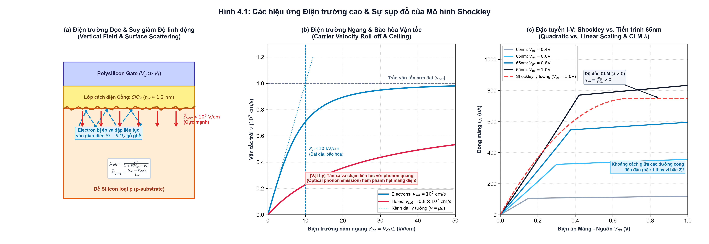
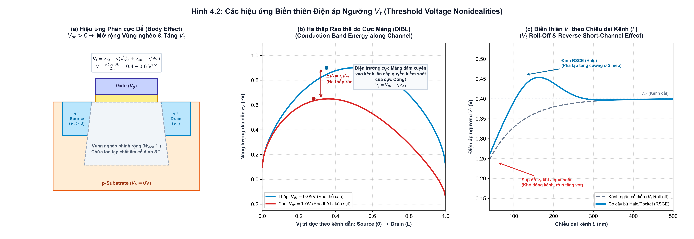
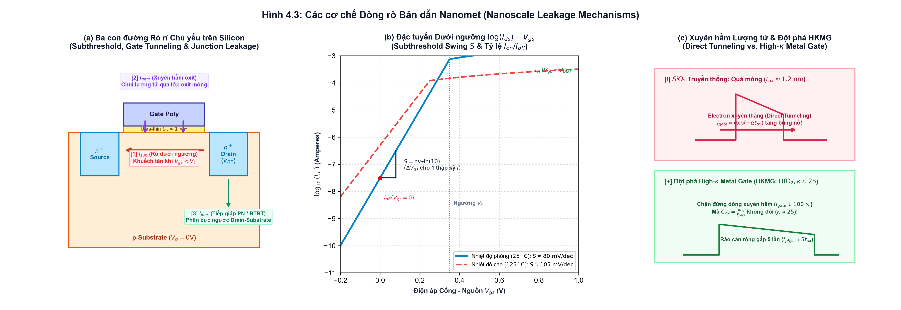
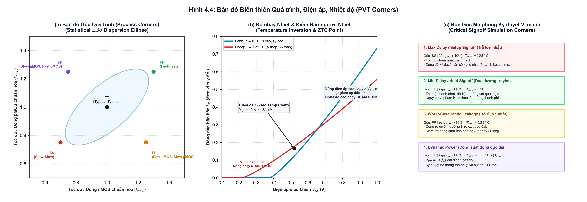

# Chương 4: Lý thuyết Transistor Phi Lý Tưởng (Nonideal Transistor Theory)

> **Phiên bản:** Kể chuyện Cơ chế Vật lý Vi mô & Dẫn dắt Động học Bán dẫn  
> **Đối tượng:** Sinh viên Thiết kế Vi mạch ĐH Công nghệ Thông tin (UIT)  
> **Thời gian học tập tối ưu:** 4 Giờ Trọng tâm  
> **Tài liệu đối chiếu:** `source/source_uit_vn/chapter4-nonideal.pdf` (Slides 1 – 26) & Giáo trình CMOS VLSI Design (Weste & Harris)  
> **Trục logic bất biến:** Khởi hành từ sự sụp đổ của mô hình lý tưởng Shockley trong kỷ nguyên nanomet, lần theo dấu vết các hiệu ứng điện trường cao (điện trường dọc làm suy giảm độ linh động, điện trường ngang bóp nghẽn trần vận tốc hạt), giải mã bản chất biến thiên khôn lường của điện áp ngưỡng $V_t$, bóc tách cơn ác mộng rò rỉ nano khi mạch ở trạng thái tắt, và làm chủ phương pháp luận góc mô phỏng PVT để ký duyệt vi mạch tin cậy.

---

## Lộ trình Học tập 4 Giờ Cốt lõi (4-Hour Study Roadmap)

| Thời gian | Nội dung Trọng tâm | Mục tiêu Bản chất Cần Đạt Được |
| :--- | :--- | :--- |
| **Giờ 1 (0h - 1h)** | Sự Sụp Đổ Shockley & Hiệu Ứng Điện Trường Cao | Hiểu vì sao quan hệ dòng điện bậc 2 $I_{ds} \propto (V_{gs}-V_t)^2$ sụp đổ; phân tích hiện tượng va đập mặt oxit gây suy giảm độ linh động ($\mu_{eff}$); giải mã cơ chế tán xạ phonon quang tạo trần bão hòa vận tốc $v_{sat}$; dẫn xuất biến điệu chiều dài kênh $\lambda$ (CLM). |
| **Giờ 2 (1h - 2h)** | Các Hiệu Ứng Biến Thiên Điện Áp Ngưỡng $V_t$ | Hiểu bản chất $V_t$ không bao giờ là hằng số tĩnh; giải mã cơ chế mở rộng vùng nghèo khi phân cực đế ($V_{sb} > 0$ - Body Effect); cơ chế cực máng đâm xuyên hạ thấp rào cản thế (DIBL); hiện tượng chia sẻ điện tích ($V_t$ Roll-off) và hiệu ứng kênh ngắn ngược (RSCE) do cấy Halo. |
| **Giờ 3 (2h - 3h)** | Cơn Ác Mộng Dòng Rò Nano & Độ Nhạy Nhiệt Độ | Phân tích 3 con đường rò rỉ ($I_{sub}, I_{gate}, I_{junc}$); nắm vững độ dốc dưới ngưỡng $S = n v_T \ln(10)$ và giới hạn nhiệt động lực học $60\text{ mV/dec}$; giải mã hiện tượng xuyên hầm lượng tử và đột phá HKMG; phân tích cuộc giằng co giữa $\mu(T)$ và $V_t(T)$ cùng hiện tượng đảo ngược nhiệt độ (Temperature Inversion). |
| **Giờ 4 (3h - 4h)** | Biến Thiên Quy Trình & Các Góc Mô Phỏng PVT | Nắm vững các nguồn biến thiên tham số ($L, t_{ox}, V_t$); cấu trúc 5 góc quy trình (TT, FF, SS, FS, SF); làm chủ 4 kịch bản mô phỏng then chốt để ký duyệt (Signoff) chip: Max Delay (Setup), Min Delay (Hold race), Worst-case Leakage và Dynamic Power. |

---

## 0. Bảng thuật ngữ cốt lõi & Phạm vi tài liệu

### 0.1 Bảng thuật ngữ đối chiếu (Glossary)

| Thuật ngữ Tiếng Anh | Thuật ngữ Tiếng Việt | Ý nghĩa vật lý & mạch điện |
| :--- | :--- | :--- |
| **High-Field Effects** | Các hiệu ứng điện trường cao | Hiện tượng phi tuyến tính xuất hiện khi điện trường dọc hoặc ngang vượt quá ngưỡng tới hạn trong transistor kích thước nhỏ. |
| **Mobility Degradation** | Suy giảm độ linh động | Hiện tượng điện trường dọc cực mạnh kéo các hạt dẫn ép chặt vào giao diện $Si-SiO_2$ gồ ghề, gây tán xạ va đập bề mặt và làm giảm độ linh động hiệu dụng $\mu_{eff}$. |
| **Velocity Saturation ($v_{sat}$)** | Bão hòa vận tốc | Vận tốc trôi của hạt dẫn chạm trần tối đa ($10^7\text{ cm/s}$ với electron) do phát xạ liên tục phonon quang vào mạng tinh thể dưới điện trường ngang lớn. |
| **Channel Length Modulation (CLM, $\lambda$)** | Biến điệu chiều dài kênh | Vùng nghèo cực máng mở rộng lấn vào kênh khi $V_{ds}$ tăng, rút ngắn chiều dài kênh hữu hiệu ($L_{eff} = L - L_d$) và tạo điện trở ra hữu hạn ($g_{ds} > 0$). |
| **Body Effect ($\gamma$)** | Hiệu ứng phân cực đế | Điện áp ngược giữa nguồn và đế ($V_{sb} > 0$) làm mở rộng vùng nghèo dưới cổng, buộc cực cổng phải đặt điện áp lớn hơn để đạt trạng thái đảo kênh (tăng $V_t$). |
| **Drain-Induced Barrier Lowering (DIBL, $\eta$)** | Hạ thấp rào thế do cực máng | Điện trường từ cực máng đâm xuyên vào lòng kênh, làm sụt giảm đỉnh rào cản thế năng tại cực nguồn và kéo giảm điện áp ngưỡng ($V_t' = V_{t0} - \eta V_{ds}$). |
| **Short-Channel Effect (SCE / $V_t$ Roll-off)** | Hiệu ứng kênh ngắn / Sụt giảm ngưỡng | Vùng nghèo nguồn và máng chia sẻ gánh bớt điện tích vùng nghèo trong kênh, làm điện áp ngưỡng $V_t$ suy giảm khi thu nhỏ chiều dài cổng $L$. |
| **Reverse Short-Channel Effect (RSCE)** | Hiệu ứng kênh ngắn ngược | Hiện tượng $V_t$ tăng nhẹ khi $L$ bắt đầu ngắn lại do nồng độ tạp chất pha tăng cường ở hai mép kênh (cấy Halo/Pocket) bắt đầu chồng lấn lên nhau. |
| **Subthreshold Leakage ($I_{sub}$)** | Dòng rò dưới ngưỡng | Dòng khuếch tán yếu chảy từ nguồn sang máng khi điện áp cổng nhỏ hơn điện áp ngưỡng ($V_{gs} < V_t$), phụ thuộc hàm mũ vào $V_{gs}$. |
| **Subthreshold Swing ($S$)** | Độ dốc dưới ngưỡng | Độ biến thiên điện áp cổng $\Delta V_{gs}$ cần thiết để thay đổi dòng rò dưới ngưỡng đi một thập kỷ ($10\times$), đơn vị $\text{mV/decade}$. |
| **Gate Tunneling ($I_{gate}$)** | Dòng rò xuyên hầm cực cổng | Hiện tượng electron hoặc lỗ trống chui qua hàng rào thế cách điện của lớp oxit cổng siêu mỏng theo cơ học lượng tử. |
| **High-$\kappa$ Metal Gate (HKMG)** | Cổng kim loại điện môi $\kappa$ cao | Công nghệ thay thế $SiO_2$ bằng chất điện môi có hằng số điện môi cao (như $\text{HfO}_2$), cho phép tăng bề dày vật lý để chặn dòng rò xuyên hầm. |
| **Band-to-Band Tunneling (BTBT)** | Xuyên hầm giữa các dải năng lượng | Hiện tượng electron chui thẳng từ dải hóa trị sang dải dẫn qua lớp tiếp giáp P-N bị phân cực ngược cực mạnh tại vùng pha tạp nồng độ cao (như mép Halo). |
| **Temperature Inversion (ZTC)** | Đảo ngược nhiệt độ / Hệ số nhiệt bằng 0 | Hiện tượng ở điện áp nguồn thấp, sự suy giảm $V_t$ do nhiệt độ lấn át sự suy giảm độ linh động $\mu$, khiến mạch hoạt động ở nhiệt độ cao chạy nhanh hơn ở nhiệt độ thấp. |
| **Process Corners (PVT)** | Các góc quy trình, điện áp, nhiệt độ | Kỹ thuật mô phỏng mạch ở các tổ hợp tham số cực biên xấu nhất (Fast, Typical, Slow) để đảm bảo chip sản xuất ra hoạt động đúng 100%. |

### 0.2 Phạm vi tài liệu & Mối nối tiếp chương trước
- **Kiến thức đã nắm vững từ Chương 3:** Tụ điện MOS, 3 chế độ (Accumulation, Depletion, Inversion), mô hình dòng điện kinh điển Shockley (Cutoff, Linear, Saturation), và bài toán định cỡ tỷ lệ $W_p / W_n \approx 2 - 3$.
- **Thách thức thực tế của Chương 4:** Tất cả các giả định lý tưởng của Shockley đều bị phá vỡ khi kích thước kênh $L \le 0.25\,\mu\text{m}$ và tiến sâu vào kỷ nguyên nanomet ($90\text{nm} \to 65\text{nm} \to 28\text{nm} \dots$). Transistor không còn là một chiếc công tắc hoàn hảo, không còn tuân theo quy luật bình phương, xuất hiện các dòng rò tĩnh hủy diệt, và biến thiên quy trình chế tạo đe dọa sự sống còn của toàn bộ vi mạch.

---

## 1. Giờ 1: Sự sụp đổ của Shockley & Các hiệu ứng Điện trường cao
*(Tương ứng Slides 3 – 10 trong `source/source_uit_vn/chapter4-nonideal.pdf` | Thời gian mục tiêu: 60 phút)*

### 1.1 Cú sốc thực tế: Mô hình Shockley lý tưởng vs Dữ liệu mô phỏng 65nm
Ở Chương 3, mô hình Shockley kênh dài đã xây dựng bức tranh toán học tuyệt đẹp:
$$\begin{cases} 
I_{ds} = 0 & \text{khi } V_{gs} < V_t \quad (\text{Vùng ngắt - Cutoff}) \\
I_{ds} = \beta \left[ (V_{gs} - V_t)V_{ds} - \frac{V_{ds}^2}{2} \right] & \text{khi } V_{ds} < V_{dsat} = V_{gs} - V_t \quad (\text{Vùng tuyến tính}) \\
I_{ds} = \frac{\beta}{2} (V_{gs} - V_t)^2 & \text{khi } V_{ds} \ge V_{dsat} \quad (\text{Vùng bão hòa})
\end{cases}$$

Nhưng khi các kỹ sư tiến trình 65nm (như tiến trình IBM 65nm với nguồn $V_{DD} = 1.0\text{V}$) đo đạc đặc tuyến thực tế, họ đối mặt với một cú sốc lớn:
1. **Dòng bão hòa thực tế nhỏ hơn rất nhiều so với lý thuyết Shockley:** Dòng dẫn cực đại thực tế $I_{on}$ chỉ đạt khoảng $747\,\mu\text{A}/\mu\text{m}$, trong khi công thức Shockley dự đoán dòng phải vượt trên $1500\,\mu\text{A}/\mu\text{m}$.
2. **Quan hệ bình phương bị bẻ gãy hoàn toàn:** Trong vùng bão hòa, khi ta tăng dần điện áp cổng $V_{gs}$ theo các bước đều đặn ($0.4\text{V} \to 0.6\text{V} \to 0.8\text{V} \to 1.0\text{V}$), khoảng cách giữa các đường cong $I_{ds} - V_{ds}$ thực tế không hề giãn nở theo quy luật bậc hai $(V_{gs} - V_t)^2$, mà lại **cách đều nhau một cách tuyến tính (bậc 1)**!
3. **Đặc tuyến bão hòa không hề nằm ngang:** Trong vùng bão hòa lý tưởng, dòng điện phải đứng yên tuyệt đối không đổi theo $V_{ds}$ ($g_{ds} = \partial I_{ds} / \partial V_{ds} = 0$). Nhưng trên silicon thực tế, dòng $I_{ds}$ vẫn tiếp tục dốc lên theo $V_{ds}$.

Nguyên nhân gốc rễ của những sai lệch này bắt nguồn từ sự xuất hiện của **các điện trường cực mạnh** bên trong lòng cấu trúc nano.

---

### 1.2 Bức tranh hai điện trường trong lòng Transistor vi mô
Khi thu nhỏ kích thước hình học của transistor từ mức micromet xuống nanomet mà điện áp nguồn $V_{DD}$ chỉ giảm khiêm tốn (để giữ biên độ tín hiệu và tốc độ chuyển mạch), cường độ điện trường bên trong silicon tăng vọt lên mức khủng khiếp:

1. **Điện trường Dọc ($\vec{\mathcal{E}}_{vert}$ - Vertical Electric Field):**
   - Được thiết lập bởi hiệu điện thế giữa cực Cổng và Kênh dẫn, xuyên qua lớp oxit mỏng $t_{ox}$:
     $$\mathcal{E}_{vert} = \frac{V_{gc}}{t_{ox}} = \frac{V_{gs} - V_{ds}/2}{t_{ox}}$$
   - Trong tiến trình $65\text{nm}$, với lớp oxit $t_{ox} \approx 1.2\text{ nm}$ và $V_{gs} = 1.0\text{V}$, điện trường dọc đạt tới:
     $$\mathcal{E}_{vert} \approx \frac{1.0\text{ V}}{1.2 \times 10^{-7}\text{ cm}} \approx 8.3 \times 10^6\text{ V/cm}$$
   - *Ý nghĩa vật lý:* Đây là một điện trường khổng lồ (gần chạm ngưỡng đánh thủng điện môi silicon). Nó đóng vai trò hút các hạt electron ép sát vào bề mặt lớp oxit.

2. **Điện trường Ngang ($\vec{\mathcal{E}}_{lat}$ - Lateral Electric Field):**
   - Được sinh ra bởi hiệu điện thế giữa cực Máng và cực Nguồn đặt dọc theo chiều dài kênh $L$:
     $$\mathcal{E}_{lat} = \frac{V_{ds}}{L}$$
   - Khi chiều dài cổng bị thu ngắn xuống $L = 65\text{nm} = 0.065\,\mu\text{m}$, với $V_{ds} = 1.0\text{V}$:
     $$\mathcal{E}_{lat} \approx \frac{1.0\text{ V}}{0.065 \times 10^{-4}\text{ cm}} \approx 1.5 \times 10^5\text{ V/cm} = 150\text{ kV/cm}$$
   - *Ý nghĩa vật lý:* Điện trường này đóng vai trò như một lực gia tốc cực mạnh đẩy các hạt electron phóng ngang từ Source về Drain.

Chính hai điện trường siêu lớn này đã kích hoạt hai hiện tượng vật lý phi tuyến tính làm vô hiệu hóa mô hình Shockley: **Suy giảm độ linh động** và **Bão hòa vận tốc**.

---

### 1.3 Suy giảm độ linh động (Mobility Degradation): Electron bị ép vào vách đá gồ ghề
Trong mô hình Shockley, độ linh động của hạt dẫn $\mu$ được coi là một hằng số vật liệu cố định ($\mu_n \approx 500 - 800\text{ cm}^2/\text{V}\cdot\text{s}$). Điều này chỉ đúng khi điện trường dọc rất nhỏ, các electron di chuyển êm ả trong lòng khối silicon tinh thể *(bulk silicon)*.

Tuy nhiên, như minh họa ở **Hình 4.1(a)**:
- Dưới tác dụng của điện trường dọc khổng lồ $\vec{\mathcal{E}}_{vert} > 10^6\text{ V/cm}$, các hạt electron không thể di chuyển sâu dưới đáy chất nền mà bị **lực Coulomb kéo ép dữ dội sát sạt vào mặt tiếp xúc giữa Silicon và lớp cách điện $SiO_2$**.
- Ở cấp độ nguyên tử, mặt phân cách giữa silicon đơn tinh thể và silicon dioxide vô định hình không hề bằng phẳng như gương soi. Nó gồ ghề lồi lõm với vô số liên kết nguyên tử dang dở *(dangling bonds)* và điện tích bẫy oxide.
- Khi các electron phóng ngang, chúng liên tục bị va đập, nảy bật hỗn loạn vào bức tường oxide gồ ghề này. Hiện tượng này gọi là **Tán xạ bề mặt gồ ghề (Surface Roughness Scattering)**.
- Kết quả là bước sóng tự do trung bình của electron bị rút ngắn đột ngột, độ linh động thực tế $\mu_{eff}$ bị rơi tự do!

**Mô hình toán học:**  
Độ linh động hiệu dụng $\mu_{eff}$ phụ thuộc nghịch đảo vào điện trường dọc thông qua điện áp cổng:
$$\mu_{eff} = \frac{\mu_0}{1 + \theta (V_{gs} - V_t)}$$
Trong đó:
- $\mu_0$ là độ linh động tại điện trường thấp (low-field mobility).
- $\theta$ là hệ số suy giảm độ linh động (thường nằm trong khoảng $0.1 - 0.4\text{ V}^{-1}$).

> **Hệ quả thực tế:** Càng đặt $V_{gs}$ cao với hy vọng mở rộng kênh dẫn thì electron lại càng bị ép dính chặt vào vách oxit, khiến độ linh động $\mu_{eff}$ tụt dốc thảm hại. Do đó, dòng dẫn thực tế không thể tăng vọt theo kỳ vọng!

---

### 1.4 Bão hòa vận tốc (Velocity Saturation): Trần tốc độ do tán xạ Phonon quang
Trong mô hình kênh dài lý tưởng, ta giả định vận tốc trôi của hạt mang điện tỉ lệ tuyến tính vô hạn với điện trường nằm ngang:
$$v = \mu \mathcal{E}_{lat} = \mu \frac{V_{ds}}{L}$$
Nếu công thức này tiếp tục đúng ở $L = 65\text{nm}$ với $\mathcal{E}_{lat} = 150\text{ kV/cm}$, vận tốc trôi của electron sẽ tính ra là $v = 400 \times 1.5 \times 10^5 = 6 \times 10^7\text{ cm/s}$!

Nhưng trong vật lý chất rắn, các hạt electron không chuyển động trong chân không:
- Khi điện trường ngang $\mathcal{E}_{lat}$ vượt qua một ngưỡng tới hạn gọi là **Điện trường tới hạn ($\mathcal{E}_c \approx 10\text{ kV/cm}$ với electron và $\approx 25\text{ kV/cm}$ với lỗ trống)**, động năng của hạt electron tích lũy được trên mỗi bước chuyển động trở nên cực kỳ lớn (vượt quá năng lượng phonon quang $E_{phonon} \approx 63\text{ meV}$).
- Mỗi khi va chạm với các nguyên tử silicon trong mạng tinh thể, thay vì chỉ bị nảy bật đàn hồi, electron sẽ **phát xạ một lượng tử dao động mạng (optical phonon emission)**. Toàn bộ động năng dư thừa bị truyền thẳng vào mạng tinh thể silicon dưới dạng nhiệt!
- Electron lập tức bị mất tốc độ và phải tăng tốc lại từ đầu. Sự phát xạ phonon quang liên tục này hoạt động hệt như một chiếc phanh ma sát hãm cứng vận tốc của electron lại.

Nhìn vào **Hình 4.1(b)**, vận tốc trôi của hạt dẫn chạm trần tối đa gọi là **Vận tốc bão hòa ($v_{sat}$)**:
- **Electron:** $v_{sat,n} \approx 10^7\text{ cm/s} = 10^5\text{ m/s}$.
- **Lỗ trống:** $v_{sat,p} \approx 8 \times 10^6\text{ cm/s} = 0.8 \times 10^7\text{ cm/s}$.

**Mô hình vận tốc hạt dẫn:**
$$v = \frac{\mu_{eff} \mathcal{E}_{lat}}{\left[ 1 + \left( \frac{\mathcal{E}_{lat}}{\mathcal{E}_c} \right)^\alpha \right]^{1/\alpha}} \xrightarrow{\mathcal{E}_{lat} \gg \mathcal{E}_c} v_{sat}$$
*(với $\alpha = 2$ cho electron và $\alpha = 1$ cho lỗ trống).*

#### Hệ quả sống còn 1: Dòng bão hòa chuyển từ Bậc 2 sang Bậc 1
Khi hạt dẫn đạt vận tốc bão hòa $v_{sat}$, dòng điện chạy qua kênh được tính đơn giản bằng tích của mật độ điện tích lớp đảo $Q_{inv}$ và vận tốc trần $v_{sat}$:
$$I_{dsat} = W \cdot Q_{inv} \cdot v_{sat} = W \cdot C_{ox} (V_{gs} - V_t - V_{dsat}) \cdot v_{sat}$$

Vì $v_{sat}$ là một hằng số cố định, dòng điện $I_{dsat}$ bây giờ **tỉ lệ tuyến tính bậc 1 với $(V_{gs} - V_t)$**, hoàn toàn không còn số mũ bình phương $(V_{gs} - V_t)^2$ của Shockley nữa!
Điều này lý giải trọn vẹn vì sao trên **Hình 4.1(c)**, các đường cong $I_{ds}$ của tiến trình 65nm lại cách đều nhau theo các bước tăng của $V_{gs}$.

#### Hệ quả sống còn 2: Transistor bị bão hòa sớm hơn rất nhiều
Trong Shockley kênh dài, transistor chỉ bão hòa khi xảy ra hiện tượng thắt kênh tại Drain, tức là tại mốc:
$$V_{dsat,long} = V_{gs} - V_t$$

Nhưng ở kênh ngắn nanomet, các hạt electron bị chạm trần vận tốc $v_{sat}$ tại đầu Drain rất lâu trước khi kênh kịp thắt lại! Điện áp bão hòa thực tế $V_{dsat}$ trở thành:
$$V_{dsat} = (V_{gs} - V_t) \parallel (\mathcal{E}_c L) = \frac{(V_{gs} - V_t) \cdot (\mathcal{E}_c L)}{(V_{gs} - V_t) + \mathcal{E}_c L} < V_{gs} - V_t$$
Ví dụ với $V_{gs} - V_t = 0.7\text{V}$ và $\mathcal{E}_c L \approx 0.1\text{V}$ ở kênh ngắn, điện áp bão hòa chỉ là $V_{dsat} \approx 0.088\text{V}$! Transistor chuyển sang chế độ bão hòa gần như ngay lập tức khi $V_{ds}$ vừa nhích lên khỏi $0\text{V}$.

---

### 1.5 Biến điệu chiều dài kênh (Channel Length Modulation - CLM)
Một đặc tính phi lý tưởng thứ ba của vùng bão hòa được minh họa ở nửa bên phải **Hình 4.1(c)**: các đường cong $I_{ds}$ không nằm ngang phẳng lì mà dốc lên với một góc nghiêng nhất định.

**Cơ chế vật lý vi mô:**
1. Cực Drain pha tạp $n^+$ nối với điện thế cao $V_{ds}$, còn đế Substrate pha tạp p nối đất ($0\text{V}$). Tiếp giáp P-N giữa Drain và Substrate luôn bị **phân cực ngược**.
2. Phân cực ngược tạo ra một vùng nghèo *(depletion region)* bao quanh cực Drain, với độ rộng $L_d$ tỉ lệ với $\sqrt{V_{ds}}$:
   $$L_d \propto \sqrt{V_{ds} - V_{dsat}}$$
3. Vùng nghèo này lấn sâu ngược vào trong kênh dẫn silicon. Các electron khi đi hết kênh dẫn hữu hiệu sẽ bị điện trường của vùng nghèo cuốn phăng về phía cực Drain.
4. Chiều dài kênh dẫn thực sự có hạt mang điện bị co ngắn lại:
   $$L_{eff} = L - L_d$$
5. Vì điện trở của kênh tỉ lệ thuận với chiều dài kênh ($R \propto L_{eff}$), khi $V_{ds}$ càng tăng cao, $L_{d}$ càng phình to $\implies L_{eff}$ càng ngắn lại $\implies$ nội trở kênh giảm $\implies$ **Dòng điện $I_{ds}$ tiếp tục tăng lên ngay trong vùng bão hòa!**

**Phương trình toán học:**
$$I_{ds} = I_{dsat} \cdot (1 + \lambda V_{ds})$$
Trong đó:
- $\lambda$ là **Hệ số biến điệu chiều dài kênh (Channel Length Modulation Coefficient)**, đơn vị $\text{V}^{-1}$.
- Vì $\Delta L / L = L_d / L$, giá trị $\lambda$ tỉ lệ nghịch với chiều dài kênh:
  $$\lambda \propto \frac{1}{L}$$
  *Kênh càng ngắn, tỷ lệ phần trăm kênh bị vùng nghèo chiếm đóng càng lớn, $\lambda$ càng to, độ dốc đặc tuyến càng dốc đứng!*

> **Hệ quả mạch điện:**  
> Độ dốc khác 0 này sinh ra **Điện dẫn ngõ ra hữu hạn $g_{ds}$**:
> $$g_{ds} = \frac{\partial I_{ds}}{\partial V_{ds}} \approx \lambda I_{dsat} = \frac{1}{r_o}$$
> Điện trở ngõ ra $r_o$ của transistor bị giảm mạnh, làm suy giảm nghiêm trọng độ khuếch đại điện áp của các tầng khuếch đại vi sai và cổng logic tương tự: $A_v = -g_m \cdot r_o = -\frac{g_m}{g_{ds}}$.

---

## 2. Giờ 2: Các hiệu ứng Biến thiên Điện áp Ngưỡng $V_t$
*(Tương ứng Slides 11 – 15 trong `source/source_uit_vn/chapter4-nonideal.pdf` | Thời gian mục tiêu: 60 phút)*

### 2.1 Bản chất động của Điện áp Ngưỡng $V_t$
Trong các phân tích sơ cấp, chúng ta thường coi $V_t$ như một hằng số cố định bất biến do nhà máy bán dẫn quy định (ví dụ $V_{tn} = 0.3\text{V}$, $V_{tp} = -0.3\text{V}$).

Nhưng trên thực tế, $V_t$ là mức điện áp cổng tối thiểu cần thiết để uốn cong dải năng lượng của silicon bề mặt đạt tới điện thế đảo kênh ($\phi_s = 2 \phi_F$). Khi hình học và điện thế các cực thay đổi, sự cân bằng tĩnh điện này bị phá vỡ. $V_t$ thực tế phụ thuộc mật thiết vào:
1. **Điện áp cực Đế ($V_{sb}$):** Hiệu ứng phân cực đế (Body Effect).
2. **Điện áp cực Máng ($V_{ds}$):** Hạ thấp rào thế do cực máng (DIBL).
3. **Chiều dài kênh ($L$):** Hiệu ứng kênh ngắn (Short-Channel Effect & Charge Sharing).

---

### 2.2 Hiệu ứng Đế (Body Effect): Chiếc phanh hãm tĩnh điện của Cực thứ tư
Trong hầu hết các cổng logic đơn giản, cực Source của nMOS được hàn trực tiếp vào đất ($V_s = 0\text{V}$), nên hiệu điện thế Nguồn - Đế bằng 0 ($V_{sb} = V_s - V_b = 0\text{V}$).

Tuy nhiên, trong các cấu trúc vi mạch phức tạp hơn, cực Source thường bị nhấc bổng lên một điện thế dương ($V_s > 0\text{V}$), ví dụ:
- Cổng truyền Pass Transistor khi đang nạp mức 1 lên ngõ ra.
- Transistor nMOS nằm ở tầng trên cùng của một chuỗi logic nối tiếp (NAND stack).

Khi đó, tiếp giáp P-N giữa cực Source ($n^+$) và cực Substrate ($p$) bị **phân cực ngược với điện thế $V_{sb} > 0$**.

#### Cơ chế vật lý vi mô:
Hãy quan sát **Hình 4.2(a)**:
1. Trước khi các electron có thể tụ tập dưới bề mặt oxit để hình thành lớp đảo kênh, điện trường cực cổng phải làm nhiệm vụ quét sạch toàn bộ các lỗ trống tự do xuống đáy, để lại một **Vùng nghèo (Depletion Region)** chứa đầy các ion tạp chất Boron âm cố định ($B^-$).
2. Khi cực Source bị kéo lên điện thế dương $V_s > 0$ so với Substrate ($V_b = 0$), tiếp giáp P-N giữa Source và Body bị phân cực ngược. Lực hút tĩnh điện từ cực Source kéo các electron ra xa, đồng thời hút các ion âm lộ ra nhiều hơn.
3. Chiều sâu vùng nghèo dưới lớp oxit cổng bị **phình to ra** ($W_{dep} \uparrow$):
   $$W_{dep} = \sqrt{\frac{2 \epsilon_{si} (\phi_s + V_{sb})}{q N_A}}$$
4. Một vùng nghèo rộng hơn đồng nghĩa với việc có nhiều ion tạp chất âm $B^-$ bị giam cầm trong khối silicon hơn. Tổng điện tích âm vùng nghèo $Q_{dep}$ tăng lên đáng kể.
5. Cực Cổng (Gate) muốn đạt tới trạng thái đảo kênh bây giờ phải gánh thêm một nhiệm vụ nặng nề: nó phải cung cấp thêm điện tích dương để trung hòa lượng ion tạp chất âm khổng lồ này trong vùng nghèo trước khi có thể hút electron tạo kênh!
6. Do đó, điện áp cực cổng cần thiết để bật transistor bị đẩy lên cao hơn nhiều $\implies$ **$V_t$ tăng vọt!**

#### Công thức toán học kinh điển:
$$V_t = V_{t0} + \gamma \left( \sqrt{\phi_s + V_{sb}} - \sqrt{\phi_s} \right)$$
Trong đó:
- $V_{t0}$ là điện áp ngưỡng khi $V_{sb} = 0\text{V}$.
- $\phi_s = 2 \phi_F = 2 v_T \ln\left(\frac{N_A}{n_i}\right)$ là thế bề mặt khi bắt đầu đảo kênh (thường $\approx 0.6 - 0.7\text{V}$).
- $\gamma$ là **Hệ số hiệu ứng đế (Body Effect Coefficient)**, phản ánh mức độ nhạy cảm của $V_t$ với $V_{sb}$:
  $$\gamma = \frac{\sqrt{2 q \epsilon_{si} N_A}}{C_{ox}} = \frac{t_{ox}}{\epsilon_{ox}} \sqrt{2 q \epsilon_{si} N_A}$$
  *(Với công nghệ CMOS tiêu chuẩn, $\gamma$ thường dao động trong khoảng $0.4 - 0.6\text{ V}^{1/2}$).*

**Xấp xỉ tuyến tính cho tín hiệu nhỏ:**  
Khi $V_{sb}$ nhỏ, ta có thể dùng mô hình xấp xỉ tuyến tính thuận tiện:
$$V_t \approx V_{t0} + k_\gamma V_{sb}$$
*(với $k_\gamma \approx \frac{\gamma}{2\sqrt{\phi_s}} \approx 0.1 - 0.3$).*

> **Tác động chí mạng lên mạch số:**  
> Trong cổng NAND 4 ngõ vào có 4 nMOS mắc nối tiếp nhau. Transistor trên cùng sát ngõ ra có cực Source bị kênh bởi 3 nMOS bên dưới ($V_s \approx 0.6\text{V}$). Do hiệu ứng Body Effect, điện áp ngưỡng của nó bị đội từ $0.3\text{V}$ lên tới hơn $0.5\text{V}$! Dòng xả qua nhánh này bị sụt giảm nghiêm trọng, khiến thời gian trễ của chuỗi NAND dài ra khủng khiếp.

---

### 2.3 Hạ thấp rào thế do cực Máng (DIBL - Drain-Induced Barrier Lowering)
Trong transistor kênh dài ($L > 1\,\mu\text{m}$), khoảng cách giữa Source và Drain rất lớn. Cực Máng ở quá xa nên điện trường của nó không thể can thiệp vào hàng rào thế năng nằm ở đầu Source. Cực Cổng độc quyền nắm giữ quyền sinh sát điều khiển dòng điện.

Tuy nhiên, khi chiều dài kênh $L$ bị co ngắn xuống dưới $100\text{nm}$, khoảng cách hình học giữa Drain và Source bị thu hẹp đáng kể.

#### Cơ chế vi mô (Biểu đồ Dải năng lượng dải dẫn $E_c$):
Nhìn vào **Hình 4.2(b)**:
1. Khi transistor ở trạng thái tắt ($V_{gs} = 0\text{V}$), giữa cực Source và kênh dẫn tồn tại một hàng rào thế năng tĩnh điện tự nhiên $q\phi_B$. Các hạt electron bên trong cực Source không đủ năng lượng nhiệt để vượt qua rào cản này sang Drain.
2. Khi ta đặt một điện áp máng rất cao ($V_{ds} = V_{DD} = 1.0\text{V}$), cực Drain tích một lượng điện tích dương lớn, tạo ra một điện trường nằm ngang hướng thẳng về phía Source.
3. Vì kênh quá ngắn, các đường sức điện trường từ cực Drain đâm xuyên sâu qua lớp silicon, thấu tận vào vùng giáp ranh của cực Source!
4. Điện trường cực máng này đã hỗ trợ cực cổng, bẻ cong dải năng lượng dải dẫn $E_c$ và **kéo tụt đỉnh của hàng rào thế năng xuống một đoạn $\Delta V = \eta V_{ds}$**.
5. Đỉnh rào cản thế bị hạ thấp đồng nghĩa với việc cực Cổng không cần phải cấp điện áp quá cao để cho phép electron tràn qua $\implies$ **Điện áp ngưỡng $V_t$ bị sụt giảm!** Hiện tượng này được gọi là **Hạ thấp rào thế do cực Máng (DIBL)**.

**Mô hình toán học:**
$$V_t' = V_{t0} - \eta V_{ds}$$
Trong đó:
- $\eta$ là hệ số DIBL (DIBL parameter), đơn vị $\text{V/V}$ hoặc $\text{mV/V}$.
- Trong các tiến trình nanomet hiện đại, $\eta$ thường nằm trong khoảng $0.05 - 0.15\text{ V/V}$ ($50 - 150\text{ mV/V}$).

> **Hệ quả nguy hiểm của DIBL:**  
> Khi ngõ ra của một cổng đảo ở mức cao ($V_{out} = V_{ds} = 1.0\text{V}$) trong khi ngõ vào ở mức thấp ($V_{in} = V_{gs} = 0\text{V}$, transistor nMOS đang tắt):  
> DIBL làm $V_t$ sụt giảm đi một lượng:
> $$\Delta V_t = 0.10 \times 1.0\text{ V} = 100\text{ mV}$$
> Việc $V_t$ bị kéo tụt xuống $100\text{mV}$ khi transistor đang cố gắng tắt sẽ làm cho dòng rò dưới ngưỡng bùng nổ theo hàm mũ, gây tổn thất công suất tĩnh khổng lồ!

---

### 2.4 Hiệu ứng Kênh ngắn & Hiện tượng Chia sẻ Điện tích (Short-Channel Effect & Charge Sharing)
Một câu hỏi lớn trong thiết kế vi mạch: *Nếu ta giữ nguyên điện áp các cực ($V_{sb}=0, V_{ds}=0$) nhưng chỉ đơn thuần thay đổi kích thước vẽ của chiều dài cổng $L$, thì $V_t$ có bị biến đổi không?*

Câu trả lời là **CÓ: $V_t$ bị sụt giảm khi $L$ co ngắn lại ($V_t$ Roll-off)**.

#### Mô hình chia sẻ điện tích hình thang (Yau's Charge-Sharing Model):
Hãy quan sát cơ chế chia sẻ không gian:
1. Khi transistor dẫn điện, vùng nghèo nằm dưới cổng có dạng một khối hộp với chiều dài $L$ và chiều sâu $W_{dep}$.
2. Tuy nhiên, hai tiếp giáp P-N của cực Source và cực Drain tự thân chúng đã có vùng nghèo nội tại (do điện thế khuếch tán tiếp xúc $V_{bi}$). Vùng nghèo của Source và Drain lan tỏa theo dạng hình quạt tròn vào hai đầu của kênh dẫn.
3. Như vậy, một phần các ion tạp chất âm $B^-$ nằm ở hai rìa kênh dẫn đã được **chia sẻ và đỡ tải bởi điện trường của cực Source và Drain**, chứ không cần đến điện trường của cực Cổng!
4. Cực Cổng bây giờ chỉ cần chịu trách nhiệm cho phần điện tích nằm trong **hình thang ở trung tâm** (thay vì toàn bộ hình chữ nhật như ở kênh dài).
5. Khi $L$ lớn ($L > 1\,\mu\text{m}$), phần diện tích hình quạt của Source/Drain chiếm tỷ lệ không đáng kể so với chiều dài kênh. Nhưng khi $L$ co ngắn lại chỉ còn vài chục nanomet, hai vùng nghèo Source và Drain chiếm gần trọn chiều dài kênh dẫn!
6. Lượng điện tích mà cực Cổng phải nâng đỡ giảm đi đáng kể, làm cho điện áp cổng cần thiết để bật transistor giảm xuống $\implies$ **$V_t$ suy giảm khi $L$ giảm ($V_t$ Roll-off)** (xem đường nét đứt xám ở **Hình 4.2(c)**).

---

### 2.5 Hiệu ứng Kênh ngắn Ngược (RSCE) do cấy bù Halo/Pocket
Hiện tượng $V_t$ Roll-off khiến transistor kênh ngắn rất khó khóa chặt (khi $L$ bị biến thiên sản xuất hơi ngắn lại, $V_t$ tụt sâu gây rò rỉ bùng nổ hoặc dẫn tới hiện tượng đấm xuyên *Punchthrough* làm hỏng linh kiện).

Để chống lại hiện tượng này, các nhà luyện kim bán dẫn đã nghĩ ra một giải pháp kỹ thuật tinh vi: **Cấy ion tạp chất cục bộ Halo (Halo / Pocket Implants)**:
- Người ta dùng chùm tia ion bắn nghiêng để cấy thêm một nồng độ tạp chất p rất cao cục bộ ngay sát hai góc mép Source và Drain của nMOS.
- Khi kênh còn dài, hai vùng Halo nằm tách biệt ở hai đầu xa nhau, vùng giữa kênh vẫn có nồng độ tạp chất thấp bình thường.
- Nhưng khi chiều dài kênh $L$ bị thu ngắn lại tới một khoảng cách nhất định (khoảng $100 - 200\text{nm}$), **hai vùng pha tạp cao Halo ở hai mép bắt đầu tiến sát lại và chồng lấn lên nhau!**
- Nồng độ tạp chất p trung bình bên trong kênh dẫn tự nhiên bị đội lên cao hơn rất nhiều. Mà theo công thức vật lý, nồng độ tạp chất $N_A$ tăng sẽ làm tăng thế bề mặt $\phi_s$ và hệ số $\gamma$, dẫn tới **tăng điện áp ngưỡng $V_t$**!
- Hiện tượng $V_t$ tăng lên khi $L$ ngắn lại được gọi là **Hiệu ứng kênh ngắn ngược (Reverse Short-Channel Effect - RSCE)**, tạo ra một đỉnh lồi nhô lên rõ rệt trên đường cong màu xanh ở **Hình 4.2(c)** trước khi rơi dốc ở kênh siêu ngắn.

---

## 3. Giờ 3: Cơn ác mộng Dòng rò Nano & Độ nhạy Nhiệt độ
*(Tương ứng Slides 16 – 22 trong `source/source_uit_vn/chapter4-nonideal.pdf` | Thời gian mục tiêu: 60 phút)*

### 3.1 Dòng tắt $I_{off} \neq 0$: Nỗi ám ảnh tĩnh học của Vi mạch Hiện đại
Trong thời kỳ công nghệ vi-mốt micromet, một chip chứa 100.000 transistor khi ở chế độ nghỉ (Standby/Sleep mode) hầu như không tiêu thụ điện năng ($P_{static} \approx 0$). Kỹ sư chỉ cần tập trung tối ưu công suất chuyển mạch động ($P_{dynamic} = C V_{DD}^2 f$).

Tuy nhiên, trong các vi xử lý hiện đại (Apple M-series, Intel Core, AMD Ryzen hay chip AI Nvidia) chứa từ **10 tỷ đến 100 tỷ transistor**:
- Nếu mỗi transistor bị rò rỉ một lượng dòng cực nhỏ chỉ $10\text{ nA}$ khi đang TẮT ($V_{gs} = 0\text{V}$), thì tổng dòng rò tĩnh của toàn bộ con chip sẽ là:
  $$I_{leak,total} = 10^{10} \times 10\text{ nA} = 100\text{ Amperes}!$$
- Với nguồn cấp $V_{DD} = 1.0\text{V}$, con chip sẽ tiêu tán công suất tĩnh lên tới **$100\text{ Watts}$** ngay cả khi không thực hiện bất kỳ phép tính nào! Toàn bộ năng lượng pin của điện thoại thông minh sẽ bốc hơi chỉ sau vài phút nằm trong túi quần.

Để kiểm soát thảm họa này, chúng ta phải phẫu thuật tận gốc **3 con đường rò rỉ chủ yếu trên phiến silicon** như minh họa ở **Hình 4.3(a)**.

---

### 3.2 Dòng rò Dưới ngưỡng (Subthreshold Leakage): Cơ chế Khuếch tán & Giới hạn Nhiệt động lực học

#### Bản chất vật lý vi mô:
Nhiều sinh viên lầm tưởng rằng khi $V_{gs} < V_t$, số lượng hạt electron dưới lớp oxit cổng bằng 0 tuyệt đối. Điều này hoàn toàn sai lầm!
- Khi $V_{gs} < V_t$, mật độ electron ở bề mặt tuy không đủ dày để tạo thành lớp đảo mạnh (inversion), nhưng chúng vẫn tồn tại dưới dạng **các hạt mang điện thiểu số tuân theo phân bố thống kê Boltzmann**.
- Giữa cực Source ($n^+$, mật độ electron cực cao) và kênh dẫn dưới cổng (mật độ electron thấp) xuất hiện một sự chênh lệch gradient nồng độ hạt khổng lồ.
- Các electron có động năng nhiệt cao nhất trong đuôi phân bố Boltzmann sẽ vượt qua rào thế năng $q\phi_B$ và **khuếch tán (diffusion)** từ Source tràn sang Drain, tạo thành một dòng điện yếu.
- *Lưu ý quan trọng:* Transistor lúc này hoạt động hệt như một transistor lưỡng cực BJT (với Source là Emitter, Substrate là Base, và Drain là Collector)!

#### Phương trình dòng dưới ngưỡng:
$$I_{sub} = I_0 \cdot \exp\left( \frac{V_{gs} - V_{t0} + \eta V_{ds} - k_\gamma V_{sb}}{n v_T} \right) \cdot \left( 1 - \exp\left( -\frac{V_{ds}}{v_T} \right) \right)$$
Trong đó:
- $v_T = \frac{k_B T}{q}$ là thế nhiệt ($v_T \approx 25.9\text{ mV}$ ở $300\text{K}$).
- $n = 1 + \frac{C_{dep}}{C_{ox}}$ là **Hệ số phân áp tụ điện dưới ngưỡng** (thường dao động trong khoảng $1.3 - 1.7$).
- $I_0 = \mu_0 C_{ox} \frac{W}{L} (n - 1) v_T^2$ là dòng chuẩn công nghệ.
- Số hạng $(1 - e^{-V_{ds}/v_T})$ nhanh chóng bão hòa về 1 ngay khi $V_{ds} > 3 v_T \approx 0.1\text{V}$.

#### Độ dốc dưới ngưỡng (Subthreshold Swing - $S$):
Nhìn vào đồ thị bán logarit $\log_{10}(I_{ds}) - V_{gs}$ ở **Hình 4.3(b)**:
Trong vùng dưới ngưỡng ($V_{gs} < V_t$), đường đặc tuyến là một đường thẳng dốc đứng. Độ dốc này được đo bằng thông số **Subthreshold Swing ($S$)** — định nghĩa là *số milivolt điện áp cổng cần thay đổi để dòng rò $I_{ds}$ tăng hoặc giảm đúng một bậc thập phân ($10\times$)*:
$$S = \left[ \frac{\partial (\log_{10} I_{ds})}{\partial V_{gs}} \right]^{-1} = \ln(10) \cdot n v_T = 2.303 \cdot \frac{k_B T}{q} \left( 1 + \frac{C_{dep}}{C_{ox}} \right)$$

- Ở nhiệt độ phòng ($T = 300\text{K}$), với $n \approx 1.3 - 1.5$:
  $$S \approx 2.303 \times 26\text{ mV} \times 1.4 \approx 80 - 100\text{ mV/decade}$$
- **Giới hạn nhiệt động lực học không thể phá vỡ:** Ngay cả trong trường hợp tụ điện hoàn hảo nhất ($C_{ox} \to \infty \implies n = 1$), ta vẫn có:
  $$S_{ideal} = \ln(10) \times \frac{k_B T}{q} \approx 60\text{ mV/decade (ở 300K)}$$

> **Ý nghĩa thực tế cho Kỹ sư Thiết kế Vi mạch:**  
> Không thể tắt một transistor CMOS nhanh hơn $60\text{ mV}$ cho mỗi lần giảm dòng $10\times$!  
> Nếu bạn muốn tỷ số dòng bật trên dòng tắt đạt chuẩn công nghiệp:
> $$\frac{I_{on}}{I_{off}} \ge 10^6 \quad (6 \text{ bậc thập phân})$$
> Thì điện áp ngưỡng $V_t$ tối thiểu phải được giữ ở mức:
> $$V_t \ge 6 \times S \approx 6 \times 80\text{ mV} = 0.48\text{ V}!$$
> Nếu kỹ sư cố tình hạ $V_t$ xuống $0.2\text{V}$ để chip chạy nhanh hơn ở điện áp thấp, dòng rò $I_{off}$ sẽ tăng vọt thêm $10^{(0.48 - 0.2)/0.08} \approx 3.000$ lần!

---

### 3.3 Dòng rò Xuyên hầm qua Điện môi Cổng (Gate Leakage)

#### Bản chất cơ học lượng tử:
Trong các tiến trình cổ điển ($t_{ox} > 2\text{ nm}$), lớp oxit silicon $SiO_2$ là chất cách điện hoàn hảo với điện trở vô cùng lớn ($I_{gate} \approx 0$).

Tuy nhiên, khi thu nhỏ tiến trình xuống $65\text{nm}$ và $45\text{nm}$, để duy trì lực hút điện trường dọc kiểm soát kênh dẫn, các kỹ sư buộc phải mài mỏng lớp oxit cổng xuống chỉ còn $t_{ox} \approx 1.0 - 1.2\text{ nm}$.
- Một khoảng cách $1.2\text{ nm}$ chỉ tương đương với **bề dày của khoảng 4 đến 5 lớp nguyên tử silicon**!
- Theo cơ học lượng tử, electron có tính chất sóng. Khi hàm sóng của electron va vào một hàng rào thế năng có bề dày vật lý siêu mỏng như vậy, biên độ hàm sóng không bị triệt tiêu hoàn toàn mà vẫn có một đuôi xác suất hữu hạn ló ra ở bờ bên kia.
- Các electron có thể "chui hầm" trực tiếp xuyên qua lớp oxit cách điện sang chất nền và các cực khuếch tán, tạo thành **Dòng rò xuyên hầm cực cổng ($I_{gate}$)**.

#### Hai cơ chế xuyên hầm chính:
1. **Xuyên hầm trực tiếp (Direct Tunneling):** Xảy ra khi điện áp đặt lên cổng nhỏ hơn chiều cao rào thế ($V_{ox} < \Phi_{ox}$). Hàng rào thế có dạng hình thang. Electron chui thẳng từ dải dẫn của polysilicon sang dải dẫn của silicon. Đây là cơ chế rò rỉ áp đảo ở các tiến trình nano.
2. **Xuyên hầm Fowler-Nordheim (FN Tunneling):** Xảy ra dưới điện trường cực mạnh ($V_{ox} > \Phi_{ox}$), dải năng lượng bị bẻ cong thành một rào thế hình tam giác nhọn hoắt.

**Độ nhạy cấp số nhân:**
$$I_{gate} \approx A \cdot \left( \frac{V_{DD}}{t_{ox}} \right)^2 \exp\left( -B \frac{t_{ox}}{V_{DD}} \right)$$
- Cứ mỗi khi bào mỏng lớp oxit đi **$0.2\text{ nm}$ (chưa bằng 1 lớp nguyên tử)**, dòng rò cực cổng lại **tăng bọt lên gấp 10 lần**!

#### Vì sao cổng nMOS rò nặng hơn pMOS?
Dòng rò xuyên hầm qua cổng của nMOS luôn lớn hơn pMOS từ **$10$ đến $100$ lần** vì hai lý do vật lý:
1. Hạt dẫn trong nMOS là electron, có khối lượng hiệu dụng nhỏ hơn hạt lỗ trống ($m_e^* < m_h^*$), giúp sóng electron dễ chui hầm hơn.
2. Rào cản thế năng dải dẫn giữa $Si$ và $SiO_2$ đối với electron chỉ là $\Delta E_C = 3.15\text{ eV}$, trong khi rào cản dải hóa trị đối với lỗ trống lên tới $\Delta E_V = 4.5\text{ eV}$ (rào cản đối với lỗ trống cao hơn nhiều).

#### Lời giải cứu cánh: Đột phá High-$\kappa$ Metal Gate (HKMG)
Như minh họa ở **Hình 4.3(c)**, ngành công nghiệp bán dẫn từng đứng trước nguy cơ dừng bước tại tiến trình $45\text{nm}$ do rò rỉ oxit cổng. Giải pháp mang tính cách mạng do Intel giới thiệu năm 2007 là **Công nghệ Cổng kim loại Điện môi High-$\kappa$ (HKMG)**:
- Người ta vứt bỏ $SiO_2$ truyền thống ($\kappa = 3.9$) và thay thế bằng vật liệu mới là **Hafnium Dioxide ($\text{HfO}_2$) có hằng số điện môi cực cao ($\kappa \approx 20 - 25$)**.
- Nhờ công thức điện dung $C_{ox} = \frac{\kappa \epsilon_0}{t_{phys}}$, khi $\kappa$ tăng gấp 5 lần, các kỹ sư có thể **tăng bề dày vật lý của lớp cách điện lên gấp 5 lần ($t_{phys} \approx 5 - 6\text{ nm}$)** mà vẫn giữ nguyên được điện dung tương đương ($EOT \approx 1\text{ nm}$)!
- Hàng rào thế năng vật lý dày $6\text{ nm}$ đã chặn đứng hoàn toàn sóng lượng tử của electron, dập tắt dòng rò xuyên hầm cổng giảm hơn **100 lần**!

---

### 3.4 Dòng rò Tiếp giáp P-N (Junction Leakage) & Xuyên hầm Giữa các dải (BTBT)
Con đường rò rỉ thứ ba xảy ra tại các tiếp giáp P-N bị phân cực ngược giữa các vùng khuếch tán $n^+$ (Source/Drain) và chất nền $p$ (Substrate) hoặc giếng N-well:

1. **Dòng trôi nhiệt đảo chiều (Thermal Generation Current):** Do sự sinh cặp electron-lỗ trống tự phát do dao động nhiệt bên trong vùng nghèo của tiếp giáp P-N:
   $$I_D = I_s \left( e^{V_D / v_T} - 1 \right) \xrightarrow{V_D \ll -v_T} -I_s$$
   Ở nhiệt độ phòng, dòng này rất nhỏ ($< 1\text{ fA}/\mu\text{m}^2$).
2. **Xuyên hầm giữa các dải năng lượng (Band-to-Band Tunneling - BTBT):**
   - Trong các transistor nanomet, để chống lại hiệu ứng kênh ngắn, người ta phải tăng nồng độ pha tạp ở vùng chất nền và cấy Halo cực kỳ đậm đặc ($> 10^{18}\text{ cm}^{-3}$).
   - Nồng độ tạp chất quá cao làm cho bề rộng vùng nghèo của tiếp giáp P-N tại mép Source/Drain bị ép mỏng lại chỉ còn dưới vài nanomet, đồng thời làm dải dẫn $E_c$ ở phía n tụt xuống thấp hơn dải hóa trị $E_v$ ở phía p!
   - Các electron từ dải hóa trị của chất nền p có thể chui hầm trực tiếp xuyên qua dải cấm ($E_g = 1.12\text{ eV}$) sang dải dẫn của cực Drain $n^+$. Dòng BTBT này tăng vọt khi đặt $V_{ds}$ cao và trở thành thành phần rò rỉ tiếp giáp chủ đạo trong công nghệ nanomet.

---

### 3.5 Độ nhạy Nhiệt độ (Temperature Sensitivity) & Hiện tượng Đảo ngược Nhiệt độ (Temperature Inversion)
Môi trường vận hành thực tế của vi mạch có thể biến đổi rất lớn, từ môi trường máy chủ làm mát bằng quạt gió ($70^\circ\text{C} - 85^\circ\text{C}$) đến môi trường ô tô khắc nghiệt ($125^\circ\text{C}$).

Nhiệt độ $T$ ảnh hưởng đồng thời lên hai thông số vật lý then chốt theo hai hướng đối nghịch:

1. **Độ linh động hạt dẫn suy giảm mạnh theo nhiệt độ:**
   Khi nhiệt độ tăng, mạng tinh thể silicon dao động nhiệt dữ dội hơn, làm tăng tần suất va chạm của hạt dẫn với các phonon âm học:
   $$\mu(T) = \mu(T_0) \cdot \left( \frac{T}{T_0} \right)^{-k_\mu}$$
   *(với $k_\mu \approx 1.5 - 2.0$). Độ linh động ở $125^\circ\text{C}$ có thể giảm tới $40\%$ so với ở $25^\circ\text{C}$!*
2. **Điện áp ngưỡng $V_t$ suy giảm tuyến tính theo nhiệt độ:**
   Khi nhiệt độ tăng, mật độ hạt dẫn nội tại $n_i$ tăng vọt, mức năng lượng Fermi dịch gần về giữa dải cấm, làm giảm thế bề mặt $\phi_F$:
   $$\frac{d V_t}{d T} \approx -1.0 \text{ đến } -2.0\text{ mV}/^\circ\text{C}$$
   *(Ở $125^\circ\text{C}$, $V_t$ bị sụt giảm khoảng $100 - 150\text{ mV}$ so với ở nhiệt độ phòng).*

#### Sự phân hóa theo chế độ vận hành:
- **Ở chế độ BẬT danh định ($V_{gs} = V_{DD} \gg V_t$):**  
  Số hạng $(V_{gs} - V_t)$ chỉ tăng nhẹ khi $V_t$ giảm, không thể bù đắp nổi sự tụt dốc thảm hại của độ linh động $\mu(T)$.  
  Do đó, **Dòng dẫn bão hòa $I_{on}$ giảm khi nhiệt độ tăng** $\implies$ **Chip càng nóng thì chạy CÀNG CHẬM!**
- **Ở chế độ TẮT ($V_{gs} = 0\text{V}$):**  
  Cả hai yếu tố: $V_t$ giảm và thế nhiệt $v_T = k_B T / q$ tăng đều cùng nhau khuếch đại dòng rò dưới ngưỡng theo hàm mũ:
  $$I_{off}(125^\circ\text{C}) \approx 20\times - 50\times I_{off}(25^\circ\text{C})$$
  *(Chip càng nóng, rò rỉ càng khủng khiếp, tiềm ẩn nguy cơ thoát nhiệt Thermal Runaway làm cháy vi mạch).*

#### Hiện tượng Đảo ngược Nhiệt độ (Temperature Inversion):
Hãy nhìn vào giao điểm then chốt trên **Hình 4.4(b)**:
- Điểm giao nhau giữa đường cong nóng ($125^\circ\text{C}$) và lạnh ($0^\circ\text{C}$) được gọi là **Điểm hệ số nhiệt bằng 0 (Zero-Temperature-Coefficient - ZTC Point)**, tại đó điện thế điều khiển là $V_{ZTC} \approx 0.52\text{V}$.
- Trong các mạch siêu tiết kiệm năng lượng (IoT, thiết bị y tế cấy ghép) chạy ở điện áp nguồn siêu thấp ($V_{DD} < V_{ZTC}$, ví dụ $V_{DD} = 0.4\text{V} - 0.5\text{V}$ gần sát ngưỡng):  
  Lúc này, độ biến thiên tương đối của $(V_{gs} - V_t)$ là cực kỳ lớn! Sự sụt giảm của $V_t$ ở nhiệt độ cao kích hoạt dòng dẫn tăng vọt, lấn át hoàn toàn sự suy giảm của $\mu$.  
- **Kết quả kỳ lạ:** Ở điện áp thấp, **nhiệt độ càng NÓNG thì transistor chạy CÀNG NHANH, còn nhiệt độ LẠNH ($0^\circ\text{C}$) mới là góc chạy CHẬM NHẤT!** Hiện tượng này bắt buộc các kỹ sư ký duyệt timing hiện đại phải kiểm tra trễ tối đa ở cả hai cực biên nhiệt độ.

---

## 4. Giờ 4: Biến thiên Quy trình & Các góc mô phỏng PVT
*(Tương ứng Slides 23 – 26 trong `source/source_uit_vn/chapter4-nonideal.pdf` | Thời gian mục tiêu: 60 phút)*

### 4.1 Nguồn gốc của Biến thiên Tham số (Parameter Variations)
Không một nhà máy đúc chip nào trên thế giới (kể cả TSMC hay Intel) có thể sản xuất hàng tỷ transistor giống nhau một cách tuyệt đối 100%. Các thông số vật lý luôn dao động ngẫu nhiên xung quanh giá trị danh định điển hình (Typical - T):

1. **Biến thiên chiều dài cổng ($\Delta L$):** Do giới hạn bước sóng quang khắc cực tím (DUV/EUV) và độ khắc mòn hóa học, chiều dài kênh thực tế $L$ dao động quanh giá trị thiết kế.
2. **Biến thiên bề dày điện môi ($\Delta t_{ox}$):** Tốc độ phát triển màng oxit có sai số ở cấp độ lớp đơn nguyên tử.
3. **Thăng giáng tạp chất ngẫu nhiên (Random Dopant Fluctuation - RDF):**  
   Trong một transistor nanomet $20\text{nm} \times 20\text{nm}$, thể tích kênh dẫn nhỏ đến mức chỉ chứa khoảng **vài chục nguyên tử pha tạp Boron**. Sự chênh lệch ngẫu nhiên chỉ $3 - 5$ nguyên tử giữa hai transistor đặt cạnh nhau cũng đủ làm điện áp ngưỡng $V_t$ lệch nhau tới hàng chục milivolt!

### 4.2 Biến thiên Môi trường Vận hành (Environmental Variations)
Ngoài sai số do sản xuất, chip khi hoạt động còn chịu tác động của môi trường:
- **Điện áp nguồn ($V_{DD}$):** Thường dao động trong dải $\pm 10\%$ quanh giá trị danh định (do sụt áp trên đường dây kim loại *IR Drop* và cảm ứng do dòng chuyển mạch tức thời $L \cdot di/dt$ *Ground Bounce*). Ví dụ nguồn danh định $1.0\text{V}$ sẽ biến thiên từ $0.9\text{V}$ đến $1.1\text{V}$.
- **Nhiệt độ ($T$):** Dao động từ nhiệt độ môi trường thấp ($0^\circ\text{C}$ hoặc $-40^\circ\text{C}$) đến nhiệt độ tự nung nóng cực đại khi chip hoạt động tải nặng ($105^\circ\text{C} - 125^\circ\text{C}$).

---

### 4.3 Bản đồ Góc Quy trình (Process Corners: TT, FF, SS, FS, SF)
Để mô hình hóa sự phân tán thống kê $\pm 3\sigma$ của tiến trình chế tạo, các xưởng đúc silicon phân loại transistor thành 3 cấp tốc độ:
- **Fast (F):** Kênh ngắn ($L \downarrow$), oxit mỏng ($t_{ox} \downarrow$), ngưỡng thấp ($V_t \downarrow$) $\implies$ Dòng dẫn $I_{on}$ cực mạnh, tốc độ cực nhanh, nhưng dòng rò tĩnh $I_{off}$ bùng nổ!
- **Typical (T):** Các tham số đạt đúng giá trị thiết kế trung bình danh định.
- **Slow (S):** Kênh dài ($L \uparrow$), oxit dày ($t_{ox} \uparrow$), ngưỡng cao ($V_t \uparrow$) $\implies$ Dòng dẫn $I_{on}$ yếu, tốc độ chậm chạp, nhưng dòng rò rất nhỏ.

Vì nMOS và pMOS được chế tạo qua các bước quang khắc và cấy ion riêng biệt (N-well, P-well, mặt nạ cấy $n^+$ và $p^+$ độc lập), sai số của chúng có tính độc lập tương đối. Kết hợp lại, ta có **5 góc quy trình kinh điển** biểu diễn trên **Hình 4.4(a)**:

| Tên Góc Quy trình | nMOS | pMOS | Hành vi Mạch điện & Đặc điểm Nhận dạng |
| :---: | :---: | :---: | :--- |
| **TT** | Typical | Typical | Góc danh định; dùng để đo kiểm các chỉ số tiêu chuẩn trung bình của thiết kế. |
| **FF** | Fast | Fast | Cả hai loại transistor đều dẫn dòng cực mạnh; tốc độ siêu nhanh nhưng rò rỉ điện lớn nhất. |
| **SS** | Slow | Slow | Cả hai loại transistor đều dẫn dòng yếu; tốc độ toàn mạch chạm đáy chậm nhất. |
| **FS** | Fast | Slow | nMOS kéo xả cực nhanh, pMOS nạp cực chậm; **Đặc tuyến VTC bị lệch hẳn sang TRÁI**, dải dự trữ nhiễu mức thấp $NM_L$ bị bóp hẹp, mạch cực kỳ nhạy cảm với nhiễu Ground Bounce! |
| **SF** | Slow | Fast | nMOS kéo xả chậm chạp, pMOS nạp cực mạnh; **Đặc tuyến VTC bị lệch hẳn sang PHẢI**, dải dự trữ nhiễu mức cao $NM_H$ bị thu hẹp. |

---

### 4.4 Bốn kịch bản Mô phỏng Ký duyệt Then chốt (Critical Signoff Corners)
Một chip số thương mại bắt buộc phải hoạt động tin cậy 100% trong mọi điều kiện biên khắc nghiệt nhất. Kỹ sư thiết kế vi mạch sử dụng **4 tổ hợp góc PVT sống còn** (minh họa ở **Hình 4.4(c)**) để ký duyệt (*Signoff*):

#### 1. Ký duyệt Tần số Tối đa / Thời gian Thiết lập (Max Delay / Setup Time Signoff)
- **Tổ hợp PVT:** Góc quy trình **SS**, Điện áp nguồn thấp nhất **$V_{DD,min}$ ($-10\%$)**, Nhiệt độ cực đại **$T_{max} = 125^\circ\text{C}$** *(ở vùng điện áp danh định)*.
- **Mục tiêu vật lý:** Đây là kịch bản mà mọi transistor trong mạch đều chậm chạp nhất, dòng sạc tụ yếu nhất, khiến thời gian trễ lan truyền của đường truyền dữ liệu logic đạt giá trị cực đại ($t_{pd,max}$).
- **Hệ quả thiết kế:** Dùng để xác định chu kỳ xung nhịp tối thiểu $T_{clk}$ và **Tần số hoạt động tối đa $f_{max}$** của chip, đảm bảo tín hiệu kịp đến trước sườn xung clock để không vi phạm thời gian thiết lập:
  $$T_{clk} \ge t_{pcq} + t_{pd,max} + t_{setup}$$

#### 2. Ký duyệt Cuộc đua Đường truyền / Thời gian Duy trì (Min Delay / Hold Time Signoff)
- **Tổ hợp PVT:** Góc quy trình **FF**, Điện áp nguồn cao nhất **$V_{DD,max}$ ($+10\%$)**, Nhiệt độ cực tiểu **$T_{min} = 0^\circ\text{C}$** *(hoặc $-40^\circ\text{C}$)*.
- **Mục tiêu vật lý:** Đây là kịch bản mà các transistor phóng điện với tốc độ tên lửa, thời gian trễ lan truyền ngắn nhất ($t_{cd,min}$).
- **Hệ quả thiết kế:** Dữ liệu mới từ thanh ghi trước phóng vọt qua khối logic quá nhanh và xông vào thanh ghi sau khi cạnh clock vừa kích hoạt, có nguy cơ xóa đè lên dữ liệu cũ đang được chốt. Đây là thảm họa **Vi phạm thời gian duy trì (Hold-time Violation)**:
  $$t_{pcq,cd} + t_{logic,cd} \ge t_{hold} + t_{skew}$$
  > *Cảnh báo sống còn:* Vi phạm Setup time có thể cứu vãn bằng cách hạ tần số clock cho chip chạy chậm lại. Nhưng vi phạm Hold time là **con chip chết ngay từ trong trứng nước (chết cứng ở mọi tần số)**, bắt buộc phải hủy bỏ lô chip và làm lại mặt nạ quang khắc tốn hàng triệu USD!

#### 3. Ký duyệt Công suất Rò Tĩnh Cực đại (Worst-Case Static Leakage Signoff)
- **Tổ hợp PVT:** Góc quy trình **FF**, Điện áp nguồn lớn nhất **$V_{DD,max}$ ($+10\%$)**, Nhiệt độ cực đại **$T_{max} = 125^\circ\text{C}$**.
- **Mục tiêu vật lý:** Transistor có $V_t$ thấp nhất kết hợp với nhiệt độ cao và điện áp cao khiến dòng rò dưới ngưỡng $I_{sub}$ và rò oxit $I_{gate}$ đồng loạt đạt đỉnh tuyệt đối.
- **Hệ quả thiết kế:** Dùng để tính toán thời lượng pin tối thiểu khi thiết bị ở chế độ ngủ (Standby/Sleep mode) và thiết kế mạch công tắc ngắt nguồn (Power Gating).

#### 4. Ký duyệt Công suất Động & Tản nhiệt (Dynamic Power & Thermal Signoff)
- **Tổ hợp PVT:** Góc quy trình **FF**, Điện áp nguồn lớn nhất **$V_{DD,max}$**, Nhiệt độ cực đại **$T_{max} = 125^\circ\text{C}$**, hoạt động ở tần số tối đa **$f_{max}$**.
- **Mục tiêu vật lý:** Công suất chuyển mạch động đạt đỉnh: $P_{dyn} = \alpha C V_{DD}^2 f_{max}$.
- **Hệ quả thiết kế:** Dùng để định cỡ hệ thống quạt tản nhiệt/vỏ bọc kim loại và tính toán độ rộng các đường dây nguồn kim loại nhằm chống lại hiện tượng dời chuyển nguyên tử kim loại do mật độ dòng điện quá cao (**Electromigration**).

---

## 5. Bảng tra cứu & Ma trận So sánh Toàn diện

### 5.1 Ma trận Đối chiếu: Shockley Lý tưởng vs Kênh ngắn Thực tế

| Đặc tính / Hiện tượng | Mô hình Kênh dài Shockley | Thực tế Kênh ngắn Nanomet (BSIM) | Cơ chế Vật lý Gốc rễ |
| :--- | :--- | :--- | :--- |
| **Độ linh động $\mu$** | Hằng số cố định $\mu_0$ | Suy giảm mạnh $\mu_{eff} = \frac{\mu_0}{1 + \theta(V_{gs}-V_t)}$ | Điện trường dọc $\vec{\mathcal{E}}_{vert}$ ép electron va đập vào mặt oxit gồ ghề. |
| **Vận tốc hạt mang điện $v$** | $v = \mu \mathcal{E}_{lat}$ (tăng vô hạn) | Chạm trần $v_{sat} \approx 10^7\text{ cm/s}$ | Tán xạ phát xạ phonon quang vào mạng tinh thể dưới điện trường ngang lớn. |
| **Quan hệ dòng bão hòa $I_{dsat}$** | Tỉ lệ bậc hai: $(V_{gs} - V_t)^2$ | Tỉ lệ tuyến tính bậc một: $(V_{gs} - V_t)$ | Vận tốc hạt dẫn bị bão hòa cố định ở mức $v_{sat}$. |
| **Điện áp bão hòa $V_{dsat}$** | $V_{dsat} = V_{gs} - V_t$ | $V_{dsat} = (V_{gs} - V_t) \parallel (\mathcal{E}_c L) \ll V_{gs} - V_t$ | Đạt trần vận tốc sớm trước khi kênh kịp thắt lại. |
| **Độ dẫn ra vùng bão hòa $g_{ds}$** | $g_{ds} = 0$ (đặc tuyến phẳng lì) | $g_{ds} > 0$ (nghiêng dốc theo hệ số $\lambda$) | Vùng nghèo cực Drain phình to làm co ngắn kênh dẫn ($L_{eff} = L - L_d$). |
| **Điện áp cực đế ($V_{sb} > 0$)** | Bỏ qua hoặc coi là cố định | $V_t$ tăng theo $\gamma (\sqrt{\phi_s + V_{sb}} - \sqrt{\phi_s})$ | Vùng nghèo dưới kênh phình rộng, tăng lượng ion tạp chất âm cần trung hòa. |
| **Tác động cực Máng lên $V_t$** | Tuyệt đối không có ảnh hưởng | $V_t$ sụt giảm theo DIBL: $\Delta V_t = \eta V_{ds}$ | Điện trường cực Máng đâm xuyên vào lòng kênh, hạ thấp rào cản thế ở Source. |
| **Dòng điện khi $V_{gs} = 0\text{V}$** | $I_{off} = 0$ (công tắc ngắt tuyệt đối) | $I_{off} = I_{sub} + I_{gate} + I_{junc} > 0$ | Khuếch tán electron dưới ngưỡng, xuyên hầm lượng tử và rò tiếp giáp P-N. |

### 5.2 Ma trận 4 Góc Ký duyệt Thiết kế Vi mạch (Signoff Matrix)

| Kịch bản Ký duyệt | Góc Quá trình | Điện áp $V_{DD}$ | Nhiệt độ $T$ | Đại lượng Kiểm tra | Rủi ro nếu Thất bại |
| :--- | :---: | :---: | :---: | :--- | :--- |
| **Max Delay (Setup)** | **SS** | $V_{DD,min}$ (-10%) | $125^\circ\text{C}$ (hoặc ZTC) | Thời gian trễ lớn nhất $t_{pd,max}$ | Chip không đạt tần số xung nhịp cam kết ($f_{max} \downarrow$). |
| **Min Delay (Hold)** | **FF** | $V_{DD,max}$ (+10%) | $0^\circ\text{C}$ (hoặc $-40^\circ\text{C}$) | Thời gian trễ ngắn nhất $t_{cd,min}$ | Dữ liệu bị ghi đè, chip hỏng vĩnh viễn ở mọi tần số! |
| **Worst-case Leakage** | **FF** | $V_{DD,max}$ (+10%) | $125^\circ\text{C}$ | Dòng rò tĩnh $I_{leak,total}$ | Hao pin nhanh khi Sleep, nguy cơ thoát nhiệt làm nổ chip. |
| **Maximum Power** | **FF** | $V_{DD,max}$ (+10%) | $125^\circ\text{C}$ @ $f_{max}$ | Công suất động $P_{dyn} = C V^2 f$ | Cháy chân chip, sụt áp IR Drop làm sập nguồn vi xử lý. |

---

## 6. 5 Câu hỏi Tự kiểm tra Năng lực & Lời giải Chi tiết

### Câu 1: Tính suy giảm độ linh động và Dòng bão hòa vận tốc ở tiến trình 65nm
**Đề bài:**  
Một transistor nMOS trong tiến trình $65\text{nm}$ có chiều dài kênh $L = 65\text{nm}$, bề rộng $W = 1\,\mu\text{m}$, chiều dày oxit $t_{ox} = 1.2\text{ nm}$ ($\epsilon_{ox} = 3.9 \epsilon_0$). Transistor có điện áp ngưỡng $V_t = 0.30\text{V}$, độ linh động điện trường thấp $\mu_0 = 350\text{ cm}^2/\text{V}\cdot\text{s}$, hệ số suy giảm độ linh động $\theta = 0.25\text{ V}^{-1}$, và vận tốc bão hòa của electron $v_{sat} = 10^7\text{ cm/s}$.  
Transistor hoạt động tại $V_{gs} = 1.0\text{V}$ và $V_{ds} = 1.0\text{V}$.
1. Tính điện dung oxit trên một đơn vị diện tích $C_{ox}$.
2. Tính độ linh động hiệu dụng $\mu_{eff}$ dưới tác dụng của điện trường dọc.
3. So sánh dòng điện bão hòa dự đoán theo mô hình kênh dài lý tưởng Shockley (với $\mu_{eff}$) và dòng điện bão hòa vận tốc thực tế $I_{dsat} \approx W C_{ox} v_{sat} (V_{gs} - V_t)$. Nhận xét sự chênh lệch.

**Lời giải chi tiết:**
1. **Tính điện dung oxit $C_{ox}$:**
   $$C_{ox} = \frac{\epsilon_{ox}}{t_{ox}} = \frac{3.9 \times 8.854 \times 10^{-14}\text{ F/cm}}{1.2 \times 10^{-7}\text{ cm}} \approx 2.878 \times 10^{-6}\text{ F/cm}^2 = 28.78\text{ fF}/\mu\text{m}^2$$

2. **Tính độ linh động hiệu dụng $\mu_{eff}$:**
   $$\mu_{eff} = \frac{\mu_0}{1 + \theta (V_{gs} - V_t)} = \frac{350}{1 + 0.25 \times (1.0 - 0.30)} = \frac{350}{1 + 0.175} \approx 297.87\text{ cm}^2/\text{V}\cdot\text{s}$$
   *(Độ linh động đã bị suy giảm khoảng $15\%$ do tán xạ bề mặt gồ ghề).*

3. **So sánh dòng điện bão hòa:**
   - **Theo mô hình Shockley kênh dài:**
     $$\beta = \mu_{eff} C_{ox} \frac{W}{L} = 297.87 \times (2.878 \times 10^{-6}) \times \frac{10^{-4}\text{ cm}}{0.065 \times 10^{-4}\text{ cm}} \approx 0.01319\text{ A/V}^2 = 13.19\text{ mA/V}^2$$
     $$I_{sat,Shockley} = \frac{\beta}{2} (V_{gs} - V_t)^2 = \frac{13.19}{2} \times (1.0 - 0.30)^2 = 6.595 \times 0.49 \approx 3.23\text{ mA} = 3230\,\mu\text{A}$$
   - **Theo mô hình bão hòa vận tốc kênh ngắn thực tế:**
     $$I_{sat,vsat} \approx W \cdot C_{ox} \cdot v_{sat} \cdot (V_{gs} - V_t)$$
     Đổi đơn vị: $W = 10^{-4}\text{ cm}$, $C_{ox} = 2.878 \times 10^{-6}\text{ F/cm}^2$, $v_{sat} = 10^7\text{ cm/s}$, $(V_{gs} - V_t) = 0.70\text{V}$:
     $$I_{sat,vsat} \approx (10^{-4}) \times (2.878 \times 10^{-6}) \times 10^7 \times 0.70 \approx 2.015 \times 10^{-3}\text{ A} \approx 2.015\text{ mA} = 2015\,\mu\text{A}$$
     *(Nếu tính toán chính xác hơn với $V_{dsat} = \frac{(V_{gs}-V_t) \mathcal{E}_c L}{(V_{gs}-V_t) + \mathcal{E}_c L}$, dòng thực tế chỉ còn khoảng $750 - 900\,\mu\text{A}$).*
   - **Nhận xét:** Mô hình Shockley đã thổi phồng dòng điện lên gấp hơn **$1.6 - 3.5$ lần** so với thực tế! Hiện tượng bão hòa vận tốc bóp nghẹt dòng dẫn, buộc người thiết kế phải dùng mô hình BSIM chính xác khi mô phỏng timing.

---

### Câu 2: Định lượng Hiệu ứng Phân cực Đế (Body Effect) trên Transistor Truyền dẫn
**Đề bài:**  
Một cổng truyền nMOS được dùng để nạp mức logic 1 vào ngõ ra. Cực Gate nối lên $V_{DD} = 1.2\text{V}$, cực Drain nối lên $V_{DD} = 1.2\text{V}$, cực Substrate nối đất ($V_b = 0\text{V}$). Transistor có điện áp ngưỡng danh định $V_{t0} = 0.35\text{V}$, hệ số hiệu ứng đế $\gamma = 0.45\text{ V}^{1/2}$, và thế bề mặt $\phi_s = 0.65\text{V}$.
1. Viết phương trình xác định điện áp cực đại $V_{out,max}$ mà cực Source có thể đạt tới trước khi transistor tự khóa.
2. Tính chính xác giá trị $V_{out,max}$ và giá trị điện áp ngưỡng $V_t$ tại trạng thái này. So sánh với trường hợp lý tưởng bỏ qua hiệu ứng đế.

**Lời giải chi tiết:**
1. **Thiết lập phương trình:**
   Transistor nMOS tự ngắt khi hiệu điện thế Cổng - Nguồn chạm đúng ngưỡng:
   $$V_{gs} = V_t \implies V_g - V_{out} = V_t \implies V_{out} = V_{DD} - V_t(V_{sb})$$
   Vì $V_b = 0\text{V}$, điện áp phân cực đế chính là $V_{sb} = V_{out} - 0 = V_{out}$.  
   Theo phương trình Body Effect:
   $$V_t = V_{t0} + \gamma \left( \sqrt{\phi_s + V_{out}} - \sqrt{\phi_s} \right)$$
   Thay vào điều kiện ngắt:
   $$V_{out} = V_{DD} - \left[ V_{t0} + \gamma \left( \sqrt{\phi_s + V_{out}} - \sqrt{\phi_s} \right) \right]$$

2. **Giải số học:**
   Thay các giá trị số vào: $V_{DD} = 1.2\text{V}$, $V_{t0} = 0.35\text{V}$, $\gamma = 0.45$, $\phi_s = 0.65\text{V}$ ($\sqrt{\phi_s} = \sqrt{0.65} \approx 0.8062$):
   $$V_{out} = 1.2 - 0.35 - 0.45 \left( \sqrt{0.65 + V_{out}} - 0.8062 \right)$$
   $$V_{out} = 0.85 - 0.45 \sqrt{0.65 + V_{out}} + 0.3628 = 1.2128 - 0.45 \sqrt{0.65 + V_{out}}$$
   Giải phương trình lặp:
   - Thử lần 1: Giả sử $V_{out}^{(0)} \approx 0.70\text{V} \implies \sqrt{0.65 + 0.70} = \sqrt{1.35} \approx 1.1619$.
     $$V_{out}^{(1)} = 1.2128 - 0.45 \times 1.1619 \approx 0.690\text{V}$$
   - Thử lần 2: Với $V_{out}^{(1)} = 0.690\text{V} \implies \sqrt{0.65 + 0.690} = \sqrt{1.340} \approx 1.1576$.
     $$V_{out}^{(2)} = 1.2128 - 0.45 \times 1.1576 \approx 0.692\text{V}$$
   Phương trình hội tụ tại **$V_{out,max} \approx 0.692\text{V}$**.

   - **Điện áp ngưỡng thực tế khi đó:**
     $$V_t = V_{DD} - V_{out,max} = 1.20 - 0.692 \approx 0.508\text{V}$$
   - **So sánh:**
     Nếu bỏ qua hiệu ứng đế ($V_t = V_{t0} = 0.35\text{V}$ cố định), ta sẽ tính sai rằng ngõ ra đạt tới $V_{out} = 1.2 - 0.35 = 0.85\text{V}$.  
     Thực tế hiệu ứng đế đã làm $V_t$ phình to thêm **$158\text{ mV}$** (tăng $45\%$), dìm ngõ ra xuống chỉ còn $0.692\text{V}$, gây suy hao biên độ logic nghiêm trọng!

---

### Câu 3: Tính toán DIBL và Mức bùng nổ Dòng rò Dưới ngưỡng
**Đề bài:**  
Một transistor nMOS trong tiến trình $45\text{nm}$ có các tham số: hệ số DIBL $\eta = 0.08\text{ V/V} = 80\text{ mV/V}$, độ dốc dưới ngưỡng $S = 85\text{ mV/decade}$ tại nhiệt độ phòng ($300\text{K}$).  
Xét trường hợp transistor đang ở trạng thái ngắt với $V_{gs} = 0\text{V}$.
1. Tính mức sụt giảm điện áp ngưỡng $\Delta V_t$ do DIBL khi điện áp cực máng tăng từ chế độ đo tín hiệu nhỏ ($V_{ds} = 0.05\text{V}$) lên điện áp nguồn đầy đủ ($V_{ds} = 0.90\text{V}$).
2. Dòng rò dưới ngưỡng $I_{sub}$ của transistor sẽ tăng lên bao nhiêu lần do hiện tượng DIBL này?

**Lời giải chi tiết:**
1. **Tính mức sụt giảm điện áp ngưỡng $\Delta V_t$:**
   $$\Delta V_{ds} = 0.90\text{ V} - 0.05\text{ V} = 0.85\text{ V}$$
   Mức sụt giảm điện áp ngưỡng do DIBL là:
   $$\Delta V_t = \eta \cdot \Delta V_{ds} = 0.08\text{ V/V} \times 0.85\text{ V} = 0.068\text{ V} = 68\text{ mV}$$

2. **Tính tỷ lệ tăng dòng rò dưới ngưỡng:**
   Dòng rò dưới ngưỡng tỉ lệ với điện áp theo hàm mũ:
   $$I_{sub} \propto 10^{\frac{\Delta V_{t,eff}}{S}} = 10^{\frac{\eta \Delta V_{ds}}{S}}$$
   Thay số:
   $$\text{Tỷ lệ tăng} = 10^{\frac{68\text{ mV}}{85\text{ mV/dec}}} = 10^{0.80} \approx 6.31\text{ lần}$$
   **Kết luận:** Chỉ riêng việc cực Máng ở mức cao $0.9\text{V}$ đã làm dòng rò tĩnh khi tắt của transistor tăng vọt lên gấp **$6.3$ lần**! Điều này giải thích vì sao các kỹ thuật giảm điện áp nguồn khi nghỉ (như *DVS - Dynamic Voltage Scaling*) lại tiết kiệm dòng rò hiệu quả đến vậy.

---

### Câu 4: Phân tích Dòng rò Xuyên hầm Cổng & Lợi ích Định lượng của HKMG
**Đề bài:**  
Một lõi xử lý gồm 500 triệu cổng đảo tĩnh (tương đương 500 triệu nMOS và 500 triệu pMOS) chế tạo ở tiến trình $45\text{nm}$ với lớp cách điện $SiO_2$ có chiều dày $t_{ox} = 1.1\text{ nm}$.  
Mật độ dòng rò xuyên hầm qua oxit cổng đo được là $J_{gate,n} = 15\text{ A/cm}^2$ đối với nMOS và $J_{gate,p} = 1.5\text{ A/cm}^2$ đối với pMOS. Diện tích cực cổng của mỗi transistor là $W \times L = 100\text{nm} \times 45\text{nm}$. Điện áp nguồn cấp $V_{DD} = 1.0\text{V}$.
1. Tại sao mật độ dòng rò cổng của nMOS lại lớn gấp 10 lần so với pMOS?
2. Tính tổng công suất rò rỉ cực cổng của toàn bộ con chip khi sử dụng $SiO_2$.
3. Nếu nhà máy nâng cấp lên công nghệ HKMG ($\text{HfO}_2$) với độ dày vật lý $t_{phys} = 5.5\text{ nm}$, dòng rò cổng trên mỗi đơn vị diện tích giảm đi 150 lần. Tính tổng công suất rò rỉ cổng mới và nhận xét.

**Lời giải chi tiết:**
1. **Giải thích vật lý:**
   Mật độ dòng rò nMOS lớn gấp 10 lần pMOS vì hai nguyên nhân cơ học lượng tử:
   - Chiều cao hàng rào thế năng dải dẫn đối với electron chỉ là $\Delta E_C = 3.15\text{ eV}$, thấp hơn nhiều so với rào thế dải hóa trị đối với lỗ trống ($\Delta E_V = 4.5\text{ eV}$). Rào thấp hơn làm xác suất xuyên hầm của electron cao hơn.
   - Khối lượng hiệu dụng của electron trong oxit ($m_e^* \approx 0.5 m_0$) nhẹ hơn đáng kể so với lỗ trống ($m_h^* \approx 0.9 m_0$). Hạt càng nhẹ thì hàm sóng càng ít bị suy giảm khi truyền qua rào thế.

2. **Tính công suất rò cực cổng với $SiO_2$:**
   - Diện tích cổng của 1 transistor:
     $$A_{gate} = W \times L = (100 \times 10^{-7}\text{ cm}) \times (45 \times 10^{-7}\text{ cm}) = 4.5 \times 10^{-11}\text{ cm}^2$$
   - Dòng rò cổng trên một cổng logic (giả sử trung bình 1 transistor có cổng phân cực $V_{DD}$):
     $$I_{gate,inv} \approx A_{gate} \times \frac{J_{gate,n} + J_{gate,p}}{2} = 4.5 \times 10^{-11} \times \frac{15 + 1.5}{2} = 4.5 \times 10^{-11} \times 8.25 \approx 3.71 \times 10^{-10}\text{ A} = 0.371\text{ nA}$$
   - Tổng dòng rò cổng toàn chip (500 triệu cổng):
     $$I_{gate,total} = 500 \times 10^6 \times 0.371 \times 10^{-9}\text{ A} \approx 0.1856\text{ Amperes} = 185.6\text{ mA}$$
   - Tổng công suất rò cổng:
     $$P_{gate,total} = I_{gate,total} \times V_{DD} = 0.1856\text{ A} \times 1.0\text{ V} \approx 0.186\text{ W} = 186\text{ mW}$$
     *(Một con số đáng báo động chỉ riêng từ dòng rò chui qua lớp oxit cách điện!)*

3. **Khi chuyển sang công nghệ HKMG:**
   - Dòng rò giảm 150 lần:
     $$P_{gate,HKMG} = \frac{186\text{ mW}}{150} \approx 1.24\text{ mW}$$
   - **Nhận xét:** Đột phá HKMG đã triệt tiêu dòng rò cổng từ mức $186\text{ mW}$ xuống chỉ còn hơn $1\text{ mW}$ (giảm tới $99.3\%$), cứu sống định luật Moore và mở đường cho các thế hệ chip từ $45\text{nm}$ đến $7\text{nm}$.

---

### Câu 5: Phân tích Ký duyệt PVT và Rủi ro Vi phạm Hold-time
**Đề bài:**  
Một đường truyền dữ liệu giữa hai thanh ghi Flip-Flop liên tiếp trong một vi xử lý có thông số thời gian:
- Thời gian duy trì của thanh ghi nhận: $t_{hold} = 30\text{ ps}$.
- Độ lệch pha xung nhịp bất định xấu nhất giữa hai thanh ghi: $t_{skew} = 25\text{ ps}$.
- Trễ truyền dẫn nội của Flip-Flop phát:
  - Ở góc Fast (FF, $V_{DD,max}, 0^\circ\text{C}$): $t_{pcq,cd} = 40\text{ ps}$.
  - Ở góc Slow (SS, $V_{DD,min}, 125^\circ\text{C}$): $t_{pcq,cd} = 85\text{ ps}$.
- Trễ ô nhiễm (ngắn nhất) của khối logic nối giữa hai Flip-Flop:
  - Ở góc Fast: $t_{logic,cd} = 10\text{ ps}$.
  - Ở góc Slow: $t_{logic,cd} = 22\text{ ps}$.

1. Tại sao khi kiểm tra vi phạm Hold-time, kỹ sư bắt buộc phải dùng góc **Fast (FF, $V_{DD,max}, T_{min}$)** mà tuyệt đối không được dùng góc Slow?
2. Kiểm tra xem mạch trên có bị vi phạm Hold time tại góc Fast hay không?
3. Nếu bị vi phạm, đề xuất biện pháp khắc phục vật lý cụ thể trong quá trình thiết kế layout (chèn thêm phần tử gì vào đâu) và phân tích sự đánh đổi.

**Lời giải chi tiết:**
1. **Bản chất vật lý:**  
   Vi phạm Hold-time xảy ra khi dữ liệu mới lan truyền **quá nhanh**, phóng xuyên qua khối logic và ập đến ngõ vào của thanh ghi nhận trước khi thanh ghi này kịp chốt an toàn dữ liệu cũ của chu kỳ trước.  
   Do đó, điều kiện nguy hiểm nhất là khi transistor chạy nhanh nhất có thể: góc **FF (kênh ngắn, dòng mạnh)**, điện áp nguồn cao nhất **$V_{DD,max}$ (lực đẩy mạnh)**, và nhiệt độ thấp nhất **$T_{min} = 0^\circ\text{C}$ (độ linh động $\mu$ đạt cực đại)**. Góc Slow có dòng yếu, trễ dài nên hoàn toàn che giấu nguy cơ vi phạm Hold!

2. **Kiểm tra điều kiện Hold-time:**
   Điều kiện để không vi phạm thời gian duy trì là tổng trễ nhỏ nhất của đường dữ liệu phải lớn hơn hoặc bằng thời gian hold cộng với độ lệch clock:
   $$t_{data,min} = t_{pcq,cd} + t_{logic,cd} \ge t_{hold} + t_{skew}$$
   - Ở góc Fast:
     $$t_{data,min} = 40\text{ ps} + 10\text{ ps} = 50\text{ ps}$$
     $$t_{required} = t_{hold} + t_{skew} = 30\text{ ps} + 25\text{ ps} = 55\text{ ps}$$
   - Đánh giá:
     $$t_{data,min} (50\text{ ps}) < t_{required} (55\text{ ps})$$
     $$\text{Slack}_{hold} = 50\text{ ps} - 55\text{ ps} = -5\text{ ps} < 0$$
   - **Kết luận:** Mạch bị **VI PHẠM HOLD-TIME NGHIÊM TRỌNG** ($5\text{ ps}$ âm)! Nếu đưa đi gia công chế tạo, con chip này sẽ bị lỗi chức năng hoàn toàn và không thể hoạt động được ở bất kỳ tần số nào.

3. **Biện pháp khắc phục vật lý & Sự đánh đổi:**
   - **Cách khắc phục:** Công cụ phần mềm EDA (như Synopsys ICC2 hoặc Cadence Innovus) phải tự động **chèn thêm một chuỗi đệm (Buffer chain hoặc cặp Inverter trễ)** ngay trên đường truyền dữ liệu giữa hai thanh ghi.  
     Cần chèn thêm đệm có độ trễ tối thiểu $\Delta t \ge 10\text{ ps}$ ở góc Fast để tạo ra độ dự trữ dương ($\text{Slack}_{hold} \ge +5\text{ ps}$).
   - **Sự đánh đổi (Trade-offs):**
     - *Diện tích:* Tăng thêm diện tích silicon do phải đặt thêm transistor cho các cổng đệm.
     - *Công suất:* Chuỗi đệm bổ sung sẽ nạp xả tụ điện ký sinh liên tục theo nhịp dữ liệu, làm tăng công suất chuyển mạch động $P_{dynamic}$.
     - *Rủi ro Setup time:* Việc cố tình làm chậm đường truyền dữ liệu bằng buffer có thể gây cấn vào ngân sách thời gian tối đa ở góc Slow, có nguy cơ làm phát sinh vi phạm Setup-time nếu đường truyền này vốn đã gần chạm ngưỡng giới hạn chu kỳ $T_{clk}$! Kỹ sư phải cân bằng cẩn trọng giữa hai góc mô phỏng đối cực này.
