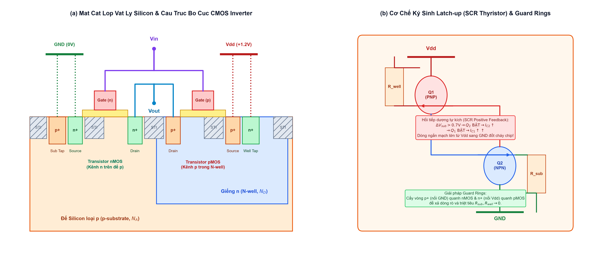
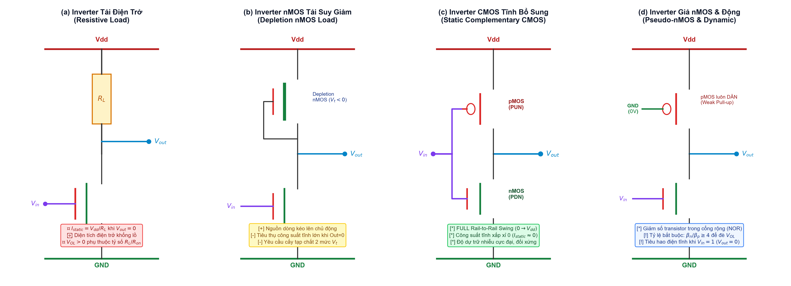
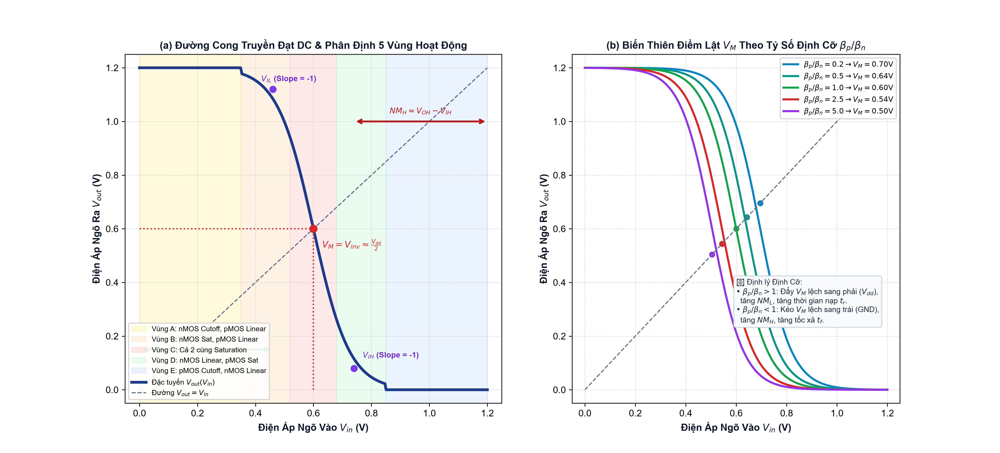
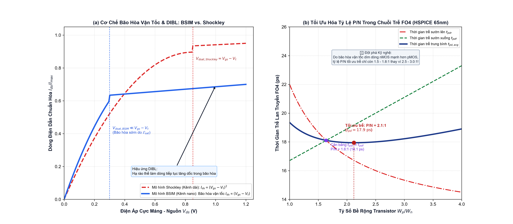

# Chuyên Đề: Các Lớp Cổng Đảo (Inverter Classes & Layers) & Mô Hình BSIM trong SPICE
> **Phiên bản:** Kể chuyện Cơ chế Vật lý Vi mô, Giải phẫu Mạch Logic & Mô hình hóa Bán dẫn Nanomet  
> **Đối tượng:** Sinh viên Thiết kế Vi mạch ĐH Công nghệ Thông tin (UIT)  
> **Thời gian học tập tối ưu:** 4 Giờ Trọng tâm  
> **Tài liệu đối chiếu:** `source/source_uit_vn/chapter4-nonideal.pdf`, `chapter5-dctran.pdf`, `chapter8-spice.pdf` & Giáo trình CMOS VLSI Design (Weste & Harris)  
> **Trục logic bất biến:** Khởi hành từ các lớp vật lý silicon và cơ chế đóng mở kênh của cặp transistor bổ sung, khảo sát sự tiến hóa của các phân lớp kiến trúc Inverter, mổ xẻ chính xác 5 vùng hoạt động truyền đạt DC, và giải mã lý do vì sao mô hình bán dẫn BSIM ra đời để cứu rỗi ngành công nghiệp vi mạch trong kỷ nguyên nanomet.

---

## Lộ trình Học tập 4 Giờ Cốt lõi (4-Hour Study Roadmap)

| Thời gian | Nội dung Trọng tâm | Mục tiêu Bản chất Cần Đạt Được |
| :--- | :--- | :--- |
| **Giờ 1 (0h - 1h)** | Các Lớp Vật Lý Silicon, Quy trình Chế tạo & Tử huyệt Latch-Up | Nắm vững cấu trúc mặt nạ silicon (Well, Active, Poly, Metal); hiểu nguồn gốc cặp BJT ký sinh PNP-NPN kích hoạt hiệu ứng Thyristor (Latch-up) và kỹ thuật bố trí Guard Rings triệt tiêu điện trở đế/giếng. |
| **Giờ 2 (1h - 2h)** | Phân Lớp Kiến Trúc Cổng Đảo (Inverter Circuit Families) | So sánh bản chất tải điện trở, tải nMOS suy giảm, CMOS tĩnh, Pseudo-nMOS và Dynamic logic; chứng minh tính ưu việt của full rail-to-rail swing và nguyên lý tối ưu chuỗi đệm Inverter kéo tải nặng ($f = e \approx 2.72$). |
| **Giờ 3 (2h - 3h)** | Đặc Tuyến DC (VTC), 5 Vùng Hoạt Động & Biên Độ Dự Trữ Nhiễu | Giải phẫu toán học và động học hạt dẫn qua 5 vùng hoạt động ($A \to E$); dẫn xuất điểm ngưỡng chuyển mạch $V_M$ ($V_{inv}$) và phân tích độ bất đối xứng của dải dự trữ nhiễu ($NM_L, NM_H$) theo tỷ số $\beta_p / \beta_n$. |
| **Giờ 4 (3h - 4h)** | Kỷ Nguyên BSIM, Hiệu Ứng Kênh Ngắn & Mô Phỏng SPICE | Giải mã sự sụp đổ của mô hình Shockley; làm chủ các hiệu ứng kênh ngắn (Bão hòa vận tốc, DIBL, Rò dưới ngưỡng, Xuyên hầm oxit); đọc hiểu tham số BSIM và lý giải vì sao tỷ lệ định cỡ tối ưu trễ FO4 giảm từ $2.5:1$ xuống $1.5:1$. |

---

## Giờ 1: Các Lớp Vật Lý Silicon, Quy trình Chế tạo & Tử huyệt Latch-Up
*(Tương ứng Slide Chế tạo & Layout | Thời gian mục tiêu: 60 phút)*

### 1.1 Khởi hành từ Bề mặt Bán dẫn: Giải phẫu các Lớp Mặt Nạ Silicon
Để cổng logic hoạt động trong thực tế, các phương trình toán học và ký hiệu sơ đồ nguyên lý phải được hiện thực hóa qua quy trình quang khắc *(Photolithography)* gồm nhiều lớp mặt nạ *(Mask Layers)* xếp chồng lên nhau. 

Hãy nhìn vào **Hình 1(a)** để khám phá giải phẫu mặt cắt vi mô của một cổng đảo CMOS chuẩn:

1. **Đế Silicon loại p (p-substrate):**  
   Đây là nền móng vật lý của toàn bộ vi mạch, là một lát cắt tinh thể silicon đơn tinh thể được pha tạp nhẹ với các nguyên tử nhóm III (như Boron, mật độ $N_A \approx 10^{15} \text{ cm}^{-3}$). Hạt dẫn đa số trong đế là các lỗ trống tích điện dương ($h^+$). Transistor nMOS sẽ được chế tạo trực tiếp ngay trên bề mặt của đế này.
2. **Hồ chứa Giếng n (N-well):**  
   Vì không thể chế tạo pMOS (vốn cần hạt dẫn đa số là lỗ trống di chuyển trong môi trường giàu electron) trực tiếp trên đế p, các kỹ sư phải bắn chùm ion năng lượng cao (như Phosphorus hoặc Arsenic, mật độ $N_D \approx 10^{16} \text{ cm}^{-3}$) để tạo ra một vùng bán dẫn loại n cục bộ gọi là Giếng n (N-well). N-well đóng vai trò là đế riêng biệt cho transistor pMOS.
3. **Cách ly Rãnh Nông (Shallow Trench Isolation - STI):**  
   Giữa các transistor cạnh nhau, người ta khắc các rãnh sâu vào silicon và lấp đầy bằng Silicon Dioxide ($SiO_2$). Các khối STI này đóng vai trò như những bức tường thành cách điện tuyệt đối, ngăn ngừa dòng điện rò rỉ bề mặt giữa cực Drain của nMOS và Drain của pMOS.
4. **Lớp Oxit Cổng Điện Môi (Gate Dielectric):**  
   Một lớp màng cực mỏng ($t_{ox} \approx 1 - 2\text{ nm}$) được oxy hóa nhiệt trên bề mặt silicon. Trong các tiến trình nanomet hiện đại, $SiO_2$ được thay thế bằng vật liệu High-$\kappa$ (như Hafnium Dioxide - $\text{HfO}_2$) để tăng điện dung cổng $C_{ox} = \frac{\epsilon}{t_{ox}}$ mà không bị dòng rò lượng tử xuyên thủng.
5. **Điện cực Cổng Polysilicon (Gate):**  
   Silicon đa tinh thể được pha tạp nồng độ cao để dẫn điện, chạy cắt ngang qua cả hai vùng tích cực (Active area) của nMOS và pMOS. Khi nối hai bản cực cổng này lại với nhau, ta tạo thành ngõ vào chung $V_{in}$.
6. **Các Vùng Khuếch Tán Nồng Độ Cao ($n^+$ và $p^+$ Diffusion):**  
   - Bằng mặt nạ N-select, ion As/P được cấy vào đế p để tạo hai hòn đảo $n^+$ ($N_D \approx 10^{20} \text{ cm}^{-3}$), hình thành cực Source và Drain cho nMOS.
   - Bằng mặt nạ P-select, ion Boron được cấy vào N-well để tạo hai hòn đảo $p^+$ ($N_A \approx 10^{20} \text{ cm}^{-3}$), hình thành cực Source và Drain cho pMOS.
7. **Cực Tiếp Xúc Cố Định Điện Thế (Substrate Tap & Well Tap):**  
   - Để ngăn đế p bị trôi điện thế lơ lửng, một vùng khuếch tán $p^+$ (Sub Tap) được cấy ngay cạnh nMOS và hàn chết vào đường ray đất **GND (0V)**.
   - Tương tự, một vùng khuếch tán $n^+$ (Well Tap) được cấy vào N-well và hàn chết vào đường ray nguồn **$V_{dd}$**.
8. **Lớp Kim Loại Thứ Nhất (Metal 1) & Lỗ Tiếp Xúc (Contact Cuts):**  
   Các cột vonfram (Tungsten plugs) xuyên thẳng đứng qua lớp điện môi cách ly để kết nối các cực khuếch tán và polysilicon với dây dẫn kim loại Metal 1:
   - Cực Source của pMOS nối lên đường ray $V_{dd}$.
   - Cực Source của nMOS nối xuống đường ray GND.
   - Cực Drain của pMOS và Drain của nMOS chập chung lại tạo thành ngõ ra **$V_{out}$**.



---

### 1.2 Hiểm Họa Tử Huyệt Latch-Up: Ác Mộng Thyristor Ký Sinh (Parasitic SCR)
Một trong những cạm bẫy vật lý nguy hiểm nhất trong công nghệ chế tạo CMOS chính là hiện tượng **Latch-up**. Nếu không hiểu rõ bản chất của các lớp silicon, một xung nhiễu nhỏ có thể biến chip thành một khối than cháy rụi trong tích tắc!

> [!NOTE]
> ### 🔬 Cơ Chế Hình Thành Cặp BJT Ký Sinh
> Nhìn vào mặt cắt silicon ở **Hình 1(a)** và sơ đồ tương đương ở **Hình 1(b)**, bạn sẽ thấy sự đan xen vô tình giữa 4 lớp bán dẫn:
> $$p^+ \text{ (Source pMOS)} \longrightarrow n \text{ (N-well)} \longrightarrow p \text{ (p-sub)} \longrightarrow n^+ \text{ (Source nMOS)}$$
> Bốn lớp này tạo thành một linh kiện bốn lớp bán dẫn $p-n-p-n$ kinh điển — chính là một **Thyristor (SCR - Silicon Controlled Rectifier)** ký sinh, cấu thành từ hai transistor lưỡng cực BJT lồng vào nhau:
> 1. **BJT PNP ký sinh ($Q_1$):**  
>    - Cực phát (Emitter): Vùng khuếch tán $p^+$ (Source của pMOS nối $V_{dd}$).  
>    - Cực gốc (Base): Giếng N-well (nối lên $V_{dd}$ qua điện trở giếng ký sinh $R_{well}$).  
>    - Cực thu (Collector): Đế p-substrate.
> 2. **BJT NPN ký sinh ($Q_2$):**  
>    - Cực phát (Emitter): Vùng khuếch tán $n^+$ (Source của nMOS nối GND).  
>    - Cực gốc (Base): Đế p-substrate (nối xuống GND qua điện trở đế ký sinh $R_{sub}$).  
>    - Cực thu (Collector): Giếng N-well.

#### Vòng Lặp Hồi Tiếp Dương Tự Kích (Regenerative Positive Feedback Loop)
Ở trạng thái hoạt động bình thường, cả hai transistor $Q_1$ và $Q_2$ đều tắt hoàn toàn vì tiếp giáp B-E của chúng có hiệu điện thế xấp xỉ 0V. Tuy nhiên, bi kịch sẽ xảy ra khi có một kích thích bất thường (ví dụ: xung gai điện áp trên đường nguồn, sốc tĩnh điện ESD, hoặc tia bức xạ hạt alpha sinh cặp electron-lỗ trống):
1. **Mồi lửa ban đầu:**  
   Giả sử một dòng điện rò chạy qua đế silicon, tạo ra một độ sụt áp trên điện trở đế:
   $$V_{BE2} = I_{sub} \cdot R_{sub} > 0.7\text{ V}$$
2. **Kích hoạt BJT thứ nhất ($Q_2$ bật):**  
   Tiếp giáp B-E của $Q_2$ bị phân cực thuận. $Q_2$ lập tức dẫn dòng cực thu $I_{C2} = \beta_2 I_{B2}$. Dòng $I_{C2}$ này bắt buộc phải rút ra từ N-well!
3. **Kích hoạt BJT thứ hai ($Q_1$ bật):**  
   Khi dòng $I_{C2}$ chảy qua điện trở giếng $R_{well}$, nó tạo ra sụt áp:
   $$V_{EB1} = I_{C2} \cdot R_{well} = (\beta_2 I_{B2}) R_{well} > 0.7\text{ V}$$
   Cực B-E của $Q_1$ lập tức bị phân cực thuận! $Q_1$ bừng tỉnh và bơm một dòng cực thu khổng lồ $I_{C1} = \beta_1 I_{B1}$ ngược trở lại vào đế p!
4. **Vòng xoáy tự khóa (Self-Sustaining Latch):**  
   Dòng $I_{C1}$ đổ vào đế p lại chính là dòng kích $I_{B2}$ cho $Q_2$. Một vòng phản hồi dương cực mạnh được thiết lập:
   $$I_{C1} \uparrow \implies I_{B2} \uparrow \implies I_{C2} \uparrow \implies I_{B1} \uparrow \implies I_{C1} \uparrow\uparrow$$
   Khi tích hệ số khuếch đại dòng thỏa mãn:
   $$\beta_1 \cdot \beta_2 \ge 1$$
   Hai transistor này sẽ tự cấp điện cho nhau mà không cần bất kỳ tín hiệu kích thích ban đầu nào nữa! Cặp SCR chuyển sang chế độ dẫn bão hòa hoàn toàn, tạo ra một **đường ngắn mạch trở kháng cực thấp nối thẳng từ $V_{dd}$ xuống GND**.
5. **Hậu quả:**  
   Dòng điện ngắn mạch lên tới hàng Ampe phóng qua thể tích silicon siêu nhỏ, làm nhiệt độ vi mạch tăng vọt lên hàng nghìn độ C. Chip bị nung chảy và phá hủy vĩnh viễn! Cách duy nhất để thoát khỏi Latch-up là phải ngắt toàn bộ nguồn điện cấp cho vi mạch.

---

### 1.3 Phòng Tuyến Vòng Bảo Vệ (Guard Rings) & Quy Tắc Bố Trí Tap
Làm thế nào để các kỹ sư vi mạch triệt tiêu hoàn toàn hiểm họa Latch-up ngay từ khâu thiết kế vật lý?

> [!IMPORTANT]
> ### 📐 Nguyên Lý Triệt Tiêu Latch-Up: Bóp Chết Điện Trở $R_{well}$ và $R_{sub}$
> Muốn vòng phản hồi dương không thể kích nổ, điều kiện bắt buộc là điện áp sụt trên các điện trở ký sinh không bao giờ được phép chạm ngưỡng kích mở $0.7\text{V}$:
> $$I_{sub} \cdot R_{sub} < 0.7\text{ V} \quad \text{và} \quad I_{well} \cdot R_{well} < 0.7\text{ V}$$
> Để làm được điều này, kỹ sư áp dụng hai giải pháp phòng vệ bắt buộc:
> 1. **Vòng bảo vệ (Guard Rings):**  
>    - Tạo một dải khuếch tán $p^+$ khép kín bao quanh toàn bộ khu vực nMOS và nối thẳng xuống GND. Bất kỳ hạt mang điện tích nào chạy lạc trong đế p sẽ bị chiếc vòng này hút sạch xuống đất trước khi kịp tích tụ điện áp trên $R_{sub}$.
>    - Tạo một dải khuếch tán $n^+$ khép kín bao quanh toàn bộ N-well và nối thẳng lên $V_{dd}$, làm nhiệm vụ dọn dẹp các electron rò rỉ để $R_{well} \to 0$.
> 2. **Luật Đặt Tap Định Kỳ (Tap Spacing Design Rules):**  
>    Quy chuẩn DRC trong các xưởng đúc TSMC/Intel bắt buộc: Mỗi cực Source của nMOS/pMOS không được cách xa Sub/Well tap quá một khoảng cách quy định (thường là $15 - 20\mu m$, tương đương quy tắc *Tapless Cell Library* phải chèn các tế bào *Tap Cells* định kỳ theo từng hàng).

---

## Giờ 2: Phân Lớp Kiến Trúc Cổng Đảo (Inverter Circuit Families)
*(Tương ứng Slide Logic Families & Weste & Harris Ch. 6, 9 | Thời gian mục tiêu: 60 phút)*

### 2.1 Biên Niên Sử Tiến Hóa: Cổng Đảo Tải Điện Trở (Resistive-Load Inverter)
Trước khi công nghệ CMOS thống trị thế giới, các kỹ sư đầu tiên đã thiết kế cổng đảo bằng cách sử dụng một transistor nMOS làm công tắc kéo xuống và một điện trở thụ động $R_L$ làm tải kéo lên (**Hình 2(a)**).

1. **Nguyên lý hoạt động:**  
   - Khi $V_{in} = 0$: nMOS tắt ($I_{ds} = 0$). Không có dòng chạy qua $R_L$, nốt ra nạp lên $V_{out} = V_{dd}$ (Mức logic 1 hoàn hảo).
   - Khi $V_{in} = V_{dd}$: nMOS dẫn mở với nội trở kênh $R_{on}$. Ngõ ra chia áp theo tỷ lệ:
     $$V_{OL} = V_{dd} \cdot \frac{R_{on}}{R_L + R_{on}}$$
2. **Nhược điểm chí mạng:**  
   - **Mất mức logic 0:** $V_{OL}$ không bao giờ đạt được $0.0\text{V}$. Muốn $V_{OL}$ đủ nhỏ (để không làm kích mở tầng logic tiếp theo), ta bắt buộc phải chọn $R_L \gg R_{on}$ (thường $R_L \ge 10 R_{on}$).
   - **Thiêu đốt công suất tĩnh khổng lồ:** Khi ngõ ra ở mức thấp ($0$), dòng điện chạy liên tục từ nguồn xuống đất:
     $$I_{static} = \frac{V_{dd}}{R_L + R_{on}} \approx \frac{V_{dd}}{R_L}$$
   - **Ác mộng diện tích silicon:** Điện trở tích hợp trên chip có điện trở suất thấp. Để tạo một điện trở $R_L = 100\text{ k}\Omega$, dải khuếch tán hoặc poly phải dài hàng trăm micromet, chiếm diện tích lớn gấp 50-100 lần so với bản thân một transistor!



---

### 2.2 Cổng Đảo nMOS Tải Tích Cực: Tải Suy Giảm (Depletion-Load nMOS Inverter)
Để loại bỏ điện trở thụ động cồng kềnh, các kỹ sư phát minh ra kỹ thuật thay thế điện trở bằng một transistor nMOS hoạt động ở chế độ **Suy Giảm (Depletion Mode)** (**Hình 2(b)**).

1. **Cơ chế chế tạo:**  
   Bằng cách cấy thêm một liều lượng ion n nhẹ vào dưới lớp oxit cổng, transistor nMOS tải suy giảm có sẵn một con kênh dẫn electron ngay cả khi điện thế cổng bằng không. Điện áp ngưỡng của nó bị âm hóa:
   $$V_{t, dep} < 0\text{ V} \quad (\approx -0.7\text{ V})$$
2. **Đấu nối nguồn dòng:**  
   Nối cực Cổng (Gate) vào chính cực Nguồn (Source) của nó ($V_{gs} = 0\text{V}$).  
   Vì $V_{gs} = 0 > V_{t, dep}$, transistor này **luôn luôn dẫn điện** và đóng vai trò như một nguồn cấp dòng kéo lên chủ động *(Active Pull-Up Current Source)*.
3. **Đánh giá kỹ thuật:**  
   - Tốc độ nạp tụ nhanh hơn tải điện trở thuần vì dòng nạp được duy trì ổn định hơn trong giai đoạn bão hòa.  
   - Đây chính là công nghệ cốt lõi của các vi xử lý lẫy lừng một thời như **Intel 8086** hay Zilog Z80.  
   - Tuy nhiên, nhược điểm công suất tĩnh $I_{static}$ khi ngõ ra ở mức thấp vẫn chưa được giải quyết! Hàng trăm nghìn transistor cùng xả điện khiến chip nMOS tỏa nhiệt như một chiếc bàn là điện.

---

### 2.3 Đỉnh Cao CMOS Bổ Sung Tĩnh (Static Complementary CMOS Inverter)
Sự kết hợp hoàn hảo giữa mạng kéo lên PUN (gồm pMOS) và mạng kéo xuống PDN (gồm nMOS) đã đưa cổng đảo CMOS lên ngai vàng thống trị ngành bán dẫn (**Hình 2(c)**).

Ba đặc tính vô song của CMOS Inverter:
1. **Full Rail-to-Rail Logic Swing ($0.0\text{V} \leftrightarrow V_{dd}$):**  
   - Khi kéo lên: pMOS dẫn mức 1 mạnh tuyệt đối, tụ nạp đầy tới đúng $V_{dd}$ mà không hề bị sụt áp ngưỡng như nMOS.
   - Khi kéo xuống: nMOS dẫn mức 0 mạnh tuyệt đối, tụ xả cạn kiệt về đúng $0.0\text{V}$.
2. **Triệt tiêu Công suất Tĩnh ($I_{static} \approx 0$):**  
   Ở trạng thái tĩnh ($V_{in} = 0$ hoặc $V_{in} = V_{dd}$), luôn có ít nhất một transistor ngắt hoàn toàn. Không bao giờ tồn tại đường dẫn một chiều trực tiếp giữa $V_{dd}$ và GND. Chip chỉ tiêu thụ năng lượng trong khoảnh khắc ngắn ngủi khi chuyển trạng thái (công suất động nạp/xả tụ $P_{dyn} = C_L V_{dd}^2 f$).
3. **Trở kháng Ngõ Vào Vô Cùng Lớn ($R_{in} \approx \infty$):**  
   Cực Cổng cách ly hoàn toàn với kênh dẫn qua lớp oxit điện môi, cho phép một cổng đảo có thể điều khiển kích mở hàng loạt cổng phía sau (Fan-out lớn) mà không bị suy hao biên độ điện áp.

---

### 2.4 Cổng Đảo Tỷ Lệ: Pseudo-nMOS Inverter
Trong các mạch số phức tạp cần cổng logic nhiều ngõ vào (như cổng NOR 8 ngõ vào, khối giải mã ROM, hoặc mảng logic khả trình PLA), mạng kéo lên PUN gồm 8 pMOS nối tiếp sẽ là một thảm họa về diện tích và tốc độ (như đã chứng minh ở Chương 2).

Để giải quyết, các kỹ sư sử dụng kiến trúc **Pseudo-nMOS** (**Hình 2(d)**):
- Cực Cổng của duy nhất một pMOS được nối cố định xuống đất **GND (0V)**.
- Transistor pMOS này đóng vai trò như một điện trở kéo lên tích cực luôn mở sẵn (Weak Pull-up).
- Toàn bộ hàm logic được giao cho mạng PDN gồm các nMOS.

> [!WARNING]
> ### ⚠️ Ràng Buộc Định Cỡ Sống Còn Của Pseudo-nMOS (Ratioed Logic)
> Khác với CMOS tĩnh (ngõ ra chỉ phụ thuộc vào trạng thái đóng/mở công tắc, gọi là *Ratioless Logic*), Pseudo-nMOS thuộc lớp **Ratioed Logic** — mức điện áp ngõ ra phụ thuộc hoàn toàn vào tỷ lệ kích thước tương quan giữa nMOS và pMOS!
> - Khi $V_{in} = V_{dd}$, nMOS bật để kéo $V_{out}$ xuống đất, nhưng pMOS vẫn ngoan cố dẫn điện để bơm dòng từ $V_{dd}$ xuống.
> - Hai transistor này tham gia vào một cuộc chiến giằng co (Tug-of-War). Muốn ngõ ra chạm được mức logic thấp hợp lệ ($V_{OL} \le 0.1 V_{dd}$), sức mạnh kéo xuống của nMOS bắt buộc phải áp đảo pMOS:
>   $$\beta_n \ge 4 \cdot \beta_p \implies \frac{W_n / L_n}{W_p / L_p} \ge 4$$
> - **Sự đánh đổi (Trade-off):** Tiết kiệm diện tích lớn trong các cổng nhiều ngõ vào, nhưng phải trả giá bằng việc tiêu tốn công suất tĩnh liên tục khi ngõ ra ở mức thấp ($I_{static} = I_{dsat,p}$).

---

### 2.5 Cổng Đảo Ba Trạng Thái (Tri-state Inverter) & C2MOS
Trong kiến trúc vi xử lý, nhiều khối chức năng (như ALU, Register File, Memory Controller) cùng phải chia sẻ một đường dây truyền dữ liệu chung gọi là **Bus**. Nếu hai cổng đảo thông thường cùng phát tín hiệu lên bus (một cổng phát 1, một cổng phát 0), đường dây sẽ bị chập mạch gây cháy chip!

Giải pháp là bổ sung trạng thái thứ ba: **Trạng Thái Trở Kháng Cao (High-Impedance - High-Z)**:
- **Cấu tạo:** Thêm hai transistor kích hoạt (Enable) mắc nối tiếp: một pMOS kích hoạt ở phía trên (điều khiển bởi $\overline{EN}$) và một nMOS kích hoạt ở phía dưới (điều khiển bởi $EN$).
- **Khi $EN = 1$ ($\overline{EN} = 0$):** Cả hai transistor kích hoạt đều dẫn mở. Cổng hoạt động như một Inverter bình thường ($V_{out} = \overline{V_{in}}$).
- **Khi $EN = 0$ ($\overline{EN} = 1$):** Cả đường kéo lên nguồn và đường xả xuống đất đều bị cắt đứt lìa. Nốt ngõ ra $V_{out}$ bị thả nổi hoàn toàn, ngắt kết nối tuyệt đối khỏi đường bus. Các cổng khác có thể thoải mái truyền dữ liệu mà không sợ bị xung đột!
- **Kiến trúc C2MOS (Clocked CMOS):** Sử dụng cặp xung nhịp đối ngẫu ($CLK, \overline{CLK}$) điều khiển cổng đảo ba trạng thái, tạo ra các phần tử nhớ chốt dữ liệu (Latch) miễn nhiễm hoàn toàn với hiện tượng chạy đua tín hiệu (race hazard).

---

### 2.6 Cổng Đảo Động (Dynamic CMOS Inverter: Precharge & Evaluate)
Để đạt tốc độ xử lý đỉnh cao vượt qua giới hạn của CMOS tĩnh, kỹ thuật mạch số động *(Dynamic Logic)* tách chu kỳ làm việc của Inverter thành hai pha xung nhịp riêng biệt:

1. **Pha Nạp Sẵn (Precharge Phase - Khi $CLK = 0$):**  
   - Transistor pMOS nạp sẵn ở đỉnh mở ra, nMOS đánh giá ở đáy ngắt lìa.
   - Nốt ngõ ra $V_{out}$ được nạp sẵn lên mức điện thế cao $V_{dd}$. Tụ điện ký sinh ngõ ra $C_L$ được bơm đầy điện tích.
2. **Pha Đánh Giá (Evaluation Phase - Khi $CLK = 1$):**  
   - pMOS nạp sẵn đóng lại. nMOS đánh giá ở đáy mở thông đường xuống đất.
   - Nếu $V_{in} = 1$: nMOS logic dẫn, xả toàn bộ điện tích trên tụ $C_L$ xuống đất $\to V_{out} = 0\text{V}$.
   - Nếu $V_{in} = 0$: nMOS logic ngắt, nốt $V_{out}$ giữ nguyên điện áp $V_{dd}$ nhờ điện tích tích lũy trên tụ $C_L$.
3. **Ưu thế và Thách thức:**  
   - **Ưu thế:** Loại bỏ hoàn toàn mạng pMOS cồng kềnh, giảm hơn 50% điện dung ngõ vào $C_{in}$, mạch chạy cực nhanh!
   - **Thách thức:** Điện tích tại nốt ngõ ra là điện tích động (Dynamic Charge). Nó có thể bị xói mòn bởi dòng rò dưới ngưỡng *(Subthreshold Leakage)* hoặc bị chia sẻ điện tích *(Charge Sharing)* với các nốt nội bộ, đòi hỏi phải có tần số xung nhịp tối thiểu để refresh liên tục.

---

### 2.7 Chuỗi Tầng Đệm Inverter (Inverter Chains & Super Buffers)
Trong thiết kế vi mạch thực tế, một cổng logic nhỏ từ khối điều khiển trung tâm thường phải kích mở một đường bus dài hoặc một chân đệm ngõ ra (Off-chip Pad) có điện dung tải khổng lồ: $C_L = 1000 \cdot C_{in}$.

Nếu ta dùng trực tiếp một cổng Inverter nhỏ cơ sở để kéo tải $C_L$, thời gian nạp tụ sẽ là một thảm họa:
$$\Delta t = \frac{C_L \cdot \Delta V}{I} \longrightarrow \text{Chậm hàng trăm lần!}$$
Nếu ta phóng to kích thước Inverter lên ngay lập tức 1000 lần ($W = 1000 W_{min}$), thì cổng logic nhỏ ở tầng trước lại không đủ sức kích mở điện dung cổng khổng lồ của chiếc Inverter này!

> [!TIP]
> ### ⚡ Định Lý Chuỗi Tầng Đệm Tối Ưu (Optimal Inverter Chain Sizing)
> Giải pháp là chèn một chuỗi gồm $N$ cổng đảo có kích thước phình to dần theo cấp số nhân với hệ số phóng to là $f$:
> $$1 \longrightarrow f \longrightarrow f^2 \longrightarrow f^3 \longrightarrow \dots \longrightarrow f^{N-1} \longrightarrow C_L$$
> Tổng thời gian trễ của chuỗi $N$ tầng:
> $$D = N \cdot \tau_0 \cdot f$$
> Với hệ số tải tổng thể $F = \frac{C_L}{C_{in}} = f^N \implies N = \frac{\ln F}{\ln f}$.  
> Thay $N$ vào phương trình trễ và lấy đạo hàm triệt tiêu theo $f$:
> $$\frac{dD}{df} = 0 \implies \ln f = 1 \implies f = e \approx 2.718 !$$
> **Ý nghĩa thực chiến:**  
> - Về mặt toán học lý thuyết, mỗi tầng đệm nên phình to gấp $e \approx 2.72$ lần so với tầng trước.
> - Trong công nghiệp vi mạch thực tế (có tính đến điện dung ký sinh cực máng $C_{db}$), các kỹ sư chọn hệ số nhân là **$f = 3$ đến $f = 4$**.
> - Với $F = 64$ và chọn $f = 4$, ta chỉ cần đúng $N = 3$ tầng đệm ($1 \to 4 \to 16 \to 64$) để đưa trễ toàn mạch về mức cực tiểu!

---

## Giờ 3: Đặc Tuyến DC (VTC), 5 Vùng Hoạt Động & Biên Độ Dự Trữ Nhiễu
*(Tương ứng Slide DC Analysis & Weste & Harris Ch. 5 | Thời gian mục tiêu: 60 phút)*

### 3.1 Bản Chất Đường Cong Truyền Đạt DC (Voltage Transfer Characteristics - VTC)
Đặc tuyến truyền đạt DC là đồ thị biểu diễn điện áp ngõ ra $V_{out}$ theo điện áp ngõ vào $V_{in}$ khi tín hiệu thay đổi cực kỳ chậm chạp, sao cho mọi hiệu ứng điện dung động học đều lắng dịu. 

Nhìn vào **Hình 3(a)**, đặc tuyến VTC của CMOS Inverter có dạng chữ S dốc đứng tuyệt đẹp, phản ánh khả năng phân biệt rạch ròi giữa mức logic 0 và mức logic 1.

---

### 3.2 Phân Tích Đường Tải (Load Line Analysis): Cân Bằng Dòng Điện Kirchhoff
Để tìm giá trị $V_{out}$ ứng với mỗi mức $V_{in}$, ta áp dụng định luật Kirchhoff dòng điện (KCL) tại nốt ngõ ra: Vì cực Cổng của tầng tiếp theo không ăn dòng điện một chiều ($I_{gate} \approx 0$), dòng điện chạy qua nMOS bắt buộc phải bằng dòng điện chạy qua pMOS:
$$I_{ds,n} = -I_{ds,p} \quad \text{hay} \quad I_{dn} = I_{sp}$$

Mỗi giá trị ngõ vào $V_{in}$ sẽ xác định một cặp điện áp điều khiển:
$$V_{gs,n} = V_{in}, \qquad V_{gs,p} = V_{in} - V_{dd}$$
Giao điểm giữa đường đặc tuyến $I-V$ của nMOS và đường cong $I-V$ đối ngẫu của pMOS chính là điểm làm việc xác lập của mạch điện!



---

### 3.3 Giải Phẫu Toán Học 5 Vùng Hoạt Động Cốt Lõi
Khi ta quét điện áp ngõ vào $V_{in}$ từ $0\text{V}$ tăng dần lên $V_{dd}$, trạng thái của hai transistor sẽ dịch chuyển tuần tự qua **5 Vùng Hoạt Động** (tô màu trực quan trên **Hình 3(a)**):

#### Vùng A: Ngõ Vào Mức Rất Thấp ($0 \le V_{in} < V_{tn}$)
- **nMOS:** Vì $V_{gs,n} = V_{in} < V_{tn}$, transistor nMOS hoàn toàn **TẮT (Cutoff)**. Dòng qua kênh bằng không ($I_{ds,n} = 0$).
- **pMOS:** Vì $V_{gs,p} = V_{in} - V_{dd} \approx -V_{dd} \ll V_{tp}$, pMOS mở toang ở chế độ **Tuyến Tính (Linear)**.
- **Ngõ ra:** Cực Source của pMOS nối lên $V_{dd}$, không có dòng xả xuống đất $\implies V_{out} = V_{dd}$ **(Mức logic 1 tuyệt đối)**.

#### Vùng B: Bắt Đầu Chuyển Mạch ($V_{tn} \le V_{in} < V_M$)
- **nMOS:** Cực cổng đã vượt ngưỡng kích hoạt ($V_{gs,n} \ge V_{tn}$), nMOS bật sáng. Vì $V_{out}$ vẫn còn rất cao nên $V_{ds,n} = V_{out} > V_{in} - V_{tn} \implies$ nMOS hoạt động ở chế độ **Bão Hòa (Saturation)**:
  $$I_{ds,n} = \frac{\beta_n}{2} (V_{in} - V_{tn})^2$$
- **pMOS:** Điện thế $V_{ds,p} = V_{out} - V_{dd}$ có độ lớn nhỏ hơn hiệu điện thế hiệu dụng $|V_{gs,p} - V_{tp}| \implies$ pMOS vẫn duy trì ở chế độ **Tuyến Tính (Linear)**:
  $$I_{ds,p} = -\beta_p \left[ (V_{in} - V_{dd} - V_{tp})(V_{out} - V_{dd}) - \frac{1}{2} (V_{out} - V_{dd})^2 \right]$$
- **Ngõ ra:** Dòng nMOS bắt đầu rút điện tích ra khỏi nốt ra, kéo $V_{out}$ trượt dốc từ từ.

#### Vùng C: Vùng Lật Trạng Thái Chớp Nhoáng ($V_{in} = V_M = V_{inv}$)
- Đây là trái tim của cổng đảo! Tại điểm chuyển mạch logic $V_M$, điện áp ngõ vào xấp xỉ bằng ngõ ra: $V_{in} = V_{out} = V_M$.
- Cả nMOS và pMOS **ĐỒNG THỜI Ở VÙNG BÃO HÒA (Saturation)**:
  $$V_{ds,n} = V_M > V_M - V_{tn} \quad \text{và} \quad |V_{ds,p}| = V_{dd} - V_M > V_{dd} - V_M - |V_{tp}|$$
- Cả hai transistor đều đóng vai trò như hai nguồn dòng lý tưởng đấu đối kháng nhau. 
- **Độ lợi vi phân cực đại (High Voltage Gain):**  
  Hệ số khuếch đại điện áp tại vùng này đạt giá trị khổng lồ:
  $$A_v = \frac{dV_{out}}{dV_{in}} = -g_m (r_{on} \parallel r_{op}) \ll -10$$
  Độ dốc dựng đứng này đảm bảo rằng chỉ cần một dao động điện áp cực nhỏ ở ngõ vào cũng đủ để quật ngõ ra lật nhào tức thì giữa 0 và 1!

#### Vùng D: Chuyển Sang Mức Thấp ($V_M < V_{in} \le V_{dd} - |V_{tp}|$)
- **nMOS:** Điện áp ngõ ra đã hạ thấp xuống sâu ($V_{out} < V_{in} - V_{tn}$), nMOS chuyển sang vùng **Tuyến Tính (Linear)**.
- **pMOS:** Hiệu điện thế dọc bị bóp nghẹt, pMOS chuyển sang vùng **Bão Hòa (Saturation)**:
  $$I_{ds,p} = -\frac{\beta_p}{2} (V_{in} - V_{dd} - V_{tp})^2$$
- **Ngõ ra:** Kênh nMOS mở rộng thênh thang, xả điện tích ồ ạt đưa $V_{out}$ sụp đổ về sát đáy GND.

#### Vùng E: Ngõ Vào Mức Rất Cao ($V_{in} > V_{dd} - |V_{tp}|$)
- **pMOS:** Hiệu điện thế cổng - nguồn $|V_{gs,p}| = V_{dd} - V_{in} < |V_{tp}| \implies$ pMOS hoàn toàn **TẮT (Cutoff)** ($I_{ds,p} = 0$).
- **nMOS:** Hoạt động ở chế độ **Tuyến Tính (Linear)**.
- **Ngõ ra:** Kênh nMOS nối thẳng ngõ ra xuống đất $\implies V_{out} = 0.0\text{V}$ **(Mức logic 0 tuyệt đối)**.

---

### 3.4 Dẫn Xuất Giải Tích Điểm Ngưỡng Chuyển Mạch ($V_M$ / $V_{inv}$)
Điểm chuyển mạch $V_M$ (Switching Threshold) là mốc điện áp mà tại đó ngõ vào bằng đúng ngõ ra: $V_{in} = V_{out} = V_M$. 

Tại điểm này, theo phân tích ở Vùng C, cả hai transistor đều bão hòa. Thiết lập phương trình cân bằng dòng Shockley:
$$I_{ds,n} = -I_{ds,p} \implies \frac{\beta_n}{2} (V_M - V_{tn})^2 = \frac{\beta_p}{2} (V_{dd} - V_M - |V_{tp}|)^2$$

Khai căn bậc hai hai vế:
$$\sqrt{\beta_n} (V_M - V_{tn}) = \sqrt{\beta_p} (V_{dd} - V_M - |V_{tp}|)$$

Nhóm các số hạng chứa $V_M$:
$$V_M \left( \sqrt{\beta_n} + \sqrt{\beta_p} \right) = \sqrt{\beta_p} (V_{dd} - |V_{tp}|) + \sqrt{\beta_n} V_{tn}$$

Chia cả hai vế cho $\sqrt{\beta_p}$:
$$V_M = \frac{(V_{dd} - |V_{tp}|) + \sqrt{\frac{\beta_n}{\beta_p}} V_{tn}}{1 + \sqrt{\frac{\beta_n}{\beta_p}}}$$

> [!IMPORTANT]
> ### 📐 Ý Nghĩa Kỹ Thuật Của Công Thức Ngưỡng Chuyển Mạch
> 1. **Trường hợp Đối Xứng Hoàn Hảo (Symmetric Inverter):**  
>    Nếu ta thiết kế điện áp ngưỡng cân bằng ($V_{tn} = |V_{tp}|$) và định cỡ bề rộng sao cho độ dẫn tương đương ($\beta_n = \beta_p$):
>    $$V_M = \frac{(V_{dd} - V_t) + V_t}{1 + 1} = \frac{V_{dd}}{2}$$
>    Điểm chuyển mạch nằm chuẩn xác ở chính giữa dải điện áp nguồn cấp! Đây là cấu hình tối ưu để đạt độ bền vững chống nhiễu đối xứng cho cả mức 0 và mức 1.
> 2. **Sự Dịch Chuyển Do Tỷ Số $\beta_p / \beta_n$ (Hình 3(b)):**  
>    - Khi $\beta_p / \beta_n > 1$ (pMOS khỏe hơn): Điểm $V_M$ bị kéo lệch về phía bên phải (tiến sát $V_{dd}$). Cổng logic chống nhiễu mức thấp tốt hơn.
>    - Khi $\beta_p / \beta_n < 1$ (nMOS khỏe hơn): Điểm $V_M$ bị kéo tụt về phía bên trái (tiến sát GND). Cổng logic chống nhiễu mức cao tốt hơn.

---

### 3.5 Định Nghĩa và Phân Tích Dải Dự Trữ Nhiễu (Noise Margins)
Trong môi trường vi mạch hoạt động thực tế, đường dây truyền tín hiệu liên tục bị tấn công bởi sóng nhiễu điện từ (crosstalk từ các dây lân cận, sụt áp IR-drop trên đường ray nguồn, hoặc dao động ground bounce). 

Khả năng chống chịu nhiễu của cổng logic được định lượng qua **Biên Độ Dự Trữ Nhiễu (Noise Margins)**:

1. **Điểm Điện Áp Ngưỡng Tiếp Nhận ($V_{IL}$ và $V_{IH}$):**  
   Được định nghĩa chuẩn mực là các điểm trên đường cong VTC mà tại đó hệ số khuếch đại vi phân bằng đúng âm một:
   $$\frac{dV_{out}}{dV_{in}} = -1$$
   - **$V_{IL}$ (Input Low Voltage):** Điện áp ngõ vào cao nhất mà mạch vẫn nhận diện chắc chắn là mức 0.
   - **$V_{IH}$ (Input High Voltage):** Điện áp ngõ vào thấp nhất mà mạch bắt đầu nhận diện chắc chắn là mức 1.
   - Khi tín hiệu đi vào vùng giữa $V_{IL}$ và $V_{IH}$, độ lợi $|A_v| > 1$, mạch sẽ khuếch đại nhiễu thay vì triệt tiêu nó!
2. **Công Thức Tính Biên Độ Dự Trữ Nhiễu:**  
   - Biên độ dự trữ nhiễu mức thấp:
     $$NM_L = V_{IL} - V_{OL} = V_{IL} - 0\text{V} = V_{IL}$$
   - Biên độ dự trữ nhiễu mức cao:
     $$NM_H = V_{OH} - V_{IH} = V_{dd} - V_{IH}$$
3. **Ý nghĩa thiết kế:**  
   Một cổng CMOS Inverter có dải dự trữ nhiễu cực lớn, xấp xỉ $NM_L \approx NM_H \approx 0.4 \cdot V_{dd}$ (gần 40% biên độ nguồn cấp), cao hơn vượt trội so với mọi họ mạch logic khác trong lịch sử (TTL, ECL hay NMOS).

---

## Giờ 4: Kỷ Nguyên BSIM, Hiệu Ứng Kênh Ngắn & Mô Phỏng SPICE
*(Tương ứng Slide Nonideal Transistors & SPICE | Thời gian mục tiêu: 60 phút)*

### 4.1 Sự Sụp Đổ Của Mô Hình Shockley Kinh Điển
Trong Chương 3 và Giờ 3 ở trên, chúng ta sử dụng **Mô hình Shockley** (được William Shockley đề xuất từ năm 1952) với công thức dòng bão hòa bậc hai quen thuộc:
$$I_{dsat} = \frac{\beta}{2} (V_{gs} - V_t)^2$$

Mô hình này hoạt động rất chính xác cho các thế hệ vi mạch có chiều dài kênh lớn ($L > 2\mu m$). Tuy nhiên, khi cuộc đua Định luật Moore đẩy kích thước transistor thu nhỏ xuống dưới ngưỡng **Deep-Submicron ($L < 0.25\mu m$, $65\text{ nm}$, $45\text{ nm}$, $28\text{ nm}$)**, mô hình Shockley hoàn toàn bị **SỤP ĐỔ**!
- Thực tế đo đạc trong phòng thí nghiệm cho thấy dòng điện dẫn thực tế nhỏ hơn từ 2 đến 3 lần so với công thức tính tay của Shockley!
- Các kỹ sư thiết kế mạch nếu tiếp tục dùng Shockley để định cỡ sẽ tính sai hoàn toàn thời gian trễ, khiến chip không thể đạt tần số mục tiêu.

Tại sao lại có sự sai lệch khủng khiếp này?

---

### 4.2 Bản Chất Vật Lý Vi Mô Của Các Hiệu Ứng Kênh Ngắn (Short-Channel Effects - SCE)

#### 1. Hiện Tượng Bão Hòa Vận Tốc (Velocity Saturation)
Trong transistor kênh dài, vận tốc trôi của electron tỷ lệ thuận với điện trường ngang: $v = \mu \mathcal{E}$. Nếu ta tăng $V_{ds}$, điện trường tăng và electron bay nhanh hơn mãi.

Tuy nhiên, trong transistor kênh ngắn nanomet ($L = 65\text{ nm}$), ngay cả một điện áp nhỏ $V_{ds} = 1.0\text{V}$ cũng tạo ra một điện trường nằm ngang cực kỳ khủng khiếp:
$$\mathcal{E}_{lat} = \frac{V_{ds}}{L} = \frac{1.0\text{ V}}{65 \times 10^{-7}\text{ cm}} \approx 1.5 \times 10^5 \text{ V/cm} !$$

> [!NOTE]
> ### 🔬 Cơ Chế Va Chạm Tán Xạ Giới Hạn Vận Tốc
> Khi điện trường ngang vượt qua ngưỡng tới hạn $\mathcal{E}_{sat} \approx 10^4 \text{ V/cm}$, các electron nhận động năng khổng lồ và trở thành các "electron nóng" *(Hot Electrons)*.  
> Chúng va chạm liên tục và cực kỳ dữ dội với các dao động nhiệt của mạng tinh thể silicon *(Optical Phonon Scattering)*. Mỗi lần va chạm, electron bị tước đoạt toàn bộ động năng và truyền nhiệt vào mạng tinh thể.  
> Kết quả là vận tốc trôi của electron không thể tăng thêm được nữa, mà bị **bão hòa kịch trần** ở vận tốc tới hạn:
> $$v_{sat} \approx 10^7 \text{ cm/s} = 10^5 \text{ m/s}$$

Khi vận tốc bị chặn đứng ở $v_{sat}$, dòng điện bão hòa không còn phụ thuộc vào thời gian bay tỷ lệ với $V_{ds}$, mà chuyển sang phụ thuộc trực tiếp vào mật độ điện tích nhân với $v_{sat}$:
$$I_{dsat, bsim} = W \cdot C_{ox} \cdot (V_{gs} - V_t) \cdot v_{sat}$$

👉 **Đột phá cốt lõi (Hình 4(a)):** Dòng điện bão hòa trong vi mạch nanomet **TỶ LỆ TUYẾN TÍNH BẬC 1** với $(V_{gs} - V_t)$, thay vì bậc 2 $(V_{gs}-V_t)^2$ như Shockley! Đồng thời, điện áp bão hòa thực tế $V_{dsat, bsim} \ll V_{gs} - V_t$, khiến transistor rơi vào vùng bão hòa sớm hơn rất nhiều.



#### 2. Hạ Thấp Rào Thế Do Cực Máng (Drain-Induced Barrier Lowering - DIBL)
Trong transistor kênh dài, việc bật/tắt kênh hoàn toàn do cực Cổng Gate độc quyền kiểm soát. 
Nhưng khi khoảng cách giữa Source và Drain co lại chỉ còn vài chục nanomet, vùng nghèo phân cực ngược của cực Drain bắt đầu vươn tay thọc sâu vào kênh dẫn:
- Điện trường cực Máng Drain bắt tay với điện trường cực Cổng, cùng nhau bẻ cong dải năng lượng silicon.
- Rào cản thế năng tĩnh điện tại đầu Source bị kéo sụt xuống.
- Electron trong Source dễ dàng tràn qua kênh ngay cả khi điện áp cực Cổng chưa đạt tới $V_t$!
- **Hậu quả:** Điện áp ngưỡng $V_t$ không còn là một hằng số cố định, mà bị giảm tuyến tính khi $V_{ds}$ tăng cao:
  $$V_t(V_{ds}) = V_{t0} - \eta \cdot V_{ds}$$
  (với $\eta$ là hệ số DIBL, tham số `ETA0` trong BSIM). Hiện tượng này làm cho dòng $I_{ds}$ tiếp tục tăng dốc trong vùng bão hòa (tạo ra độ dốc dương rõ rệt trên **Hình 4(a)**).

#### 3. Dòng Rò Dưới Ngưỡng (Subthreshold Leakage)
Khi $V_{gs} < V_t$, transistor không ngắt điện đột ngột về 0 như một công tắc cơ học. Các electron có năng lượng nhiệt cao vẫn có xác suất vượt qua rào thế để khuếch tán từ Source sang Drain. Dòng điện rò rỉ này suy giảm theo hàm mũ:
$$I_{sub} \propto \exp \left( \frac{V_{gs} - V_t}{n \cdot v_{th}} \right)$$
Độ dốc dưới ngưỡng *(Subthreshold Swing $S$)* cho biết cần giảm bao nhiêu millivolt cực cổng để dòng rò giảm đi 10 lần:
$$S = n \cdot \frac{k_B T}{q} \ln(10) \approx 70 - 90 \text{ mV/decade}$$
Trong các chip hiện đại có hàng tỷ transistor, tổng dòng rò dưới ngưỡng này có thể tiêu tốn tới 30-40% tổng công suất tiêu thụ của toàn bộ vi mạch khi ở chế độ chờ (Standby Mode)!

#### 4. Dòng Rò Xuyên Hầm Lượng Tử Qua Oxit Cổng (Gate Direct Tunneling)
Khi lớp oxit cổng $SiO_2$ bị bào mỏng xuống chỉ còn $1.2\text{ nm}$ (tương đương bề dày của khoảng 5 lớp nguyên tử silicon!), nguyên lý bất định Heisenberg bắt đầu chi phối: hàm sóng của electron có thể xuyên thủng qua rào cản cách điện của oxide. Một dòng điện rò rỉ $I_{gate}$ chạy thẳng từ cực Cổng xuyên xuống chất nền, làm tăng công suất tĩnh và nóng chip.

---

### 4.3 Kỷ Nguyên Mô Hình BSIM & Thẻ Tham Số SPICE
Để giải quyết cuộc khủng hoảng mô hình hóa, nhóm nghiên cứu của Giáo sư **Chenming Hu** tại Đại học California, Berkeley đã phát triển mô hình **BSIM (Berkeley Short-channel IGFET Model)**. 

BSIM nhanh chóng được Hội đồng Tiêu chuẩn Công nghệ Compact (Compact Model Coalition - CMC) công nhận là **chuẩn mực công nghiệp quốc tế duy nhất** cho việc mô phỏng vi mạch CMOS:
- **BSIM3v3:** Chuẩn mực cho công nghệ $0.25\mu m - 0.18\mu m$, giải quyết trọn vẹn bão hòa vận tốc và DIBL.
- **BSIM4:** Chuẩn mực vàng cho công nghệ phẳng nanomet ($90\text{ nm} \to 28\text{ nm}$), tích hợp dòng rò xuyên hầm oxit, hiệu ứng ứng suất cơ học màng nén (Stress effect / STI), và điện trở ký sinh cực cổng phân tán.
- **BSIM-CMG (Common Multi-Gate):** Chuẩn mực thế hệ mới nhất dành riêng cho các cấu trúc transistor 3D FinFET và Gate-All-Around (GAAFET) từ $16\text{ nm}$ xuống tới $2\text{ nm}$ tại TSMC và Intel.

> [!NOTE]
> ### 🔬 Giải Mã Các Tham Số Cốt Lõi Trong Thẻ Mô Hình BSIM SPICE
> Một thẻ mô hình BSIM trong tệp thư viện công nghệ (như IBM 65nm trong `source/source_uit_vn/chapter8-spice.pdf`) chứa hơn 200 tham số vật lý:
> - `LEVEL = 49` hoặc `LEVEL = 54`: Chỉ định phiên bản thuật toán BSIM3v3 hoặc BSIM4.
> - `VTH0`: Điện áp ngưỡng cơ sở ở điện thế phân cực 0V (ví dụ: `0.35V` cho nMOS, `-0.35V` cho pMOS).
> - `U0`: Độ linh động hạt dẫn ở điện trường thấp (ví dụ: `500 cm2/V.s` cho electron, `180 cm2/V.s` cho lỗ trống).
> - `TOXE`: Bề dày vật lý hiệu dụng của lớp oxit cổng điện môi (ví dụ: `1.5e-9 m`).
> - `VSAT`: Vận tốc bão hòa của hạt dẫn tại điện trường cao (ví dụ: `8.0e4 m/s`).
> - `ETA0`: Hệ số điều chế hạ rào thế DIBL của cực máng lên điện áp ngưỡng.
> - `PCLM`: Tham số điều chế chiều dài kênh dẫn *(Channel Length Modulation)* trong vùng bão hòa.
> - `RDSW`: Điện trở ký sinh của vùng khuếch tán tiếp xúc Source và Drain.
> - `CGSO` / `CGDO`: Điện dung phủ ký sinh giữa Cực Cổng và Cực Nguồn/Máng trên một đơn vị bề rộng.

---

### 4.4 Thực Hành Mô Phỏng SPICE Chuyên Sâu: Chuỗi Trễ FO4 & Tối Ưu Hóa Tỷ Lệ P/N

#### Cú Pháp Mô Tả Phần Tử MOSFET trong SPICE
Trong tệp netlist SPICE (`.sp`), một transistor không chỉ được khai báo đơn thuần là tên cực, mà phải gắn liền với kích thước hình học và diện tích khuếch tán để BSIM tính toán chính xác điện dung ký sinh:
```spice
* Cú pháp chuẩn phần tử MOSFET:
* Mname Drain Gate Source Body ModelName W=val L=val AS=val AD=val PS=val PD=val
M1 out in gnd gnd NMOS W=120n L=60n AS=72f AD=72f PS=360n PD=360n
M2 out in vdd vdd PMOS W=240n L=60n AS=144f AD=144f PS=600n PD=600n
```
Trong đó:
- `AS`, `AD`: Diện tích khuếch tán cực Source và cực Drain ($A = W \cdot L_{diff}$). Quyết định điện dung đáy $C_{bottom} = C_j \cdot A$.
- `PS`, `PD`: Chu vi tiếp giáp khuếch tán ($P = 2W + 2L_{diff}$). Quyết định điện dung thành bên $C_{sidewall} = C_{jsw} \cdot P$.

#### Chuẩn Đo Trễ FO4 (Fan-Out of 4 Inverter Delay)
Tại sao ngành công nghiệp vi mạch không đo độ trễ của một cổng đảo đứng cô lập một mình?
Bởi vì trong thực tế, tín hiệu ngõ vào có sườn dốc hữu hạn, và ngõ ra luôn phải kéo tải các cổng tiếp theo. 

Chuẩn mực công nghiệp toàn cầu là sử dụng **Chuỗi Đo Trễ FO4** (**Hình 4(b)**):
- Tầng $X_1, X_2$: Đóng vai trò là các tầng định hình sóng *(Shaping Stages)*, tạo ra sườn xung dốc thực tế nhất.
- Tầng $X_3$: Là **Thiết bị Cần Đo (DUT - Device Under Test)**.
- Tầng $X_4, X_5$: Đóng vai trò là tải thực tế với hệ số tải $h = 4$ (mỗi tầng sau có kích thước to gấp 4 lần tầng trước).

Đoạn mã netlist SPICE đo trễ FO4 (`fo4.sp`):
```spice
* Khảo sát độ trễ FO4 Inverter trong tiến trình 65nm
.include 'models_bsim4.sp'
.param SUPPLY=1.0
.param H=4

* Khai báo mạch con Inverter chuẩn hóa
.subckt inv in out N=120n P=240n
M1 out in gnd gnd NMOS W='N' L=65n AS='N*150n' PS='2*N+300n' AD='N*150n' PD='2*N+300n'
M2 out in vdd vdd PMOS W='P' L=65n AS='P*150n' PS='2*P+300n' AD='P*150n' PD='2*P+300n'
.ends

* Chuỗi 5 tầng FO4
X1 in  n1 inv M=1
X2 n1  n2 inv M='H'
X3 n2  n3 inv M='H*H'      * Tầng DUT cần đo trễ
X4 n3  n4 inv M='H*H*H'    * Tải chuẩn Fan-out of 4
X5 n4  n5 inv M='H*H*H*H'  * Tải thứ cấp

* Phân tích quá độ và đo thời gian trễ
.tran 0.1ps 300ps
.measure tran tpdr TRIG v(n2) VAL='SUPPLY/2' FALL=1 TARG v(n3) VAL='SUPPLY/2' RISE=1
.measure tran tpdf TRIG v(n2) VAL='SUPPLY/2' RISE=1 TARG v(n3) VAL='SUPPLY/2' FALL=1
.measure tran tpd  param='(tpdr + tpdf) / 2'
```

#### Đột Phá Định Cỡ P/N Trong Kỷ Nguyên Nanomet: Từ 2.5:1 Xuống 1.5:1
Hãy nhìn vào đồ thị tối ưu hóa tỷ lệ P/N trên **Hình 4(b)**. Đây là một bài học đắt giá thay đổi hoàn toàn tư duy của kỹ sư thiết kế vi mạch:

1. **Tư duy cũ (Mô hình Shockley):**  
   Vì độ linh động lỗ trống kém hơn electron 2.5 lần ($\mu_n / \mu_p \approx 2.5$), lý thuyết kinh điển dạy rằng ta phải làm pMOS to gấp 2.5 lần nMOS ($W_p / W_n \approx 2.5:1$) để cân bằng thời gian trễ sườn lên và sườn xuống ($t_{pdr} = t_{pdf}$).
2. **Thực tế Nanomet (Mô hình BSIM):**  
   - Khi chiều dài kênh thu nhỏ về $65\text{ nm}$, electron trong nMOS bị **bão hòa vận tốc cực kỳ nặng nề**, khiến dòng dẫn $I_{dsat,n}$ bị dìm xuống mức tăng tuyến tính.
   - Trong khi đó, các hạt lỗ trống trong pMOS có độ linh động thấp hơn nên chúng ít bị bão hòa vận tốc hơn nMOS. Tỷ số dòng thực tế $I_{on,n} / I_{on,p}$ co hẹp từ $2.5$ xuống chỉ còn khoảng $1.5 - 1.8$!
   - Nếu ta vẫn cố chấp phình to pMOS lên $2.5:1$ hoặc $3.0:1$, kích thước pMOS khổng lồ sẽ làm **phình to điện dung ngõ vào $C_g$ và điện dung tiếp giáp khuếch tán $C_{db}$**. Điện dung này tự biến thành tải nặng ngáng chân chính cổng đảo và tầng phía trước!
3. **Kết luận kỹ nghệ đột phá:**  
   - Để đạt **thời gian trễ trung bình nhỏ nhất ($t_{pd, avg} = \min$)**, tỷ số bề rộng tối ưu trong các tiến trình nanomet hiện đại chỉ là:
     $$\frac{W_p}{W_n} \approx 1.5:1 \quad \text{đến} \quad 1.8:1 !$$
   - Tỷ số này vừa giúp chip chạy nhanh nhất, vừa tiết kiệm hơn 30% diện tích silicon và cắt giảm công suất chuyển mạch động!

### 4.5 Bảng Tra Cứu Toàn Diện Các Lớp Inverter & Đặc Tính Mô Hình BSIM

Dưới đây là ma trận tổng kết toàn diện so sánh các lớp kiến trúc cổng đảo silicon và tác động của mô hình bán dẫn BSIM:

| Tiêu Chí So Sánh | Inverter Tải Điện Trở ($R_L$) | Inverter nMOS Tải Giảm Thiểu | Inverter CMOS Tĩnh Chuẩn | Inverter Pseudo-nMOS | Inverter C2MOS / Tri-State | Inverter Logic Động (Dynamic) | BSIM Nanoscale Inverter (FinFET/65nm) |
| :--- | :--- | :--- | :--- | :--- | :--- | :--- | :--- |
| **Linh kiện Kéo Lên (Pull-Up)** | Điện trở thụ động $R_L$ (Poly/Khuếch tán) | Transistor nMOS Depletion ($V_t < 0$) | Transistor pMOS bổ sung | 1 pMOS nối đất cổng ($V_{gs} = -V_{dd}$) | Cặp pMOS nối tiếp điều khiển bởi $\overline{\text{CLK}}$ | 1 pMOS nạp trước điều khiển bởi $\text{CLK}$ | Cặp FinFET pMOS đa kênh 3D |
| **Linh kiện Kéo Xuống (Pull-Down)** | Transistor nMOS | Transistor nMOS | Transistor nMOS | Khối logic nMOS | Cặp nMOS nối tiếp điều khiển bởi $\text{CLK}$ | Khối giải mã nMOS nối tiếp transistor đánh giá | Cặp FinFET nMOS đa kênh 3D |
| **Mức Logic Ngõ Ra ($V_{OH} / V_{OL}$)** | $V_{OH} = V_{dd}$<br>$V_{OL} = V_{dd} \frac{R_{on,n}}{R_L + R_{on,n}} > 0\text{V}$ | $V_{OH} = V_{dd}$<br>$V_{OL} > 0\text{V}$ (phụ thuộc tỷ số) | **Full Rail-to-Rail**<br>$V_{OH} = V_{dd}$<br>$V_{OL} = 0\text{V}$ | $V_{OH} = V_{dd}$<br>$V_{OL} > 0\text{V}$ (cần $\beta_n / \beta_p \ge 4$) | $V_{OH} = V_{dd}$<br>$V_{OL} = 0\text{V}$<br>Trạng thái Hi-Z | $V_{OH} = V_{dd}$<br>$V_{OL} = 0\text{V}$ (logic động) | **Full Rail-to-Rail**<br>$V_{OH} = V_{dd}$<br>$V_{OL} = 0\text{V}$ |
| **Công Suất Tĩnh ($P_{static}$)** | **Rất lớn** khi $V_{out}=0$<br>($P = V_{dd}^2 / R_L$) | **Rất lớn** khi $V_{out}=0$<br>($P = V_{dd} \cdot I_{sat,load}$) | **Triệt tiêu lý tưởng**<br>(Chỉ tồn tại dòng rò nano-ampe) | **Lớn** khi $V_{out}=0$<br>($P = V_{dd} \cdot I_{on,p}$) | **Triệt tiêu lý tưởng** khi tĩnh | **Không có tĩnh thuần**, nhưng nhạy cảm rò rỉ | **Đáng kể do dòng rò** ($I_{sub} + I_{gate}$ theo BSIM) |
| **Biên Độ Dự Trữ Nhiễu ($NM_L / NM_H$)** | Kém ($NM_L$ hẹp do $V_{OL} > 0$) | Trung bình ($NM_L$ vừa phải) | **Cực đại**<br>($NM_L \approx NM_H \approx 0.4 V_{dd}$) | Bất đối xứng ($NM_L$ rất hẹp) | Rất cao khi ở chế độ dẫn | Rất nhạy cảm với nhiễu sụt áp và chia sẻ điện tích | Rất nhạy cảm với DIBL và biến thiên PVT |
| **Diện Tích Silicon** | Rất lớn (do điện trở $R_L$ cần diện tích khổng lồ) | Trung bình (cần bước cấy mặt nạ tạo kênh suy giảm) | Tối ưu hóa cao (chia sẻ khuếch tán, Euler path) | Rất nhỏ gọn cho cổng nhiều ngõ vào ($N+1$) | Tăng do thêm 2 transistor điều khiển | Cực kỳ nhỏ gọn ($N+2$ transistor), tải ngõ vào nhẹ | Cực nhỏ theo công nghệ nanomet, mật độ siêu cao |
| **Đặc Trưng BSIM Nanomet** | N/A (công nghệ lịch sử) | N/A (công nghệ lịch sử) | Chi phối bởi bão hòa vận tốc, DIBL và rò rỉ | Chi phối bởi dòng bão hòa vận tốc của pMOS | Hiệu ứng thân (body effect) ở transistor bên trong | Rò rỉ dưới ngưỡng làm mất điện tích nạp trước | $W_p/W_n \approx 1.5 - 1.8:1$, Fin quantization |
| **Ứng Dụng Điển Hình** | Lịch sử bán dẫn đầu tiên | Máy tính cá nhân thập niên 1970 (Intel 8085) | **Chuẩn mực vàng** trong mọi chip số hiện đại | Khối giải mã ROM, PLA, cổng NOR nhiều ngõ vào | Ghép bus dữ liệu dùng chung, chốt D-Latch, Flip-Flop | Bộ số học ALU siêu tốc, thanh ghi tập tin (Register File) | CPU/GPU hiệu năng cao (Apple M-series, Intel, AMD, NVIDIA) |

---

### 4.6 5 Câu Hỏi Chẩn Đoán & Tự Đánh Giá Chuyên Sâu (Diagnostic Self-Assessment)

Dưới đây là 5 bài toán chẩn đoán kỹ thuật đòi hỏi tư duy phân tích sâu sắc về cơ chế vật lý hạt dẫn, phân tích mạch và mô hình hóa nanomet:

#### Câu hỏi 1 (Cơ chế Vật lý Latch-Up, Vòng Lặp Hồi Tiếp Dương & Kỹ thuật Thiết Kế Guard Rings)
Một vi điều khiển chế tạo trên tiến trình CMOS Substrate p- / N-well được gắn trên bo mạch công nghiệp. Khi một rơ-le công suất đóng ngắt, một xung đột biến điện áp (voltage surge) đánh vào chân I/O làm điện áp tạm thời tụt xuống âm $-0.8\text{V}$ trong $2\text{ ns}$. Ngay sau đó, vi điều khiển bị sụt nguồn đột ngột, dòng tiêu thụ tăng vọt từ $15\text{ mA}$ lên hơn $800\text{ mA}$ và chip nóng rực, không phản hồi xung nhịp reset:
1. Hãy vẽ sơ đồ nguyên lý tương đương và giải thích vòng lặp hồi tiếp dương tự duy trì giữa cặp BJT ký sinh $Q_1$ (pnp) và $Q_2$ (npn). Thiết lập phương trình điều kiện toán học về hệ số khuếch đại dòng $\beta_1, \beta_2$ để trạng thái Latch-up bị khóa cứng?
2. Tại sao sau khi xung âm $-0.8\text{V}$ biến mất sau $2\text{ ns}$, mạch vẫn bị kẹt cứng ở trạng thái dòng cực đại mà không tự phục hồi? Giải thích tại sao tín hiệu Reset mềm không có tác dụng mà bắt buộc phải ngắt hoàn toàn nguồn cung cấp ($V_{dd}$ Power Cycle)?
3. Phân tích nguyên lý vật lý của các vòng bảo vệ Guard Rings (vòng P+ trong Substrate nối GND và N+ trong N-well nối $V_{dd}$). Vì sao chúng có thể triệt tiêu hoàn toàn nguy cơ Latch-up ngay cả khi có xung đột biến điện áp?

*Lời giải chi tiết từ bản chất vật lý:*
1. **Vòng lặp hồi tiếp dương (Positive Feedback Loop):**
   - Transistor $Q_1$ (pnp ký sinh): Cực phát (Emitter) là vùng p+ source của pMOS nối $V_{dd}$, cực gốc (Base) là N-well, cực thu (Collector) là p-substrate.
   - Transistor $Q_2$ (npn ký sinh): Cực phát (Emitter) là vùng n+ source của nMOS nối GND, cực gốc (Base) là p-substrate, cực thu (Collector) là N-well.
   - Khi xung âm $-0.8\text{V}$ kích vào chân I/O, tiếp giáp P-N giữa p-substrate và n+ bị phân cực thuận đột ngột, bơm một dòng điện electron lớn vào substrate. Dòng này chảy qua điện trở nền $R_{sub}$ về chân tiếp xúc GND, tạo ra sụt áp:
     $$V_{BE2} = I_{sub} \cdot R_{sub} \ge 0.7\text{V}$$
   - Sụt áp này kích mở transistor $Q_2$ (npn). Khi $Q_2$ dẫn, nó kéo một dòng cực thu $I_{C2}$ từ giếng N-well chảy xuống GND.
   - Dòng $I_{C2}$ này lại chính là dòng chạy qua điện trở giếng $R_{well}$ từ nguồn $V_{dd}$. Khi $I_{C2} \cdot R_{well} \ge 0.7\text{V}$, điện thế giếng N-well bị kéo tụt xuống, làm tiếp giáp Base-Emitter của $Q_1$ (pnp) bị phân cực thuận ($V_{EB1} \ge 0.7\text{V}$). Transistor $Q_1$ lập tức bật mở!
   - Khi $Q_1$ bật mở, nó bơm ngược dòng cực thu $I_{C1}$ từ $V_{dd}$ vào p-substrate. Dòng $I_{C1}$ này lại tiếp tục làm tăng sụt áp trên $R_{sub}$, bơm thêm dòng kích cho cực gốc của $Q_2$.
   - **Điều kiện duy trì:** Hệ số khuếch đại vòng kín của mạch ghép Darlington ngược này là:
     $$A_{loop} = \beta_1 \cdot \beta_2 \ge 1$$
     Khi tích số hai hệ số khuếch đại dòng $\beta_1 \cdot \beta_2 \ge 1$, mạch trở thành một cấu trúc Thyristor (SCR - Silicon Controlled Rectifier) dẫn thông hoàn toàn. Dòng điện tự nuôi chính nó trong một vòng lặp hồi tiếp dương khép kín.
2. **Tại sao không thể tắt bằng Reset mềm:**
   - Khi đã rơi vào vùng dẫn thông của SCR, dòng điện $I_{SCR}$ chạy trực tiếp qua đường dẫn trở kháng cực thấp từ nguồn $V_{dd}$ xuyên qua hai tiếp giáp P-N dẫn bão hòa thẳng xuống GND, hoàn toàn không đi qua các kênh transistor MOS logic.
   - Xung ngõ vào hay chân Reset chỉ điều khiển cực cổng Poly-Si của MOS, trong khi đường dẫn Latch-up nằm sâu trong khối bán dẫn thể tích (bulk substrate). Do đó, ngắt xung kích ngõ vào hay gửi lệnh Reset logic hoàn toàn vô dụng.
   - Cách duy nhất để dập tắt SCR là **hạ điện áp nguồn $V_{dd}$ xuống dưới mức điện áp giữ (Holding Voltage $V_H \approx 1.0 - 1.2\text{V}$)** hoặc cắt dòng qua SCR xuống dưới dòng duy trì (Holding Current $I_H$), tức là phải ngắt nguồn điện (Power-down/Power Cycle).
3. **Cơ chế triệt tiêu của Guard Rings:**
   - Vòng bảo vệ Guard Ring gồm một đai P+ nồng độ cao bao quanh toàn bộ transistor nMOS nối trực tiếp về GND, và một đai N+ bao quanh pMOS nối trực tiếp về $V_{dd}$.
   - **Triệt tiêu điện trở ký sinh:** Nồng độ hạt dẫn cực cao của đai kim loại hóa giúp giảm điện trở phân tán $R_{sub}$ và $R_{well}$ xuống mức gần bằng $0\,\Omega$. Do đó, dù có dòng rò hay xung quá độ $I_{leak}$ lớn đến đâu, tích số $I \cdot R$ luôn nhỏ hơn $0.7\text{V}$, ngăn chặn tiếp giáp B-E phân cực thuận.
   - **Hút hạt dẫn thiểu số (Carrier Recombination Sink):** Vòng Guard Ring đóng vai trò như một hố chôn điện tích. Mọi hạt dẫn thiểu số (electron đi lạc trong p-substrate hoặc lỗ trống đi lạc trong N-well) trước khi kịp khuếch tán tới cực Base của BJT ký sinh đều bị vòng Guard Ring thu gom và triệt tiêu ngay lập tức. Điều này kéo tụt hệ số truyền hạt dẫn qua miền gốc $\alpha_1, \alpha_2 \to 0$, khiến $\beta_1 \cdot \beta_2 \ll 1$, bẻ gãy hoàn toàn vòng lặp hồi tiếp dương.

---

#### Câu hỏi 2 (Dịch Chuyển Ngưỡng Logic $V_M$ & Biến Thiên Tiến Trình Sản Xuất PVT)
Một cổng đảo CMOS thiết kế cho điện áp danh định $V_{dd} = 1.0\text{V}$, với các transistor đối xứng lý tưởng có $V_{tn} = 0.3\text{V}$, $|V_{tp}| = 0.3\text{V}$ và $\beta_n = \beta_p$:
1. Hãy viết phương trình dòng điện tại điểm ngưỡng chuyển mạch $V_{in} = V_{out} = V_M$ và chứng minh rằng $V_M = V_{dd}/2$.
2. Giả sử do sự biến động trong lò luyện nhiệt và quang khắc, lô chip xuất xưởng rơi vào góc tiến trình lệch cực đoan **FS (Fast nMOS, Slow pMOS)**: nMOS có độ dẫn tăng mạnh với $\beta_n' = 1.44 \beta_n$ và $V_{tn}' = 0.22\text{V}$, trong khi pMOS bị suy yếu với $\beta_p' = 0.64 \beta_p$ và $|V_{tp}'| = 0.38\text{V}$. Hãy tính giá trị chính xác của $V_M'$ trong góc FS này?
3. Đường đặc tuyến VTC bị dịch sang trái hay sang phải? Sự dịch chuyển này làm cho cổng logic dễ bị lỗi logic hơn khi gặp loại nhiễu nào: Nhiễu nảy đất (Ground Bounce trên chân GND) hay nhiễu sụt nguồn (Supply Droop trên chân $V_{dd}$)?

*Lời giải chi tiết từ bản chất vật lý:*
1. **Dẫn xuất điểm ngưỡng logic $V_M$:**
   - Tại điểm ngưỡng chuyển mạch logic, theo định nghĩa: $V_{in} = V_{out} = V_M$.
   - Khi đó, hiệu điện thế cực máng - cực nguồn của cả hai transistor thỏa mãn điều kiện bão hòa:
     $$V_{ds,n} = V_M \ge V_{gs,n} - V_{tn} = V_M - V_{tn}$$
     $$|V_{ds,p}| = V_{dd} - V_M \ge |V_{gs,p}| - |V_{tp}| = V_{dd} - V_M - |V_{tp}|$$
   - Cả nMOS và pMOS đều đồng thời dẫn trong vùng bão hòa. Cân bằng dòng điện Kirchhoff tại nút ngõ ra ($I_{ds,n} = I_{ds,p}$):
     $$\frac{1}{2}\beta_n (V_M - V_{tn})^2 = \frac{1}{2}\beta_p (V_{dd} - V_M - |V_{tp}|)^2$$
   - Lấy căn bậc hai hai vế và đặt $r = \sqrt{\beta_p / \beta_n}$:
     $$V_M - V_{tn} = r (V_{dd} - V_M - |V_{tp}|)$$
     $$V_M (1 + r) = V_{tn} + r (V_{dd} - |V_{tp}|)$$
     $$V_M = \frac{V_{tn} + r (V_{dd} - |V_{tp}|)}{1 + r}$$
   - Khi mạch đối xứng hoàn hảo ($r = 1$, $V_{tn} = |V_{tp}| = 0.3\text{V}$):
     $$V_M = \frac{0.3 + 1 \cdot (1.0 - 0.3)}{1 + 1} = \frac{0.3 + 0.7}{2} = 0.5\text{V} = \frac{V_{dd}}{2}$$
2. **Tính toán điểm ngưỡng trong góc FS (Fast nMOS, Slow pMOS):**
   - Tỷ số căn bậc hai độ dẫn dòng mới:
     $$r' = \sqrt{\frac{\beta_p'}{\beta_n'}} = \sqrt{\frac{0.64 \beta_p}{1.44 \beta_n}} = \sqrt{\frac{0.64}{1.44}} = \frac{0.8}{1.2} = \frac{2}{3} \approx 0.667$$
   - Thay các giá trị điện áp ngưỡng mới $V_{tn}' = 0.22\text{V}$, $|V_{tp}'| = 0.38\text{V}$ vào phương trình:
     $$V_M' = \frac{V_{tn}' + r'(V_{dd} - |V_{tp}'|)}{1 + r'} = \frac{0.22 + 0.667 \cdot (1.0 - 0.38)}{1 + 0.667} = \frac{0.22 + 0.667 \cdot 0.62}{1.667} = \frac{0.22 + 0.4133}{1.667} \approx \frac{0.6333}{1.667} \approx 0.38\text{V}$$
   - Điểm ngưỡng chuyển mạch logic sụt giảm mạnh từ $0.50\text{V}$ xuống chỉ còn **$0.38\text{V}$**!
3. **Phân tích chiều trượt đặc tuyến và tính tổn thương nhiễu:**
   - **Chiều trượt VTC:** Vì $V_M'$ giảm từ $0.5\text{V} \to 0.38\text{V}$, toàn bộ đường cong chuyển mức VTC bị **trượt mạnh sang bên trái (Shifted to the Left)**.
   - **Tác động lên lề nhiễu:**
     - Điện áp ngưỡng ngõ vào mức thấp $V_{IL}$ bị kéo tụt xuống gần $0\text{V}$.
     - Lề dự trữ nhiễu mức thấp: $NM_L = V_{IL} - V_{OL} \approx V_{IL} - 0\text{V}$ bị suy giảm nghiêm trọng (bị bóp nghẹt).
     - Trong khi đó, khoảng cách từ $V_{IH}$ đến $V_{dd}$ dãn rộng ra, làm $NM_H = V_{OH} - V_{IH} \approx V_{dd} - V_{IH}$ tăng lên.
   - **Kết luận chẩn đoán rủi ro:** Mạch trở nên **cực kỳ nhạy cảm và dễ tổn thương trước Nhiễu nảy đất (Ground Bounce)** trên đường dây GND. Một xung nhiễu dương nhỏ đẩy đường GND lên quá $0.3\text{V}$ ở ngõ vào sẽ bị nMOS quá khỏe kích hoạt lật sai trạng thái ngõ ra từ mức 1 sang mức 0, dẫn đến sai sót tính toán trên toàn bộ chip!

---

#### Câu hỏi 3 (Bí Ẩn Định Cỡ P/N Trong Kỷ Nguyên Nanomet: Velocity Saturation vs Self-Loading)
1. Trong lý thuyết kinh điển Shockley, độ linh động của electron cao gấp khoảng 2.5 đến 3.0 lần độ linh động lỗ trống ($\mu_n / \mu_p \approx 2.5 - 3.0$). Tại sao công thức truyền thống luôn khuyến nghị định cỡ $W_p \approx 2.5 W_n$ để cân bằng thời gian trễ $t_{pdr} = t_{pdf}$?
2. Khi chiều dài kênh thu hẹp xuống tiến trình $65\text{ nm}$ và $28\text{ nm}$, giải thích cơ chế vật lý tại sao hiện tượng Bão hòa vận tốc (Velocity Saturation) lại "dìm hàng" dòng dẫn nMOS nặng nề hơn pMOS, làm cho tỷ số dòng $I_{on,n} / I_{on,p}$ co hẹp chỉ còn khoảng $1.5 - 1.8$?
3. Hãy thiết lập biểu thức tính thời gian trễ trung bình của một cổng đảo $t_{pd,avg} = (t_{pdr} + t_{pdf})/2$ theo biến số kích thước $W_p$ (với $W_n$ cố định) khi tính đến điện dung tự tải nội tại $C_{int} = \gamma (W_n + W_p) C_{ox} L$. Chứng minh rằng điểm cực tiểu của thời gian trễ trung bình đạt được tại tỷ số:
   $$\frac{W_p}{W_n} = \sqrt{\frac{\mu_n}{\mu_p}} \approx 1.5 - 1.7$$
   chứ không phải tỷ số $2.5 - 3.0$?

*Lời giải chi tiết từ bản chất vật lý:*
1. **Lý thuyết Shockley truyền thống:**
   - Dòng bão hòa Shockley tỷ lệ thuận với độ linh động: $I_{dsat} = \frac{1}{2} \mu C_{ox} \frac{W}{L} (V_{gs} - V_t)^2$.
   - Điện trở dẫn tương đương tỷ lệ nghịch với dòng: $R_{on} \propto \frac{1}{\mu W}$.
   - Để trễ sườn lên do pMOS kéo bằng trễ sườn xuống do nMOS xả ($t_{pdr} = R_{on,p} C_L = t_{pdf} = R_{on,n} C_L$), ta bắt buộc phải có $R_{on,p} = R_{on,n}$.
   - Điều này dẫn thẳng đến phương trình cân bằng kinh điển:
     $$\frac{W_p}{W_n} = \frac{\mu_n}{\mu_p} \approx 2.5 - 3.0$$
2. **Cơ chế bão hòa vận tốc dìm nMOS trong nanomet:**
   - Vận tốc hạt dẫn dưới điện trường dọc $E_x$ là $v = \frac{\mu E_x}{1 + E_x / E_c}$. Khi $E_x = V_{ds}/L$ vượt quá điện trường tới hạn $E_c = 2 v_{sat} / \mu$, vận tốc hạt dẫn chạm trần tối đa $v_{sat} \approx 10^7 \text{ cm/s}$ do tán xạ quang phonon liên tục.
   - Vì electron có độ linh động $\mu_n$ rất lớn, điện trường tới hạn của nó rất nhỏ ($E_{c,n} \approx 1.5 \times 10^4 \text{ V/cm}$). Ngay ở điện áp $V_{ds} = 0.2\text{V}$ trên kênh $65\text{nm}$, điện trường $E_x = 0.2 / (65 \times 10^{-7}) \approx 3 \times 10^4 \text{ V/cm}$ đã vượt xa ngưỡng $E_c$, khiến nMOS bị **bão hòa vận tốc hoàn toàn**. Dòng nMOS chuyển dịch sang quan hệ bậc 1 tuyến tính:
     $$I_{dsat,n} \approx W_n C_{ox} v_{sat,n} (V_{gs} - V_{tn})$$
   - Ngược lại, lỗ trống có độ linh động $\mu_p$ nhỏ nên điện trường tới hạn của nó lớn hơn gấp đôi ($E_{c,p} \approx 4 \times 10^4 \text{ V/cm}$). Trong phần lớn dải hoạt động, pMOS vẫn hoạt động gần với chế độ suy giảm vận tốc nhẹ chứ chưa bị bão hòa triệt để như nMOS.
   - Do đó, khả năng cấp dòng trên một đơn vị micron bề rộng ($I_{on}/W$) của nMOS bị suy giảm nghiêm trọng so với lý thuyết, khiến tỷ số dòng thực tế đo được trong mô hình BSIM4 chỉ còn:
     $$\frac{I_{on,n} / W_n}{I_{on,p} / W_p} \approx 1.5 - 1.8$$
3. **Chứng minh toán học cực tiểu trễ trung bình:**
   - Đặt tỷ số kích thước là $k = W_p / W_n$. Tải điện dung ngõ ra bao gồm tải ngoài $C_{ext}$ và điện dung ký sinh khuếch tán của chính cổng (tự tải):
     $$C_L = C_{ext} + C_{int} = C_{ext} + \gamma (W_n + W_p) C_{ox} L = C_{ext} + \gamma W_n (1 + k) C_{ox} L$$
   - Điện trở kéo xuống của nMOS là $R_n = \frac{R_0}{W_n}$. Điện trở kéo lên của pMOS là $R_p = \frac{R_0}{W_p} \cdot \frac{\mu_n}{\mu_p} = \frac{R_0}{k W_n} \cdot \mu_r$ (với $\mu_r = \mu_n / \mu_p$).
   - Thời gian trễ sườn xuống và sườn lên:
     $$t_{pdf} = R_n C_L = \frac{R_0}{W_n} [C_{ext} + \gamma W_n (1 + k) C_{ox} L]$$
     $$t_{pdr} = R_p C_L = \frac{\mu_r R_0}{k W_n} [C_{ext} + \gamma W_n (1 + k) C_{ox} L]$$
   - Thời gian trễ trung bình:
     $$t_{pd,avg} = \frac{t_{pdf} + t_{pdr}}{2} = \frac{R_0}{2 W_n} \left(1 + \frac{\mu_r}{k}\right) [C_{ext} + \gamma W_n (1 + k) C_{ox} L]$$
   - Bỏ qua các hằng số không phụ thuộc vào $k$, biểu thức phụ thuộc vào $k$ có dạng:
     $$f(k) = \left(1 + \frac{\mu_r}{k}\right) (A + B k) = A + B k + \frac{\mu_r A}{k} + \mu_r B$$
   - Để tìm $k$ tối ưu nhằm tối thiểu hóa độ trễ, ta lấy đạo hàm theo $k$ và cho bằng $0$:
     $$\frac{df(k)}{dk} = B - \frac{\mu_r A}{k^2} = 0 \implies k^2 = \mu_r \frac{A}{B}$$
   - Khi tải tự thân chiếm ưu thế hoặc trong chuỗi đồng dạng ($A \approx B$):
     $$k_{opt} = \frac{W_p}{W_n} = \sqrt{\mu_r} = \sqrt{\frac{\mu_n}{\mu_p}}$$
   - Với $\mu_n / \mu_p \approx 2.5 - 3.0$, ta có:
     $$k_{opt} = \sqrt{2.5} \approx 1.58 \quad \text{đến} \quad \sqrt{3.0} \approx 1.73 !$$
   - **Ý nghĩa kỹ nghệ:** Nếu ta phình to $W_p$ lên $3W_n$ để làm $t_{pdr} = t_{pdf}$, điện dung $C_{int}$ sẽ phình to khủng khiếp. Tải dung này làm chậm chính cổng đảo và kéo tụt tốc độ của tầng logic phía trước. Định cỡ $W_p/W_n \approx 1.5 - 1.8$ hy sinh một chút tính đối xứng sườn xung nhưng đem lại tốc độ tổng thể nhanh nhất cho toàn bộ con chip!

---

#### Câu hỏi 4 (Hiệu Ứng DIBL & Mô Hình Hóa Dòng Rò Dưới Ngưỡng BSIM)
Một chip xử lý di động cao cấp chế tạo ở tiến trình $28\text{ nm}$ có điện áp nguồn $V_{dd} = 0.9\text{V}$. Ở chế độ ngủ (Standby Sleep mode), ngõ vào cổng đảo được giữ cố định ở $V_{in} = 0\text{V}$, làm nMOS ở trạng thái ngắt ($V_{gs,n} = 0\text{V}$) và $V_{ds,n} = V_{dd} = 0.9\text{V}$. Transistor có hệ số dốc dưới ngưỡng đo được ở nhiệt độ phòng ($T = 300\text{K}$) là $S = 80\text{ mV/decade}$:
1. Hãy mô tả hiện tượng DIBL (Drain-Induced Barrier Lowering) dưới góc độ phân bố thế năng tĩnh điện của rào cản khuếch tán electron giữa cực Source và kênh dẫn.
2. Trong file mô hình SPICE BSIM, tham số DIBL được đo là $\text{ETA}0 = 0.075$. Khi điện áp cực Máng tăng từ chế độ đo tuyến tính ($V_{ds} = 0.05\text{V}$) lên mức nguồn đầy đủ ($V_{ds} = 0.9\text{V}$), điện áp ngưỡng $V_t$ của transistor bị sụt giảm đi bao nhiêu millivolt ($\text{mV}$)?
3. Dòng rò rỉ dưới ngưỡng $I_{sub}$ của transistor nMOS sẽ bị đội lên bao nhiêu lần do sự sụt giảm điện áp ngưỡng này? Nếu chip bị tăng nhiệt độ từ $27^\circ\text{C}$ ($300\text{K}$) lên $87^\circ\text{C}$ ($360\text{K}$), hệ số dốc $S$ và dòng rò rỉ sẽ thay đổi theo quy luật vật lý nào?

*Lời giải chi tiết từ bản chất vật lý:*
1. **Bản chất vật lý của DIBL:**
   - Ở transistor kênh dài, rào cản thế năng tĩnh điện ngăn không cho electron từ vùng Source n+ tràn vào kênh p-substrate hoàn toàn do điện áp cực cổng $V_{gs}$ kiểm soát. Cực Máng (Drain) ở quá xa nên không tác động tới rào cản này.
   - Khi chiều dài kênh $L$ co ngắn về mức nanomet, vùng suy giảm (depletion region) mở rộng quanh tiếp giáp n+/p của cực Máng tiến sát cực Source. Điện thế dương rất lớn tại cực Máng ($V_{ds} = 0.9\text{V}$) thâm nhập sâu vào lòng kênh, tạo ra điện trường hỗ trợ kéo tụt đỉnh rào cản thế năng tĩnh điện ở đầu Source xuống.
   - Hiện tượng hạ thấp đỉnh rào cản thế năng bởi điện áp cực Máng gọi là **DIBL (Drain-Induced Barrier Lowering)**. Hậu quả là electron từ Source dễ dàng vượt rào tràn sang Drain ngay cả khi cực cổng chưa mở, tương đương với việc điện áp ngưỡng $V_t$ bị sụt giảm.
2. **Tính toán độ sụt giảm điện áp ngưỡng do DIBL:**
   - Theo mô hình BSIM chuẩn, lượng dịch chuyển điện áp ngưỡng tuyến tính theo $V_{ds}$ được mô tả bởi:
     $$\Delta V_t = \text{ETA}0 \cdot (V_{ds,high} - V_{ds,low})$$
   - Thay các thông số thiết kế vào công thức:
     $$\Delta V_t = 0.075 \times (0.9\text{V} - 0.05\text{V}) = 0.075 \times 0.85\text{V} = 0.06375\text{V} = 63.75\text{ mV}$$
   - Điện áp ngưỡng $V_t$ bị sụt giảm gần **$64\text{ mV}$** khi nối với đường nguồn đầy đủ!
3. **Đánh giá mức độ bùng nổ dòng rò dưới ngưỡng:**
   - Dòng điện rò dưới ngưỡng phụ thuộc hàm mũ vào điện áp ngưỡng và hệ số dốc dưới ngưỡng $S$:
     $$I_{sub} \propto 10^{-\frac{V_t}{S}}$$
   - Tỷ số tăng vọt của dòng rò khi $V_t$ sụt giảm một lượng $\Delta V_t$ là:
     $$\frac{I_{sub}'}{I_{sub}} = 10^{\frac{\Delta V_t}{S}} = 10^{\frac{63.75\text{ mV}}{80\text{ mV}}} = 10^{0.7969} \approx 6.26 \text{ lần!}$$
   - Chỉ riêng hiệu ứng DIBL đã làm dòng rò tĩnh khi chip đang ở chế độ ngủ **tăng vọt gấp hơn 6.2 lần**!
   - **Tác động của nhiệt độ:**
     - Hệ số dốc dưới ngưỡng có bản chất tỷ lệ thuận với nhiệt độ nhiệt động học:
       $$S = n \cdot \left(\frac{k_B T}{q}\right) \ln(10)$$
     - Khi nhiệt độ tăng từ $300\text{K}$ lên $360\text{K}$ (tăng $20\%$), hệ số $S$ tăng tỷ lệ thuận từ $80\text{ mV/decade}$ lên:
       $$S_{360K} = 80 \times \frac{360}{300} = 96\text{ mV/decade}$$
     - Đồng thời, nhiệt năng $k_B T$ cung cấp năng lượng kích thích nhiệt cho các electron vượt đỉnh thế năng, làm dòng phát xạ nhiệt tăng theo quy luật $T^2$.
     - Kết hợp cả hai yếu tố, ở $87^\circ\text{C}$, dòng rò tĩnh dưới ngưỡng của chip thường bùng nổ tăng từ **$10$ đến $30$ lần** so với nhiệt độ phòng, biến rò rỉ nhiệt thành tử huyệt hàng đầu gây hao pin của các thiết bị di động!

---

#### Câu hỏi 5 (Tối Ưu Chuỗi Đệm Inverter Kéo Tải Dung Lớn & Quá Độ Miller Ngược Chiều)
Một khối phát xung nhịp lõi (Clock Generator) cần phân phối tín hiệu xung nhịp đến một mạng lưới cây xung nhịp (Clock Tree) có tổng điện dung tải lên tới $C_L = 512\text{ fF}$. Cổng logic ban đầu chỉ có kích thước tối thiểu với điện dung ngõ vào $C_{in} = 2\text{ fF}$:
1. Để tổng thời gian trễ truyền lan là nhỏ nhất, cần chèn một chuỗi đệm Inverter gồm bao nhiêu tầng ($N$)? Tính hệ số phóng đại kích thước tối ưu giữa các tầng kế tiếp ($f$) và tổng độ trễ chuẩn hóa theo trễ cơ bản $\tau_0$?
2. Trong thực tế thiết kế layout công nghiệp, tại sao các kỹ sư thiết kế thư viện chuẩn (Standard Cell Library) thường chọn tỷ số phóng đại $f \approx 3.5 - 4.0$ thay vì con số lý thuyết $e \approx 2.718$? Phân tích sự đánh đổi giữa diện tích silicon, năng lượng chuyển mạch động và độ trễ?
3. Trong quá trình chuyển mạch ngõ vào từ cao xuống thấp ($V_{in}: 1 \to 0$, ngõ ra $V_{out}: 0 \to 1$), quan sát trên máy hiện sóng mô phỏng SPICE với độ phân giải cao ta thấy điện áp $V_{out}$ không leo lên ngay mà bị "nhúng" xuống dưới $0\text{V}$ (Undershoot bump tới $-0.15\text{V}$) trong vài pico-giây đầu tiên. Hãy giải thích hiện tượng này từ góc độ tụ điện chồng lấn Miller $C_{gd}$ và chỉ ra nguy cơ của nó đối với tiếp giáp silicon?

*Lời giải chi tiết từ bản chất vật lý:*
1. **Tối ưu hóa chuỗi đệm Inverter (Logical Effort Buffer Optimization):**
   - Tỷ số tổng độ khuếch đại điện dung (Path Effort):
     $$F = \frac{C_L}{C_{in}} = \frac{512\text{ fF}}{2\text{ fF}} = 256$$
   - Giả sử chuỗi gồm $N$ tầng inverter, hệ số phóng đại mỗi tầng là $f = F^{1/N}$. Thời gian trễ chuẩn hóa của toàn chuỗi (với hệ số tự tải $\gamma \approx 1$):
     $$D = N \cdot (f + \gamma) = N \cdot (F^{1/N} + 1)$$
   - Để tìm $N$ tối ưu, lấy đạo hàm của $D$ theo $N$ và gán bằng $0$:
     $$\frac{\partial D}{\partial N} = F^{1/N} + 1 + N \cdot F^{1/N} \left(-\frac{\ln F}{N^2}\right) = f + 1 - f \ln f = 0$$
   - Khi bỏ qua điện dung tự tải ($\gamma = 0$), phương trình trở thành $f - f \ln f = 0 \implies \ln f = 1 \implies f = e \approx 2.718$.
   - Khi tính cả điện dung tự tải ($\gamma = 1$), nghiệm số cho phương trình $f + 1 - f \ln f = 0$ là $f \approx 3.59$.
   - Với $F = 256$:
     $$N = \ln(256) / \ln(f)$$
     - Nếu chọn $f = e$: $N = \ln(256) / 1 \approx 5.54 \implies$ Làm tròn thành **$N = 6$ tầng**.
     - Khi đó hệ số phóng đại thực tế: $f = 256^{1/6} = 2.52$.
     - Tổng thời gian trễ chuẩn hóa: $D = 6 \times (2.52 + 1) = 21.12\,\tau_0$.
2. **Sự đánh đổi công nghiệp giữa $f = 2.7$ và $f = 4.0$:**
   - Nếu chọn $f = 4$: Số tầng đệm giảm xuống: $N = \log_4(256) = 4$ tầng!
   - Tổng độ trễ khi $N = 4, f = 4$:
     $$D_{f=4} = 4 \times (4 + 1) = 20\,\tau_0$$
     Độ trễ thậm chí còn nhỏ hơn trường hợp 6 tầng (vì bớt được 2 tầng tiêu tốn độ trễ tự tải parasitic $\gamma$)!
   - **Đánh đổi về diện tích và công suất:**
     - Chuỗi 4 tầng ($1, 4, 16, 64$) có tổng bề rộng transistor: $W_{total} = 1 + 4 + 16 + 64 = 85$ đơn vị.
     - Chuỗi 6 tầng ($1, 2.5, 6.3, 16, 40, 102$) có tổng bề rộng: $W_{total} \approx 168$ đơn vị.
     - Chuỗi $f = 4$ **tiết kiệm gần $50\%$ diện tích silicon** và giảm $50\%$ năng lượng sạc xả tụ ký sinh động ($E = C_{total} V_{dd}^2$)!
     - Vì vậy, trong mọi thư viện tế bào chuẩn công nghiệp, các kỹ sư luôn ưu tiên chọn $f$ nằm trong khoảng $3.5$ đến $4.0$.
3. **Giải mã cú nhúng điện áp ngõ ra (Miller Undershoot Bump):**
   - Transistor MOS luôn tồn tại một điện dung ký sinh chồng lấn giữa cực Cổng và cực Máng $C_{gd} = C_{ox} W L_{overlap}$.
   - Tụ điện này bắc cầu trực tiếp giữa nút ngõ vào $V_{in}$ và nút ngõ ra $V_{out}$.
   - Khi ngõ vào chuyển từ $V_{dd} \to 0\text{V}$, tốc độ biến thiên điện áp cực kỳ nhanh ($\frac{dV_{in}}{dt} < 0$).
   - Nút ngõ ra ban đầu đang ở $0\text{V}$. Theo nguyên lý ghép tụ xoay chiều (Capacitive Feedthrough), dòng điện dịch chuyển qua tụ $C_{gd}$:
     $$I_{Miller} = C_{gd} \frac{d(V_{in} - V_{out})}{dt}$$
   - Điện áp giảm đột ngột ở ngõ vào sẽ "kéo giật" điện áp ngõ ra tụt xuống theo trước khi transistor pMOS kịp dẫn dòng để sạc nút ngõ ra lên. Kết quả là $V_{out}$ bị nhúng sâu xuống mức âm (Undershoot tới $-0.15\text{V}$).
   - **Nguy cơ vật lý:** 
     - Nút ngõ ra được nối với vùng n+ diffusion của nMOS nằm trên p-substrate (đang nối GND $0\text{V}$).
     - Khi nút ngõ ra bị kéo âm quá $-0.6\text{V}$, tiếp giáp P-N giữa p-substrate và n+ ngõ ra sẽ **bị phân cực thuận**.
     - Một dòng electron lớn sẽ bị phun trực tiếp vào nền silicon, có thể kích hoạt cặp BJT ký sinh gây ra **thảm họa Latch-Up** đã phân tích ở Câu hỏi 1!
     - Kỹ sư thiết kế phải kiểm soát độ dốc sườn xung ($Slew Rate$) và khoảng cách đặt Guard Ring quanh các tầng đệm công suất để ngăn chặn hiểm họa này.
